# Architecture Overview of the ParksMap Application

This lab introduces you to the architecture of the ParksMap application used throughout this workshop, to get a better understanding of the things you’ll be doing from a developer perspective. 

ParksMap is a polyglot geo-spatial data visualization application built using the microservices architecture and is composed of a set of services which are developed using different programming languages and frameworks.

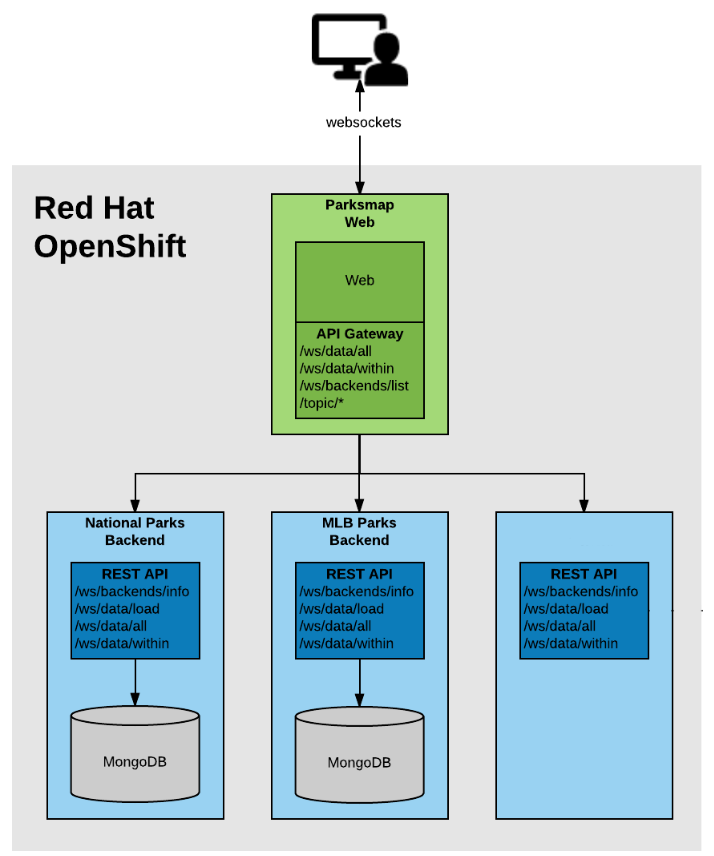

The main service is a web application which has a server-side component in charge of aggregating the geo-spatial APIs provided by multiple independent backend services and a client-side component in JavaScript that is responsible for visualizing the geo-spatial data on the map. The client-side component which runs in your browser communicates with the server-side via WebSockets protocol in order to update the map in real-time.

There will be a set of independent backend services deployed that will provide different mapping and geo-spatial information. The set of available backend services that provide geo-spatial information are:

>WorldWide National Parks

>Major League Baseball Stadiums in North America

The server-side component of the ParksMap web application acts as a communication gateway to all the available backends. These backends will be dynamically discovered by using service discovery mechanisms provided by OpenShift which will be discussed in more details in the following labs.

# Exploring the CLI and Web Console

## Command Line Interface

OpenShift includes a feature-rich web console with both an Administrator perspective and a Developer perspective. In addition to the web console, OpenShift includes command line tools to provide users with a nice interface to work with applications deployed to the platform. The oc command line tool is an executable written in the Go programming language and is available for the following operating systems:

> Microsoft Windows

> macOS 10

> Linux

This lab environment has the oc command line tool installed, and your lab user is already logged in to the OpenShift cluster.

Issue the following command to see help information:

>>
    oc help

## Using a Project

Projects are a top level concept to help you organize your deployments. An OpenShift project allows a community of users (or a user) to organize and manage their content in isolation from other communities. Each project has its own resources, policies (who can or cannot perform actions), and constraints (quotas and limits on resources, etc). Projects act as a "wrapper" around all the application services and endpoints you (or your teams) are using for your work.

During this lab, we are going to use a few different commands to make sure that things in the environment are working as expected. Don’t worry if you don’t understand all of the terminology as we will cover it in detail in later labs.

In this lab environment, you already have access to single project: **your_username**.

If you had multiple projects, the first thing you would want to do is to switch to the **your_username** project to make sure you’re on the correct project from now on. You can do this with the following command:

>>
    oc project **your_username**

## The Web Console

OpenShift ships with a web-based console that will allow users to perform various tasks via a browser.

To get a feel for how the web console works, click on this Web Console link.

On the login screen, enter the following credentials:

Username: **your_username**

Password: your_password

<mark>*If you don't know your password please ask an instructor*</mark>

The first time you access the web console, you will most likely be in the Administrator perspective. You will be presented with the list of Projects that you can access, and you will see something that looks like the following image:

Click on the **your_username** project link. When you click on the **your_username** project, you will be taken to the project details page, which will list some metrics and details about your project. There’s nothing there now, but that will change as you progress through the lab.

At the top of the left navigation menu, you can toggle between the Administrator perspective and the Developer perspective.

Select **Developer** to switch to the Developer perspective. Once the Developer perspective loads, you should be in the **Topology** view. Right now, there are no applications or components to view, but once you begin working on the lab, you’ll be able to visualize and interact with the components in your application here.

We will be using a mix of command line tooling and the web console for the labs. Get ready!

# Deploying Your First Container Image

In this lab, we’re going to deploy the web component of the ParksMap application which is also called parksmap and uses OpenShift’s service discovery mechanism to discover the backend services deployed and shows their data on the map.

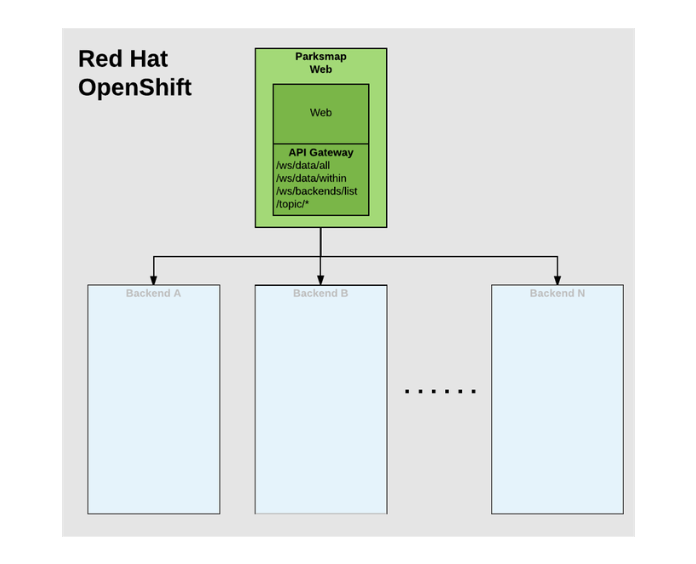

# Exercise: Deploying your First Image

Let’s start by doing the simplest thing possible - get a plain old Docker-formatted image to run on OpenShift. This is incredibly simple to do. With OpenShift it can be done directly from the web console.

Return to the Web Console.

If you’re no longer on the **Topology** view in the Developer perspective, return there now. Click **Container Image** to open a dialog that will allow you to specify the information for the image you want to deploy.

In the **Image Name** field, copy/paste the following into the box:

` quay.io/openshiftroadshow/parksmap:latest`

OpenShift will then go out to the container registry specified and interrogate the image.

Your screen will end up looking something like this:

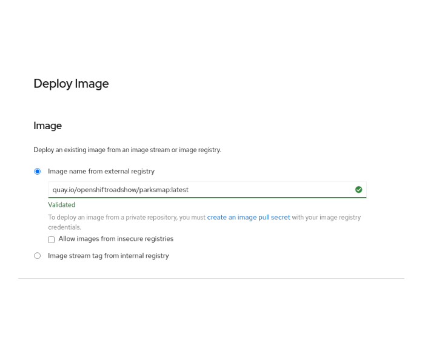

In **Runtime Icon** you can select the icon to use in OpenShift Topology View for the app. You can leave the default OpenShift icon, or select one from the list.

NOTE	The purpose of this exercise is to deploy a microservice from an agnostic existing container image (Frontend, this was made with Spring Boot). The specific programming language path you have chosen is described and implemented in the next microservice chapter (Backend).
Make sure to have the correct values in:

> **Application Name** : workshop

> **Name** : parksmap

Ensure **Deployment** is selected from **Resource** section.

**Un-check** the checkbox next to **Create a route to the application**. For learning purposes, we will create a **Route** for the application later in the workshop.

At the bottom of the page, click **Labels** in the Advanced Options section and add some labels to better identify this deployment later. Labels will help us identify and filter components in the web console and in the command line.

We will add 3 labels. After you enter the name=value pair for each label, press tab or de-focus with mouse before typing the next. First the name to be given to the application.

`app=workshop`

Next the name of this deployment.

`component=parksmap`

And finally, the role this component plays in the overall application.

`role=frontend`

Next, click the blue **Create** button. You will be directed to the **Topology** page, where you should see the visualization for the parksmap deployment config in the workshop application.

These few steps are the only ones you need to run to get a container image deployed on OpenShift. This should work with any container image that follows best practices, such as defining an EXPOSE port, not needing to run specifically as the root user or other user name, and a single non-exiting CMD to execute on start.

Providing appropriate labels is desired when deploying complex applications for organization purposes. OpenShift uses a label app to define and group components together in the Overview page. OpenShift will create this label with some default if the user doesn’t provide it explicitly.

# Background: Containers and Pods

Before we start digging in, we need to understand how containers and Pods are related. We will not be covering the background on these technologies in this lab but if you have questions please inform the instructor. Instead, we will dive right in and start using them.

In OpenShift, the smallest deployable unit is a Pod. A Pod is a group of one or more OCI containers deployed together and guaranteed to be on the same host. From the official OpenShift documentation:

Each Pod has its own IP address, therefore owning its entire port space, and containers within pods can share storage. Pods can be "tagged" with one or more labels, which are then used to select and manage groups of pods in a single operation.

Pods can contain multiple OCI containers. The general idea is for a Pod to contain a "main process" and any auxiliary services you want to run along with that process. Examples of containers you might put in a Pod are, an Apache HTTPD server, a log analyzer, and a file service to help manage uploaded files.

# Exercise: Examining the Pod

If you click on the parksmap entry in the Topology view, you will see some information about that deployment config. The **Resources** tab may be displayed by default. If so, click on the **Details** tab. On that panel, you will see that there is a single **Pod** that was created by your actions.

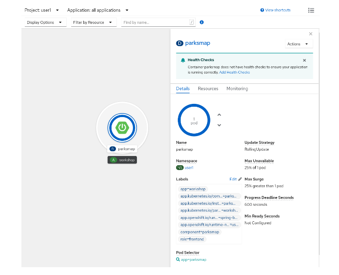

You can also get a list of all the **Pods** created within your **Project**, by navigating to **Workloads → Pods** in the Administrator perspective of the web console.

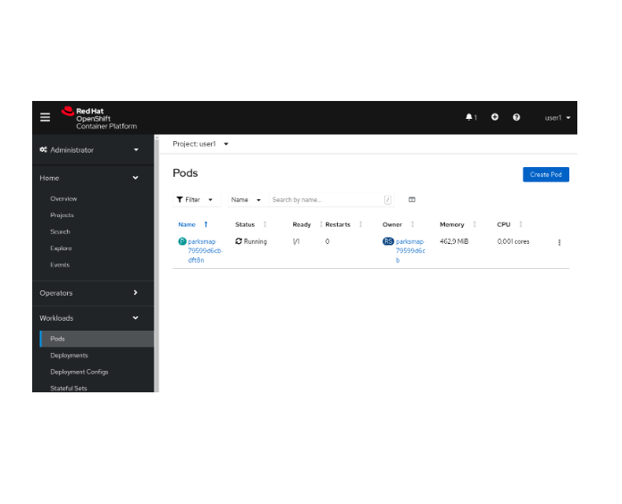

This Pod contains a single container, which happens to be the parksmap application - a simple Spring Boot/Java application.

You can also examine Pods from the command line:

` oc get pods `

You should see output that looks similar to:

>>
    NAME                READY   STATUS      RESTARTS   AGE
    parksmap-65c4f8b676-k5gkk    1/1     Running     0          20s

The above output lists all of the Pods in the current Project, including the Pod name, state, restarts, and uptime. Once you have a Pod's name, you can get more information about the Pod using the oc get command. To make the output readable, I suggest changing the output type to YAML using the following syntax:

Make sure you use the correct Pod name from your output.

`
oc get pod parksmap-65c4f8b676-k5gkk -o yaml`

You should see something like the following output (which has been truncated due to space considerations of this workshop manual):

>>
    apiVersion: v1
    kind: Pod
    metadata:
    annotations:
        k8s.v1.cni.cncf.io/network-status: |-
        [{
            "name": "",
            "interface": "eth0",
            "ips": [
                "10.131.0.93"
            ],
            "default": true,
            "dns": {}
        }]
        k8s.v1.cni.cncf.io/networks-status: |-
        [{
            "name": "",
            "interface": "eth0",
            "ips": [
                "10.131.0.93"
            ],
            "default": true,
            "dns": {}
        }]
        openshift.io/generated-by: OpenShiftWebConsole
        openshift.io/scc: restricted
    creationTimestamp: "2021-01-05T17:00:32Z"
    generateName: parksmap-65c4f8b676-
    labels:
        app: parksmap
        component: parksmap
        deploymentconfig: parksmap
        pod-template-hash: 65c4f8b676
        role: frontend
    ...............

The web interface also shows a lot of the same information on the Pod details page. If you click on the name of the Pod, you will find the details page. You can also get there by clicking on the parksmap deployment config on the Topology page, selecting Resources, and then clicking the Pod name.

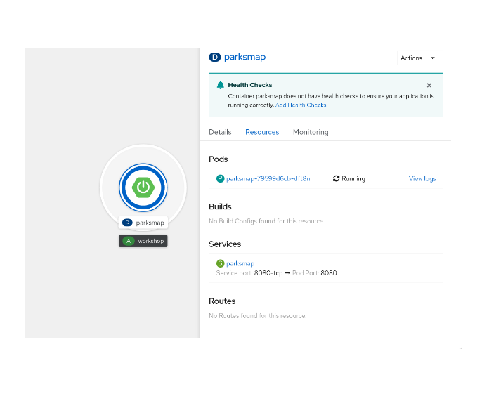

Getting the parksmap image running may take a little while to complete. Each OpenShift node that is asked to run the image has to pull (download) it, if the node does not already have it cached locally. You can check on the status of the image download and deployment in the Pod details page, or from the command line with the oc get pods command that you used before.

# Background: Customizing the Image Lifecycle Behavior

Whenever OpenShift asks the node’s CRI (Container Runtime Interface) runtime (Docker daemon or CRI-O) to run an image, the runtime will check to make sure it has the right "version" of the image to run. If it doesn’t, it will pull it from the specified registry.

There are a number of ways to customize this behavior. They are documented in specifying an image as well as image pull policy.

# Background: Services

Services provide a convenient abstraction layer inside OpenShift to find a group of similar Pods. They also act as an internal proxy/load balancer between those Pods and anything else that needs to access them from inside the OpenShift environment. For example, if you needed more parksmap instances to handle the load, you could spin up more Pods. OpenShift automatically maps them as endpoints to the Service, and the incoming requests would not notice anything different except that the Service was now doing a better job handling the requests.

When you asked OpenShift to run the image, it automatically created a Service for you. Remember that services are an internal construct. They are not available to the "outside world", or anything that is outside the OpenShift environment. That’s okay, as you will learn later.

The way that a Service maps to a set of Pods is via a system of Labels and Selectors. Services are assigned a fixed IP address and many ports and protocols can be mapped.

There is a lot more information about Services, including the YAML format to make one by hand, in the official documentation.

Now that we understand the basics of what a Service is, let’s take a look at the Service that was created for the image that we just deployed. In order to view the Services defined in your Project, enter in the following command:

` oc get services `

You should see output similar to the following:

>>
    NAME       TYPE        CLUSTER-IP      EXTERNAL-IP   PORT(S)    AGE
    parksmap   ClusterIP   172.30.22.209  <none>        8080/TCP   3h

In the above output, we can see that we have a Service named parksmap with an IP/Port combination of 172.30.22.209/8080TCP. Your IP address may be different, as each Service receives a unique IP address upon creation. Service IPs are fixed and never change for the life of the Service.

In the Developer perspective from the Topology view, service information is available by clicking the parksmap deployment config, then Resources, and then you should see the parksmap entry in the Services section.

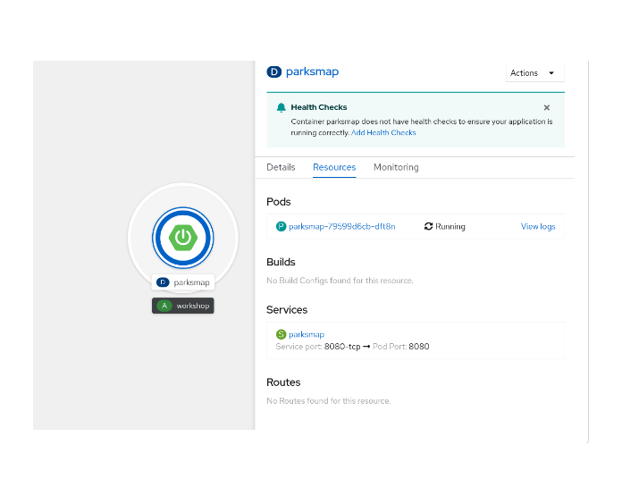

You can also get more detailed information about a Service by using the following command to display the data in YAML:

 ` 
oc get service parksmap -o yaml`

You should see output similar to the following:

>>

    apiVersion: v1
    kind: Service
    metadata:
    annotations:
        openshift.io/generated-by: OpenShiftWebConsole
    creationTimestamp: "2020-09-30T14:10:12Z"
    labels:
        app: workshop
        app.kubernetes.io/component: parksmap
        app.kubernetes.io/instance: parksmap
        app.kubernetes.io/part-of: workshop
        component: parksmap
        role: frontend
    name: parksmap
    namespace: user1
    resourceVersion: "1062269"
    selfLink: /api/v1/namespaces/user1/services/parksmap
    uid: e1ff69c8-cb2f-11e9-82a1-0267eec7e1a0
    spec:
    clusterIP: 172.30.22.209
    ports:
    - name: 8080-tcp
        port: 8080
        protocol: TCP
        targetPort: 8080
    selector:
        app: parksmap
        deploymentconfig: parksmap
    sessionAffinity: None
    type: ClusterIP
    status:
    loadBalancer: {}

Take note of the selector stanza. Remember it.

Alternatively, you can use the web console to view information about the Service by clicking on it from the previous screen.

It is also of interest to view the YAML of the Pod to understand how OpenShift wires components together. For example, run the following command to get the name of your parksmap Pod:

`oc get pods`

You should see output similar to the following:

>>
    NAME                        READY   STATUS    RESTARTS   AGE
    parksmap-65c4f8b676-k5gkk   1/1     Running   0          5m12s

Now you can view the detailed data for your Pod with the following command:

`oc get pod parksmap-65c4f8b676-k5gkk -o yaml`

Under the metadata section you should see the following:

>>
    labels:
    app: parksmap
    deploymentconfig: parksmap
The Service has selector stanza that refers to deploymentconfig=parksmap.

The Pod has multiple Labels:

> app=parksmap

> deploymentconfig=parksmap

**Labels** are just key/value pairs. Any **Pod** in this **Project** that has a Label that matches the **Selector** will be associated with the Service. To see this in action, issue the following command:

`oc describe service parksmap`

You should see something like the following output:

>>
        Name:              parksmap
        Namespace:         user1
        Labels:            app=workshop
                        app.kubernetes.io/component=parksmap
                        app.kubernetes.io/instance=parksmap
                        app.kubernetes.io/part-of=workshop
                        component=parksmap
                        role=frontend
        Annotations:       openshift.io/generated-by: OpenShiftWebConsole
        Selector:          app=parksmap,deploymentconfig=parksmap
        Type:              ClusterIP
        IP:                172.30.22.209
        Port:              8080-tcp  8080/TCP
        TargetPort:        8080/TCP
        Endpoints:         10.128.2.90:8080
        Session Affinity:  None
        Events:            <none>

You may be wondering why only one endpoint is listed. That is because there is only one Pod currently running. In the next lab, we will learn how to scale an application, at which point you will be able to see multiple endpoints associated with the Service.

# Scaling and Self Healing

## Background: Deployments and ReplicaSets

While **Services** provide routing and load balancing for **Pods**, which may go in and out of existence, **ReplicaSet** (RS) and **ReplicationController** (RC) are used to specify and then ensure the desired number of **Pods** (replicas) are in existence. For example, if you always want your application server to be scaled to 3 **Pods** (instances), a **ReplicaSet** is needed. Without an RS, any **Pods** that are killed or somehow die/exit are not automatically restarted. **ReplicaSets** and **ReplicationController** are how OpenShift "self heals" and while Deployments control **ReplicaSets**, **ReplicationController** here are controlled by **DeploymentConfigs**.

From the deployments documentation:

*Similar to a replication controller, a ReplicaSet is a native Kubernetes API object that ensures a specified number of pod replicas are running at any given time. The difference between a replica set and a replication controller is that a replica set supports set-based selector requirements whereas a replication controller only supports equality-based selector requirements.*

In Kubernetes, a **Deployment** (D) defines how something should be deployed. In almost all cases, you will end up using the **Pod**, **Service**, **ReplicaSet** and **Deployment** resources together. And, in almost all of those cases, OpenShift will create all of them for you.

There are some edge cases where you might want some **Pods** and an **RS** without a **D** or a Service, and others, so feel free to ask us about them after the labs.

## Exercise: Exploring Deployment-related Objects

Now that we know the background of what a ReplicaSet and Deployment are, we can explore how they work and are related. Take a look at the Deployment (D) that was created for you when you told OpenShift to stand up the parksmap image:

` oc get deployment `

>>
    NAME       READY   UP-TO-DATE   AVAILABLE   AGE
    parksmap   1/1     1            1           20m

To get more details, we can look into the ReplicaSet (RS).

Take a look at the ReplicaSet (RS) that was created for you when you told OpenShift to stand up the parksmap image:

` oc get rs `

>>
    NAME                  DESIRED   CURRENT   READY   AGE
    parksmap-65c4f8b676   1         1         1       21m

This lets us know that, right now, we expect one Pod to be deployed (Desired), and we have one Pod actually deployed (Current). By changing the desired number, we can tell OpenShift that we want more or less Pods.

OpenShift’s HorizontalPodAutoscaler effectively monitors the CPU usage of a set of instances and then manipulates the RCs accordingly.

## Exercise: Scaling the Application

Let’s scale our parksmap "application" up to 2 instances. We can do this with the scale command. You could also do this by incrementing the Desired Count in the OpenShift web console. Pick one of these methods; it’s your choice.

`oc scale --replicas=2 deployment/parksmap`

You can also scale up to two pods in the Developer Perspective. From the Topology view, first click the parksmap deployment config and select the Details tab:

Next, click the ^ icon next to the Pod visualization to scale up to 2 pods.

To verify that we changed the number of replicas, issue the following command:

`oc get rs`
>>
    NAME                  DESIRED   CURRENT   READY   AGE
    parksmap-65c4f8b676   2         2         2       23m

You can see that we now have 2 replicas. Let’s verify the number of pods with the oc get pods command:

`oc get pods`

>>
    NAME                        READY   STATUS    RESTARTS   AGE
    parksmap-65c4f8b676-fxcrq   1/1     Running   0          92s
    parksmap-65c4f8b676-k5gkk   1/1     Running   0          24m

And lastly, let’s verify that the Service that we learned about in the previous lab accurately reflects two endpoints:

`oc describe svc parksmap`

You will see something like the following output:

>>
    Name:              parksmap
    Namespace:         user1
    Labels:            app=workshop
                    app.kubernetes.io/component=parksmap
                    app.kubernetes.io/instance=parksmap
                    app.kubernetes.io/part-of=workshop
                    app.openshift.io/runtime-version=latest
                    component=parksmap
                    role=frontend
    Annotations:       openshift.io/generated-by: OpenShiftWebConsole
    Selector:          app=parksmap,deploymentconfig=parksmap
    Type:              ClusterIP
    IP:                172.30.136.210
    Port:              8080-tcp  8080/TCP
    TargetPort:        8080/TCP
    Endpoints:         10.128.2.138:8080,10.131.0.93:8080
    Session Affinity:  None
    Events:            <none>

Another way to look at a Service's endpoints is with the following:

`oc get endpoints parksmap`

And you will see something like the following:

>>
    NAME       ENDPOINTS                           AGE
    parksmap   10.128.2.90:8080,10.131.0.40:8080   45m

Your IP addresses will likely be different, as each pod receives a unique IP within the OpenShift environment. The endpoint list is a quick way to see how many pods are behind a service.

You can also see that both Pods are running in the Developer Perspective:

Overall, that’s how simple it is to scale an application (Pods in a Service). Application scaling can happen extremely quickly because OpenShift is just launching new instances of an existing image, especially if that image is already cached on the node.

## Application "Self Healing"

Because OpenShift’s RSs are constantly monitoring to see that the desired number of Pods actually are running, you might also expect that OpenShift will "fix" the situation if it is ever not right. You would be correct!

Since we have two Pods running right now, let’s see what happens if we "accidentally" kill one. Run the oc get pods command again, and choose a Pod name. Then, do the following:

`oc delete pod parksmap-65c4f8b676-k5gkk && oc get pods`

>>
    pod "parksmap-65c4f8b676-k5gkk" deleted
    NAME                        READY   STATUS    RESTARTS   AGE
    parksmap-65c4f8b676-bjz5g   1/1     Running   0          13s
    parksmap-65c4f8b676-fxcrq   1/1     Running   0          4m48s

Did you notice anything? One container has been deleted, and there’s a new container already being created.

Also, the names of the Pods are slightly changed. That’s because OpenShift almost immediately detected that the current state (1 Pod) didn’t match the desired state (2 Pods), and it fixed it by scheduling another Pod.

Additionally, OpenShift provides rudimentary capabilities around checking the liveness and/or readiness of application instances. If the basic checks are insufficient, OpenShift also allows you to run a command inside the container in order to perform the check. That command could be a complicated script that uses any installed language.

Based on these health checks, if OpenShift decided that our parksmap application instance wasn’t alive, it would kill the instance and then restart it, always ensuring that the desired number of replicas was in place.

More information on probing applications is available in the Application Health section of the documentation and later in this guide.

## Exercise: Scale Down

Before we continue, go ahead and scale your application down to a single instance. Feel free to do this using whatever method you like.

Don’t forget to scale down back to 1 instance your parksmap component as otherwise you might experience some weird behavior in later labs. This is due to how the application has been coded and not to OpenShift itself.

***

# Exposing Your Application to the Outside World

In this lab, we’re going to make our application visible to the end users, so they can access it.

## Background: Routes

While **Services** provide internal abstraction and load balancing within an OpenShift environment, sometimes clients (users, systems, devices, etc.) **outside** of OpenShift need to access an application. The way that external clients are able to access applications running in OpenShift is through the OpenShift routing layer. And the data object behind that is a **Route**.

The default OpenShift router (HAProxy) uses the HTTP header of the incoming request to determine where to proxy the connection. You can optionally define security, such as TLS, for the **Route**. If you want your **Services**, and, by extension, your **Pods**, to be accessible from the outside world, you need to create a **Route**.

## Exercise: Creating a Route

You may remember that when we deployed the parksmap application, we un-checked the checkbox to create a Route. Normally it would have been created for us automatically. Fortunately, creating a Route is a pretty straight-forward process. You simply expose the Service via the command line. Or, via the Administrator Perspective, just click Networking → Routes and then the Create Route button.

Insert parksmap in Name field.

From Service field, select parksmap. For Target Port, select 8080.

In Security section, check Secure route. Select Edge from TLS Termination list.

Leave all other fields blank and click Create:

When creating a **Route**, some other options can be provided, like the hostname and path for the **Route** or the other TLS configurations.

When using the command line, we can first verify that we don’t already have any existing **Routes**:

`oc get routes`

>>
    No resources found.

Now we need to get the **Service** name to expose:

`oc get services`

>>
    NAME       CLUSTER-IP       EXTERNAL-IP   PORT(S)    AGE
    parksmap   172.30.169.213   <none>        8080/TCP   5h

Once we know the **Service** name, creating a **Route** is a simple one-command task:

`oc create route edge parksmap --service=parksmap`

>>
    route.route.openshift.io/parksmap exposed

Verify the Route was created with the following command:

`oc get route`

>>
    NAME       HOST/PORT                            PATH      SERVICES   PORT       TERMINATION   WILDCARD
    parksmap   parksmap-user3.apps.cluster-test-efcf.test-efcf.example.opentlc.com             parksmap   8080-tcp   edge          None

You can also verify the **Route** in the **Developer Perspective** under the **Resources** tab for your parksmap deployment configuration. Also note that there is a decorator icon on the parksmap visualization now. If you click that, it will open the URL for your **Route** in a browser.

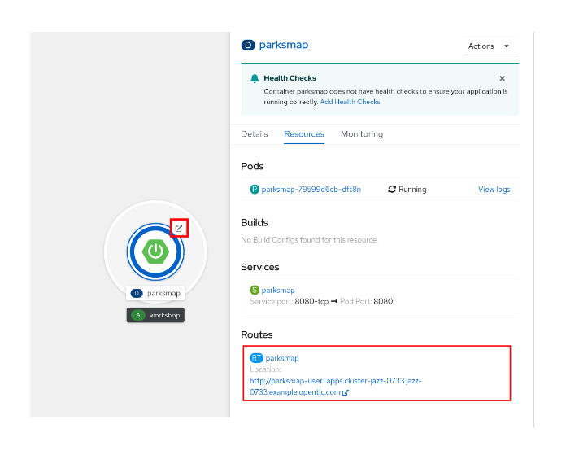

This application is now available at the URL shown in the Developer Perspective. Click the link and you will see it.

At first time, the Browser will ask permission to get your position. This is needed by the Frontend app to center the world map to your location, if you don’t allow it, it will just use a default location.

***

# Exploring OpenShift's Logging Capabilities

OpenShift provides some convenient mechanisms for viewing application logs. First and foremost is the ability to examine a Pod's logs directly from the web console or via the command line.

## Background: Container Logs

OpenShift is constructed in such a way that it expects containers to log all information to STDOUT. In this way, both regular and error information is captured via standardized Docker mechanisms. When exploring the Pod's logs directly, you are essentially going through the Docker daemon to access the container’s logs, through OpenShift’s API.

	
In some cases, applications may not have been designed to send all of their information to STDOUT and STDERR. In many cases, multiple local log files are used. While OpenShift cannot parse any information from these files, nothing prevents them from being created, either. In other cases, log information is sent to some external system. Here, too, OpenShift does not prohibit these behaviors. If you have an application that does not log to STDOUT, either because it already sends log information to some "external" system or because it writes various log information to various files, fear not.

## Exercise: Examining Logs

Since we already deployed our application, we can take some time to examine its logs. In the Developer Perspective, from Topology view, click the parksmap entry and then the Resources tab. You should see a View Logs link next to the Pod entry.

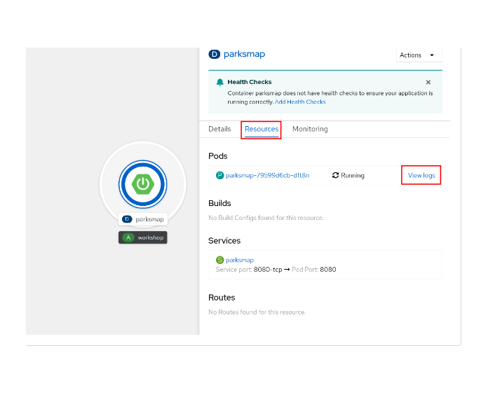

Click the **View Logs** link and you should see a nice view of the Pod's logs:

If you notice some errors in the log, that’s okay. We’ll remedy those in a little bit.

You also have the option of viewing logs from the command line. Get the name of your Pod:

`oc get pods`

>>
    NAME               READY     STATUS    RESTARTS   AGE
    parksmap-1-hx0kv   1/1       Running   0          5h

And then use the logs command to view this Pod's logs:

`oc logs parksmap-1-hx0kv`

You will see all of the application logs scroll on your screen:

>>

    2019-05-22 19:37:01.433  INFO 1 --- [           main] o.s.m.s.b.SimpleBrokerMessageHandler     : Started.
    2019-05-22 19:37:01.465  INFO 1 --- [           main] s.b.c.e.t.TomcatEmbeddedServletContainer : Tomcat started on port(s): 8080 (http)
    2019-05-22 19:37:01.468  INFO 1 --- [           main] c.o.evg.roadshow.ParksMapApplication     : Started ParksMapApplication in 3.97 seconds (JVM running
    for 4.418)
    2019-05-22 19:38:00.762  INFO 1 --- [MessageBroker-1] o.s.w.s.c.WebSocketMessageBrokerStats    : WebSocketSession[0 current WS(0)-HttpStream(0)-HttpPoll(
    0), 0 total, 0 closed abnormally (0 connect failure, 0 send limit, 0 transport error)], stompSubProtocol[processed CONNECT(0)-CONNECTED(0)-DISCONNECT(0)]
    , stompBrokerRelay[null], inboundChannel[pool size = 0, active threads = 0, queued tasks = 0, completed tasks = 0], outboundChannel[pool size = 0, active
    threads = 0, queued tasks = 0, completed tasks = 0], sockJsScheduler[pool size = 1, active threads = 1, queued tasks = 0, completed tasks = 0]
    2019-05-22 19:44:11.517  INFO 1 --- [nio-8080-exec-1] o.a.c.c.C.[Tomcat].[localhost].[/]       : Initializing Spring FrameworkServlet 'dispatcherServlet'
    2019-05-22 19:44:11.517  INFO 1 --- [nio-8080-exec-1] o.s.web.servlet.DispatcherServlet        : FrameworkServlet 'dispatcherServlet': initialization sta
    rted
    2019-05-22 19:44:11.533  INFO 1 --- [nio-8080-exec-1] o.s.web.servlet.DispatcherServlet        : FrameworkServlet 'dispatcherServlet': initialization com
    pleted in 16 ms
    2019-05-22 19:44:13.395  INFO 1 --- [nio-8080-exec-2] c.o.e.roadshow.rest.BackendsController   : Backends: getAll

If you scroll through the logs, you may notice an error that mentions a service account. What’s that? Never fear, we will cover that shortly.

***

# Role-Based Access Control

Almost every interaction with an OpenShift environment that you can think of requires going through the OpenShift’s control plane API. All API interactions are both authenticated (AuthN - who are you?) and authorized (AuthZ - are you allowed to do what you are asking?).

In the log aggregation lab we saw that there was an error in reference to a Service Account.

As OpenShift is a declarative platform, some actions will be performed by the platform and not by the end user (when he or she issues a command). These actions are performed using a Service Account which is a special type of user that the platform will use internally.

OpenShift automatically creates a few special service accounts in every project. The default service account is the one taking the responsibility of running the pods, and OpenShift uses and injects this service account into every pod that is launched. By changing the permissions for that service account, we can do interesting things.

You can view current permissions in the web console, go to the Topology view in the Developer Perspective, click the parksmap entry, go to the Details tab, and then click the Namespace.

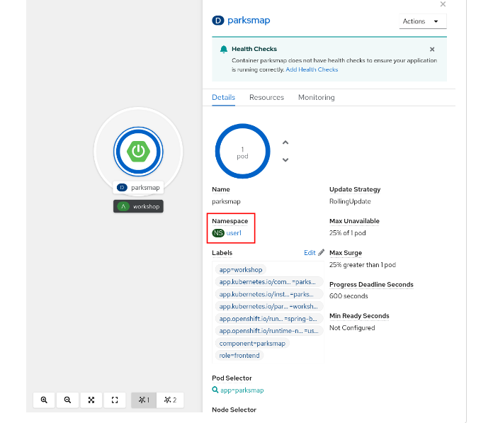

Then, click Role Bindings.

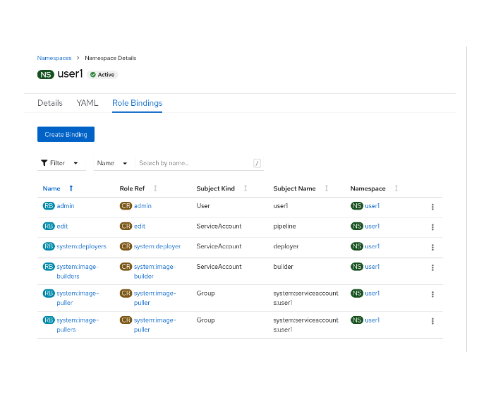

## Exercise: Grant Service Account View Permissions

The parksmap application wants to talk to the OpenShift API to learn about other Pods, Services, and resources within the Project. You’ll soon learn why!

` oc project your_username`

Then:

`oc policy add-role-to-user view -z default`
  
The oc policy command above is giving a defined role (view) to a user. But we are using a special flag, -z. What does this flag do? From the -h output:

>
    -z, --serviceaccount=[]: service account in the current namespace to use as a user

The -z syntax is a special one that saves us from having to type out the entire string, which, in this case, is system:serviceaccount:user3:default. It’s a nifty shortcut.

The -z flag will only work for service accounts in the current project. If you’re referring to a service account in a different project, use the `-n <project>`switch.

Now that the default Service Account now has view access, so now it can query the API to see what resources are within the Project. This also has the added benefit of suppressing the error message! Although, in reality, we fixed the application.

Another way you could have done the same is by using the OpenShift console. Once you’re on the Workloads → Deployments page, click on the Namespace, then Role Bindings and then the Create Binding button.

Select view for the Role Binding Name your_username for the Namespace, view for the Role Name, Service Account for the Subject, your_username for the Subject Namespace, and default for the Subject Name.

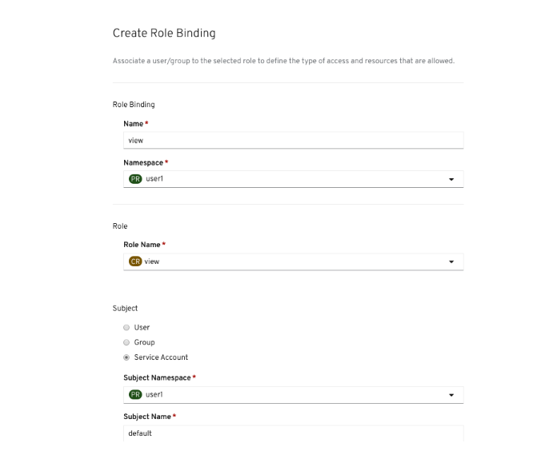

Once you’re finished editing permissions, click on the Create button.

## Exercise: Redeploy Application

One more step is required. We need to re-deploy the parksmap application because it’s given up trying to query the API.

`oc rollout restart deployment/parksmap`

A new deployment is immediately started. Return to Topology view and click the parksmap entry again to watch it happen. You might not be fast enough! But it will be reflected in the ReplicaSet number.

If you look at the logs for the application now, you should see no errors. That’s great.

## (Optional) Exercise: Grant User View Permissions

If you create a project, you are that project’s administrator. This means that you can grant access to other users, too. If you like, give your neighbor view access to your project using the following command:

	In the following command(s), replace user3 with the user name of the person to whom you want to grant access.

`oc policy add-role-to-user view your_username`

Have them go to the project view by clicking the Projects button and verify that they can see your project and its resources. This type of arrangement (view but not edit) might be ideal for a developer getting visibility into a production application’s project.

***

# Remote Access to Your Application

Containers are treated as immutable infrastructure and therefore it is generally not recommended to modify the content of a container through SSH or running custom commands inside the container. Nevertheless, in some use-cases, such as debugging an application, it might be beneficial to get into a container and inspect the application.

## Exercise: Remote Shell Session to a Container Using the CLI

OpenShift allows establishing remote shell sessions to a container without the need to run an SSH service inside each container. In order to establish an interactive session inside a container, you can use the oc rsh command. First get the list of available pods:

`oc get pods`

You should an output similar to the following:

>>
    NAME                        READY   STATUS    RESTARTS   AGE
    parksmap-65c4f8b676-fxcrq   1/1     Running   0          52m

Now you can establish a remote shell session into the pod by using the pod name:

`oc rsh
parksmap-65c4f8b676-fxcrq`

You would see the following output:

>>
    sh-4.2$
	
The default shell used by oc rsh is /bin/sh. If the deployed container does not have sh installed and uses another shell, (e.g. A Shell) the shell command can be specified after the pod name in the issued command.

Run the following command to list the files in the top folder:

`ls /`

>>
    anaconda-post.log  bin  dev  etc  home  lib  lib64  lost+found  media  mnt  opt  parksmap.jar  proc  root  run  sbin  srv  sys  tmp  usr  var

## Exercise: Remote Shell Session to a Container Using the Web Console

The OpenShift Web Console also provides a convenient way to access a terminal session on the container without having to use the CLI.

In order to access a pod’s terminal via the Web Console, go to the Topology view in the Developer Perspective, click the parksmap entry, and then click on the Pod.

Once you are viewing the information for the selected pod, click on the Terminal tab to open up a shell session.

Go ahead and execute the same commands you did when using the CLI to see how the Web Console based terminal behaves.

Before proceeding, close the connection to the pod.

`exit`

## Exercise: Execute a Command in a Container

In addition to remote shell, it is also possible to run a command remotely in an already running container using the oc exec command. This does not require that a shell is installed, but only that the desired command is present and in the executable path.

In order to show just the JAR file, run the following:

`oc exec parksmap-2-mcjsw -- ls -l /parksmap.jar`
You would see something like the following:

>>

    -rw-r--r--. 1 root root 39138901 Apr  1 16:54 /parksmap.jar

The -- syntax in the oc exec command delineates where exec’s options end and where the actual command to execute begins. Take a look at oc exec --help for more details.

You can also specify the shell commands to run directly with the oc rsh command:

`oc rsh parksmap-2-mcjsw whoami`
 
You would see something like:

 >> 
    1000580000

It is important to understand that, for security reasons, OpenShift does not run containers as the user specified in the Dockerfile by default. In fact, when OpenShift launches a container its user is actually randomized.

If you want or need to allow OpenShift users to deploy container images that do expect to run as root (or any specific user), a small configuration change is needed. You can learn more about the container image guidelines for OpenShift.

***

# Deploying Java Code

In this section, we’re going to deploy a backend service, developed in Java that will expose 2 main REST endpoints to the visualizer application (parksmap web component that was deployed in the previous labs). The application will query for national parks information (including its coordinates) that is stored in a MongoDB database. This application will also provide an external access point, so that the API provided can be directly used by the end user.

## Background: Source-to-Image (S2I)

In a previous lab, we learned how to deploy a pre-existing image image. Now we will expand on that by learning how OpenShift builds container images using source code from an existing repository. This is accomplished using the Source-to-Image project.

Source-to-Image (S2I) is a open source project sponsored by Red Hat that has the following goal:

<mark>Source-to-image (S2I) is a tool for building reproducible container images. S2I
produces ready-to-run images by injecting source code into a container image and
assembling a new container image which incorporates the builder image and built
source. The result is then ready to use with docker run. S2I supports
incremental builds which re-use previously downloaded dependencies, previously
built artifacts, etc.</mark>

OpenShift is S2I-enabled and can use S2I as one of its build mechanisms (in addition to building container images from Dockerfiles, and "custom" builds).

OpenShift runs the S2I process inside a special Pod, called a Build Pod, and thus builds are subject to quotas, limits, resource scheduling, and other aspects of OpenShift.

A full discussion of S2I is beyond the scope of this class, but you can find more information about it either in the OpenShift S2I documentation or on GitHub. The only key concept you need to remember about S2I is that it’s magic.

## Exercise: Creating a Java application

The backend service that we will be deploying as part of this exercise is called nationalparks. This is a Java Spring Boot application that performs 2D geo-spatial queries against a MongoDB database to locate and return map coordinates of all National Parks in the world. That was just a fancy way of saying that we are going to deploy a webservice that returns a JSON list of places.

## Add to Project

Because the nationalparks component is a backend to serve data that our existing frontend (parksmap) will consume, we are going to build it inside the existing project that we have been working with. To illustrate how you can interact with OpenShift via the CLI or the web console, we will deploy the nationalparks component using the web console.

## Using Application Code on an Embedded Git Server

OpenShift can work with any accessible Git repository. This could be GitHub, GitLab, or any other server that speaks Git. You can even register webhooks in your Git server to initiate OpenShift builds triggered by any update to the application code!

The repository that we are going to use is already cloned in the internal Gogs repository and located at the following URL:
	https://github.com/alexandrust88/nationalparks

Make a fork of it and start using the fork in the next steps.

Gogs Repository

Later in the lab, we want you to make a code change and then rebuild your application. This is a fairly simple Spring framework Java application.

## Build the Code on OpenShift

Similar to how we used +Add before with an existing image, we can do the same for specifying a source code repository. Since for this lab you have your own git repository, let’s use it with a simple Java S2I image.

In the Developer Perspective, click +Add in the left navigation and then choose "From Git"

The Import from Git workflow will guide you through the process of deploying your app based on a few selections.

Enter the following for Git Repo URL:

`https://github.com/alexandrust88/nationalparks`

In Git Type select Other.

if you copied the Gogs URL correctly (check spaces etc) and you still get a warning like 'Git repository is not reachable' please ignore it at this time, since the UI may fail to ping the repo sometimes.
Select Java as your Builder Image, and be sure to select version 11.

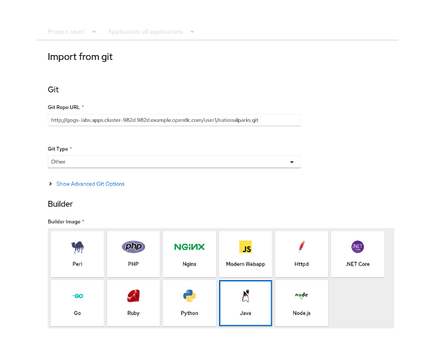

All of these runtimes shown are made available via **Templates** and **ImageStreams**, which will be discussed in a later lab.
Scroll down to the **General** section. Select:

**Application Name** : workshop

**Name** : nationalparks

In **Resources** section, select **Deployment**.

Expand the Labels section and add 3 labels:

The name of the Application group:

`app=workshop`
                           
Next the name of this deployment.

`component=nationalparks`

And finally, the role this component plays in the overall application.

>  role=backend

To see the build logs, in Topology view, click the nationalparks entry, then click on View Logs in the Builds section of the Resources tab.

This is a Java-based application that uses Maven as the build and dependency system. For this reason, the initial build will take a few minutes as Maven downloads all of the dependencies needed for the application. You can see all of this happening in real time!

From the command line, you can also see the Builds:

`oc get builds`

You’ll see output like:

    NAME              TYPE      FROM          STATUS     STARTED              DURATION
    nationalparks-1   Source    Git@b052ae6   Running    About a minute ago   1m2s

You can also view the build logs with the following command:

`oc logs -f builds/nationalparks-1`

After the build has completed and successfully:

>>
    The S2I process will push the resulting image to the internal OpenShift registry

    The Deployment (D) will detect that the image has changed, and this will cause a new deployment to happen.

    A ReplicaSet (RS) will be spawned for this new deployment.

    The RS will detect no Pods are running and will cause one to be deployed, as our default replica count is just 1.

 In the end, when issuing the oc get pods command, you will see that the build Pod has finished (exited) and that an application Pod is in a ready and running state:

    NAME                    READY     STATUS      RESTARTS   AGE
    nationalparks-1-tkid3   1/1       Running     3          2m
    nationalparks-1-build   0/1       Completed   0          3m
    parksmap-57df75c46d-xltcs        1/1       Running     0          2h
If you look again at the web console, you will notice that, when you create the application this way, OpenShift also creates a Route for you. You can see the URL in the web console, or via the command line:

`oc get routes`

Where you should see something like the following:

    NAME            HOST/PORT                                                   PATH      SERVICES        PORT       TERMINATION       WILDCARD
    nationalparks   nationalparks-user3.apps.cluster-test-efcf.test-efcf.example.opentlc.com             nationalparks   8080-tcp
    parksmap        parksmap-user3.apps.cluster-test-efcf.test-efcf.example.opentlc.com                  parksmap        8080-tcp        edge        none
In the above example, the URL is:

http://nationalparks-user3.apps.cluster-test-efcf.test-efcf.example.opentlc.com
Since this is a backend application, it doesn’t actually have a web interface. However, it can still be used with a browser. All backends that work with the parksmap frontend are required to implement a /ws/info/ endpoint. To test, visit this URL in your browser:

National Parks Info Page

The trailing slash is required. If the Pod is Running and the application is not available, please wait a few seconds and retry since we haven’t configured yet Health Checks for that.
You will see a simple JSON string:

{"id":"nationalparks","displayName":"National Parks","center":{"latitude":"47.039304","longitude":"14.505178"},"zoom":4}
Earlier we said:

This is a Java Spring Boot application that performs 2D geo-spatial queries
against a MongoDB database
But we don’t have a database. Yet.

***

# Adding a Database (MongoDB)

In this section we will deploy and connect a MongoDB database where the nationalparks application will store location information.

Finally, we will mark the nationalparks application as a backend for the map visualization tool, so that it can be dynamically discovered by the parksmap component using the OpenShift discovery mechanism and the map will be displayed automatically.

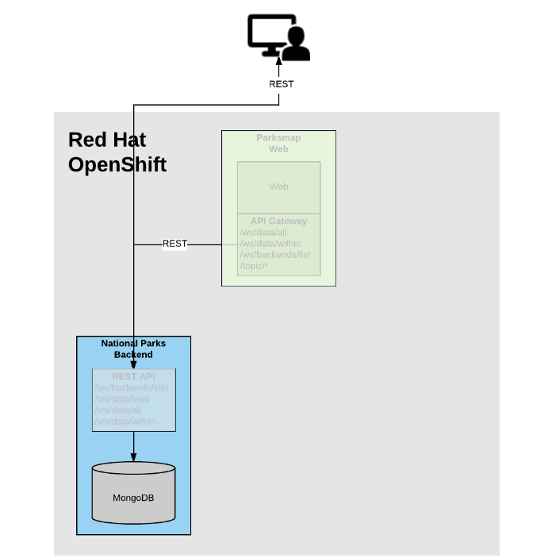

## Background: Storage

Most useful applications are "stateful" or "dynamic" in some way, and this is usually achieved with a database or other data storage. In this lab we are going to add MongoDB to our nationalparks application and then rewire it to talk to the database using environment variables via a secret.

We are going to use the MongoDB image that is included with OpenShift.

By default, this will use EmptyDir for data storage, which means if the Pod disappears the data does as well. In a real application you would use OpenShift’s persistent storage mechanism to attach real-world storage (NFS, Ceph, EBS, iSCSI, etc) to the Pods to give them a persistent place to store their data.

## Background: Templates

In this module we will create MongoDB from a Template, which is useful mechanism in OpenShift to define parameters for certain values, such as DB username or password, that can be automatically generated by OpenShift at processing time.

Administrators can load Templates into OpenShift and make them available to all users. Users can create Templates and load them into their own Projects for other users (with access) to share and use.

The great thing about Templates is that they can speed up the deployment workflow for application development by providing a "recipe" of sorts that can be deployed with a single command. Not only that, they can be loaded into OpenShift from an external URL, which will allow you to keep your templates in a version control system.

## In this module we will create MongoDB from a Template, which is useful mechanism in OpenShift to define parameters for certain values, such as DB username or password, that can be automatically generated by OpenShift at processing time.

Administrators can load Templates into OpenShift and make them available to all users. Users can create Templates and load them into their own Projects for other users (with access) to share and use.

The great thing about Templates is that they can speed up the deployment workflow for application development by providing a "recipe" of sorts that can be deployed with a single command. Not only that, they can be loaded into OpenShift from an external URL, which will allow you to keep your templates in a version control system.

## Exercise: Instantiate a MongoDB Template

In this step we will create a MongoDB template inside our project, so that is only visible to our user and we can access it from Developer Perspective to create a MongoDB instance.

` 
oc create -f https://raw.githubusercontent.com/openshift-labs/starter-guides/ocp-4.6/mongodb-template.yaml -n user3`

What just happened? What did you just create? The item that we passed to the create command is a **Template**. create simply makes the template available in your **Project**.

## Exercise: Deploy MongoDB

As you’ve seen so far, the web console makes it very easy to deploy things onto OpenShift. When we deploy the database, we pass in some values for configuration. These values are used to set the username, password, and name of the database.

The database image is built in a way that it will automatically configure itself using the supplied information (assuming there is no data already present in the persistent storage!). The image will ensure that:

> A database exists with the specified name

> A user exists with the specified name

> The user can access the specified database with the specified password

In the Developer Perspective in your your_username project, click **+Add** and then **Database**. In the Databases view, you can click **Mongo** to filter for just MongoDB.

Make sure to uncheck **Operator Backed** option from **Type** section

Alternatively, you could type mongodb in the search box. Once you have drilled down to see MongoDB, find the **MongoDB (Ephemeral)** template and select it. You will notice that there are multiple MongoDB templates available. We do not need a database with persistent storage, so the ephemeral Mongo template is what you should choose. Go ahead and select the ephemeral template and click the **Instantiate Template** button.

When we performed the application build, there was no template. Rather, we selected the builder image directly and OpenShift presented only the standard build workflow. Now we are using a template - a preconfigured set of resources that includes parameters that can be customized. In our case, the parameters we are concerned with are — user, password, database, and admin password.

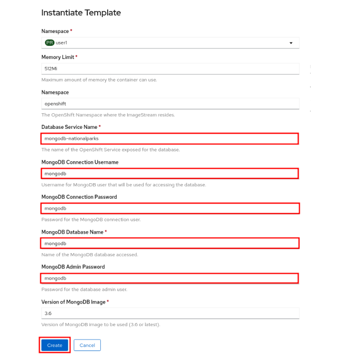

*Make sure you name your database service name mongodb-nationalparks*

You can see that some of the fields say **"generated if empty"**. This is a feature of **Templates** in OpenShift. For now, be sure to use the following values in their respective fields:

> Database Service Name : mongodb-nationalparks

> MongoDB Connection Username : mongodb

> MongoDB Connection Password : mongodb

> MongoDB Database Name: mongodb

> MongoDB Admin Password : mongodb

*Make sure to have configured the MongoDB Database Name parameter with the appropriate value as by default it will already have a value of sampledb.*

Once you have entered in the above information, click on **Create** to go to the next step which will allow us to add a binding.

From left-side menu, click to **Secrets**.

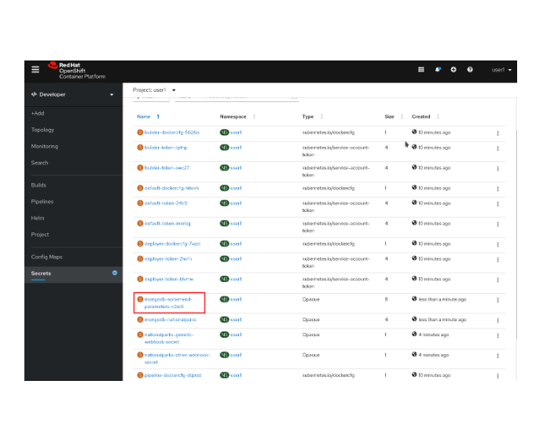

Click the secret name listed that we will use for **Parameters**. The secret can be used in other components, such as the nationalparks backend, to authenticate to the database.

Now that the connection and authentication information stored in a secret in our project, we need to add it to the nationalparks backend. Click the **Add Secret to Workload** button.

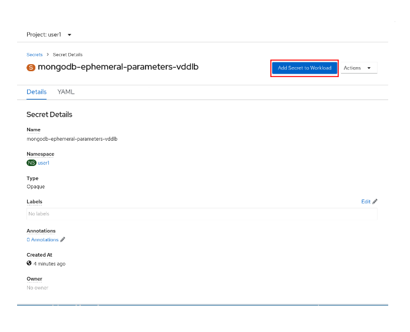

Select the nationalparks workload and click **Save**.

This change in configuration will trigger a new deployment of the nationalparks application with the environment variables properly injected.

Back in the **Topology** view, click and drag with Shift key the mongodb-nationalparks component into the light gray area that denotes the workshop application, so that all three components are contained in it.

Next, let’s fix the labels assigned to the mongodb-nationalparks deployment. Currently, we cannot set labels when using the database template from the catalog, so we will fix these labels manually.

Like before, we’ll add 3 labels:

The name of the Application group:

`app=workshop`

Next the name of this deployment.

`component=nationalparks`

And finally, the role this component plays in the overall application.

`role=database`

Execute the following command:

`oc label dc/mongodb-nationalparks svc/mongodb-nationalparks app=workshop`

`component=nationalparks role=database --overwrite`

## Exercise: Exploring OpenShift Magic

As soon as we attached the Secret to the **Deployment**, some magic happened. OpenShift decided that this was a significant enough change to warrant updating the internal version number of the **ReplicaSet**. You can verify this by looking at the output of oc get rs:

>>

    NAME                       DESIRED   CURRENT   READY   AGE
    nationalparks-58bd4758fc   0         0         0       4m58s
    nationalparks-7445576cd9   0         0         0       6m42s
    nationalparks-789c6bc4f4   1         1         1       41s
    parksmap-57df75c46d        1         1         1       8m24s
    parksmap-65c4f8b676        0         0         0       18m

We see that the DESIRED and CURRENT number of instances for the current deployment. The desired and current number of the other instances are 0. This means that OpenShift has gracefully torn down our "old" application and stood up a "new" instance.

## Exercise: Data, Data, Everywhere

Now that we have a database deployed, we can again visit the nationalparks web service to query for data:

>>
    http://nationalparks-user3.apps.cluster-test-efcf.test-efcf.example.opentlc.com/ws/data/all

And the result?

>>
    []

Where’s the data? Think about the process you went through. You deployed the application and then deployed the database. Nothing actually loaded anything **INTO** the database, though.

The application provides an endpoint to do just that:

`http://nationalparks-user3.apps.cluster-test-efcf.test-efcf.example.opentlc.com/ws/data/load`

And the result?

>>
    Items inserted in database: 2893

If you then go back to /ws/data/all you will see tons of JSON data now. That’s great. Our parks map should finally work!

There are some errors reported with browsers like Firefox 54 that don’t properly parse the resulting JSON. It’s a browser problem, and the application is working properly.

`https://parksmap-user3.apps.cluster-test-efcf.test-efcf.example.opentlc.com`

Hmm…​ There’s just one thing. The main map **STILL** isn’t displaying the parks. That’s because the front end parks map only tries to talk to services that have the right **Label**.

You are probably wondering how the database connection magically started working? When deploying applications to OpenShift, it is always best to use environment variables, secrets, or configMaps to define connections to dependent systems. This allows for application portability across different environments. The source file that performs the connection as well as creates the database schema can be viewed here:

`http://www.github.com/openshift-roadshow/nationalparks/blob/master/src/main/java/com/openshift/evg/roadshow/parks/db/MongoDBConnection.java#L44-l48`

In short summary: By referring to bindings to connect to services (like databases), it can be trivial to promote applications throughout different lifecycle environments on OpenShift without having to modify application code.

## Exercise: Working With Labels

We explored how a **Label** is just a key=value pair earlier when looking at **Services** and **Routes** and **Selectors**. In general, a **Label** is simply an arbitrary key=value pair. It could be anything.

> pizza=pepperoni

> pet=dog

> openshift=awesome

In the case of the parks map, the application is actually querying the OpenShift API and asking about the **Routes** and **Services** in the project. If any of them have a **Label** that is type=parksmap-backend, the application knows to interrogate the endpoints to look for map data. You can see the code that does this here.

Fortunately, the command line provides a convenient way for us to manipulate labels. describe the nationalparks service:

`oc describe route nationalparks`

>>
    Name:                   nationalparks
    Namespace:              user3
    Created:                2 hours ago
    Labels:                 app=workshop
                            app.kubernetes.io/component=nationalparks
                            app.kubernetes.io/instance=nationalparks
                            app.kubernetes.io/name=nodejs
                            app.kubernetes.io/part-of=workshop
                            app.openshift.io/runtime=nodejs
                            app.openshift.io/runtime-version=10
                            component=nationalparks
                            role=backend
    Annotations:            openshift.io/host.generated=true
    Requested Host:         nationalparks-user3.apps.cluster-test-efcf.test-efcf.example.opentlc.com
                            exposed on router router 2 hours ago
    Path:                   <none>
    TLS Termination:        <none>
    Insecure Policy:        <none>
    Endpoint Port:          8080-tcp

    Service:                nationalparks
    Weight:                 100 (100%)
    Endpoints:              10.1.9.8:8080

You see that it already has some labels. Now, use oc label:

`oc label route nationalparks type=parksmap-backend`

You will see something like:

>>
    route.route.openshift.io/nationalparks labeled

If you check your browser now:

`https://parksmap-user3.apps.cluster-test-efcf.test-efcf.example.opentlc.com/`

You’ll notice that the parks suddenly are showing up. That’s really cool!

***

# Application Health

## Background: Readiness and Liveness Probes

As we have seen before in the UI via warnings, there is a concept of application health checks in OpenShift. These come in two flavors:

> Readiness probe

> Liveness probe

From the Application Health section of the documentation, we see the definitions:

**Liveness Probe**

A liveness probe checks if the container in which it is configured is still running. If the liveness probe fails, the kubelet kills the container, which will be subjected to its restart policy. Set a liveness check by configuring the template.spec.containers.livenessprobe stanza of a pod configuration.

**Readiness Probe**

A readiness probe determines if a container is ready to service requests. If the readiness probe fails a container, the endpoints controller ensures the container has its IP address removed from the endpoints of all services. A readiness probe can be used to signal to the endpoints controller that even though a container is running, it should not receive any traffic from a proxy. Set a readiness check by configuring the template.spec.containers.readinessprobe stanza of a pod configuration.

It sounds complicated, but it really isn’t. We will use the web console to add these probes to our nationalparks application.

## Exercise: Add Health Checks

As we are going to be implementing a realistic CI/CD pipeline, we will be doing some testing of the "development" version of the application. However, in order to test the app, it must be ready. This is where OpenShift’s application health features come in very handy.

We are going to add both a readiness and liveness probe to the existing nationalparks deployment. This will ensure that OpenShift does not add any instances to the service until they pass the readiness checks, and will ensure that unhealthy instances are restarted (if they fail the liveness checks).

From the **Topology view**, click nationalparks. On the side panel, click the **Actions** dropdown menu and the select **Add Health Checks**.

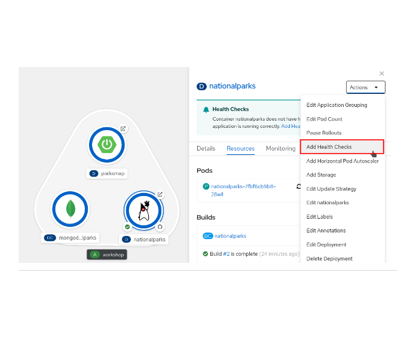

Click to **Add Readiness Probe** and add in **Path** field:

`/ws/healthz/`

Leave all default settings like **Port 8080** and **Type** HTTP GET. Click the little bottom-right confirmation gray tick to confirm:

Repeat the same procedure for Liveness Probe, click to **Add Liveness Probe** and add in **Path** field:

`/ws/healthz/`

Leave all default settings like **Port** 8080 and **Type** HTTP GET. Click the little bottom-right confirmation gray tick to confirm.

Note the trailing slash in the URL

Finally confirm all new changes clicking to **Add**:

You will notice that these changes caused a new deployment — they counted as a configuration change.

***

# Automate Build and Deployment with Pipelines

In this lab you will learn about pipelines and how to configure a pipeline in OpenShift so that it will take care of the application lifecycle.

## Background: Continuous Integration and Pipelines

A continuous delivery (CD) pipeline is an automated expression of your process for getting software from version control right through to your users and customers. Every change to your software (committed in source control) goes through a complex process on its way to being released. This process involves building the software in a reliable and repeatable manner, as well as progressing the built software (called a "build") through multiple stages of testing and deployment.

OpenShift Pipelines is a cloud-native, continuous integration and delivery (CI/CD) solution for building pipelines using Tekton. Tekton is a flexible, Kubernetes-native, open-source CI/CD framework that enables automating deployments across multiple platforms (Kubernetes, serverless, VMs, etc) by abstracting away the underlying details.

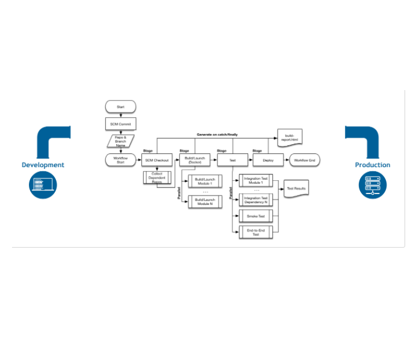

## Understanding Tekton

Tekton defines a number of Kubernetes custom resources as building blocks in order to standardize pipeline concepts and provide a terminology that is consistent across CI/CD solutions.

The custom resources needed to define a pipeline are listed below:

> Task: a reusable, loosely coupled number of steps that perform a specific task (e.g. building a container image)

> Pipeline: the definition of the pipeline and the Tasks that it should perform

> TaskRun: the execution and result of running an instance of task

> PipelineRun: the execution and result of running an instance of pipeline, which includes a number of TaskRuns

In short, in order to create a pipeline, one does the following:

> Create custom or install existing reusable Tasks

> Create a Pipeline and PipelineResources to define your application’s delivery pipeline

> Create a PersistentVolumeClaim to provide the volume/filesystem for pipeline execution or provide a VolumeClaimTemplate which creates a PersistentVolumeClaim

> Create a PipelineRun to instantiate and invoke the pipeline

For further details on pipeline concepts, refer to the Tekton documentation that provides an excellent guide for understanding various parameters and attributes available for defining pipelines.

## Create Your Pipeline

As pipelines provide the ability to promote applications between different stages of the delivery cycle, Tekton, which is our Continuous Integration server that will execute our pipelines, will be deployed on a project with a Continuous Integration role. Pipelines executed in this project will have permissions to interact with all the projects modeling the different stages of our delivery cycle.

For this example, we’re going to deploy our pipeline which is stored in the same Gogs repository where we have our code. In a more real scenario, and in order to honor infrastructure as code principles, we would store all the pipeline definitions along with every OpenShift resources definitions we would use.

`oc create -f 	https://raw.githubusercontent.com/alexandrust88/nationalparks/master/pipeline/nationalparks-pipeline-all-new.yaml
 -n your_username`

Verify the Tasks you created:

`oc get tasks -n user3`

You should see something similar:

>>
    NAME                 AGE
    redeploy             13s
    s2i-java-11-binary   13s

Verify the Pipeline you created:

`oc get pipelines -n your_username`

You should see something like this:

>>
    NAME                     AGE
    nationalparks-pipeline   8s
    Now let’s review our Tekton Pipeline:

    ---
    apiVersion: tekton.dev/v1beta1
    kind: Pipeline
    metadata:
    name: nationalparks-pipeline
    spec:
    params:
        - default: nationalparks
        description: The application name
        name: APP_NAME
        type: string
        - default: 'https://github.com/openshift-roadshow/nationalparks.git'
        description: The application git repository url
        name: APP_GIT_URL
        type: string
        - default: master
        description: The application git repository revision
        name: APP_GIT_REVISION
        type: string
    tasks:
        - name: git-clone
        params:
            - name: url
            value: $(params.APP_GIT_URL)
            - name: revision
            value: $(params.APP_GIT_REVISION)
            - name: submodules
            value: 'true'
            - name: depth
            value: '1'
            - name: sslVerify
            value: 'true'
            - name: deleteExisting
            value: 'true'
        taskRef:
            kind: ClusterTask
            name: git-clone
        workspaces:
            - name: output
            workspace: app-source
        - name: build-and-test
        params:
            - name: GOALS
            value:
                - package
            - name: PROXY_PROTOCOL
            value: http
        runAfter:
            - git-clone
        taskRef:
            kind: ClusterTask
            name: maven
        workspaces:
            - name: source
            workspace: app-source
            - name: maven-settings
            workspace: maven-settings
        - name: build-image
        params:
            - name: PATH_CONTEXT
            value: .
            - name: TLSVERIFY
            value: 'false'
            - name: OUTPUT_IMAGE_STREAM
            value: '$(params.APP_NAME):latest'
        runAfter:
            - build-and-test
        taskRef:
            kind: Task
            name: s2i-java-11-binary
        workspaces:
            - name: source
            workspace: app-source
        - name: redeploy
        params:
            - name: DEPLOYMENT_CONFIG
            value: $(params.APP_NAME)
            - name: IMAGE_STREAM
            value: '$(params.APP_NAME):latest'
        runAfter:
            - build-image
        taskRef:
            kind: Task
            name: redeploy
    workspaces:
        - name: app-source
        - name: maven-settings

A Pipeline is a user-defined model of a CD pipeline. A Pipeline’s code defines your entire build process, which typically includes stages for building an application, testing it and then delivering it.

A Task and a **ClusterTask** contain some step to be executed. ClusterTasks are available to all user within a cluster where OpenShift Pipelines has been installed, while **Tasks** can be custom.

This pipeline has 4 Tasks defined:

> **git clone**: this is a ClusterTask that will clone our source repository for nationalparks and store it to a Workspace app-source which will use the PVC created for it app-source-workspace

> **build-and-test**: will build and test our Java application using maven ClusterTask

> **build-image**: will build an image using a binary file as input in OpenShift. The build will use the .jar file that was created and a custom Task for it s2i-java11-binary

> **redeploy**: it will deploy the created image on OpenShift using the Deployment named nationalparks we created in the previous lab, using the custom Task redeploy

From left-side menu, click on **Pipeline**, then click on **nationalparks-pipeline** to see the pipeline you just created.

The Pipeline is parametric, with default value on the one we need to use.

It is using two **Workspace**:

> **app-source**: linked to a **PersistentVolumeClaim** app-source-pvc created from the YAML template we used in previous command. This will be used to store the artifact to be used in different **Task**

> **maven-settings**: an **EmptyDir** volume for the maven cache, this can be extended also with a PVC to make subsequent Maven builds faster

## Run the Pipeline

We can start now the **Pipeline** from the Web Console. From left-side menu, click on Pipeline, then click on **nationalparks-pipeline**. From top-right **Actions** list, click on **Start**.

You will be prompted with parameters to add the Pipeline, showing default ones.

Add in **APP_GIT_URL** the nationalparks repository you have in Github (remember that you created a fork right? ):

`https://github.com/alexandrust88/nationalparks`

In **Workspaces→ app-source** select **PVC** from the list, then select **app-source-pvc**. This is the shared volume used by Pipeline Tasks in your Pipeline containing the source code and compiled artifacts.

Click on **Start** to run your Pipeline.

You can follow the **Pipeline** execution from Pipeline section, watching all the steps in progress. Click on  **Pipeline Runs** tab to see it running:

The click on the PipelineRun **national-parks-deploy-run-:**

Then click on the **Task** running to check logs:

Verify PipelineRun has been completed with success:

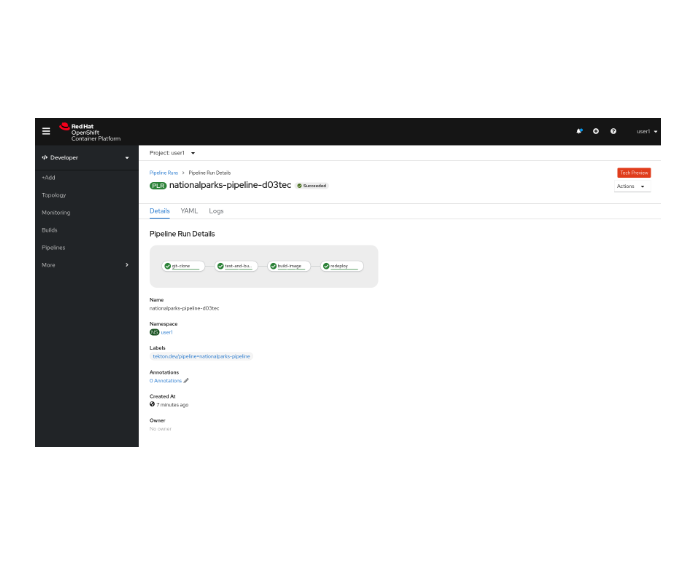

***

# Automation for Your Application on Code Changes

## Background: Web Hooks

Most Git repository servers support the concept of web hooks — calling to an external source via HTTP(S) when a change in the code repository happens. OpenShift provides an API endpoint that supports receiving hooks from remote systems in order to trigger builds. By pointing the code repository’s hook at the OpenShift Pipelines resources, automated code/build/deploy pipelines can be achieved.

## Adding Triggers to your Pipeline

Tekton **Triggers** enable us to configure Pipelines to respond to external events (Git push events, pull requests etc) such as Web Hooks.

Adding triggering support requires the creation of a TriggerTemplate, TriggerBinding, and an EventListener in our project.

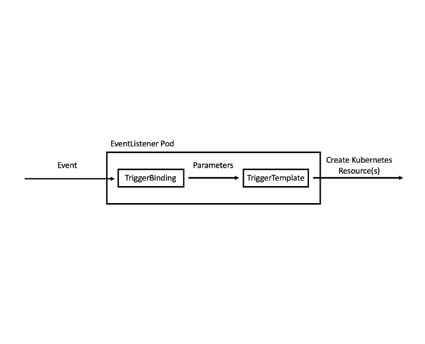

Let’s see each component in detail:

> **TriggerTemplate**: a trigger template is a template for newly created resources. It supports parameters to create specific PipelineResources and PipelineRuns.

> **TriggerBinding**: validates events and extracts payload fields

> **EventListener**: connects TriggerBindings and TriggerTemplates into an addressable endpoint (the event sink). It uses the extracted event parameters from each TriggerBinding (and any supplied static parameters) to create the resources specified in the corresponding TriggerTemplate. It also optionally allows an external service to pre-process the event payload via the interceptor field.

Now let’s create them all together for our Pipeline:

`oc create -f 	https://raw.githubusercontent.com/alexandrust88/nationalparks/master/pipeline/nationalparks-triggers-all.yaml -n your_username`

This will create a new Pod with a Route that we can use to setup our Webhook on Github to trigger the automatic start of the Pipeline.

From left side menu, click on **Topology** to verify if a new Deployment **el-nationalparks** for the EventListener has ben created:

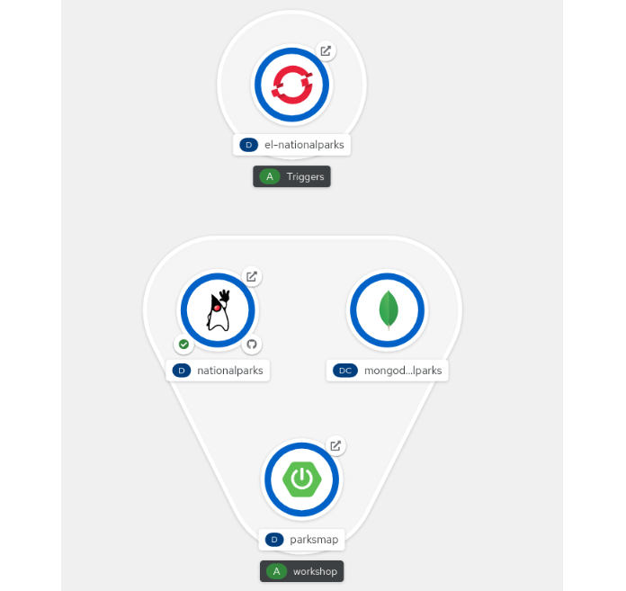

## Exercise: Configuring Gogs Web Hooks

Click on the Deployment, go into **Routes** section and and copy the **el-nationparks** Route URL.

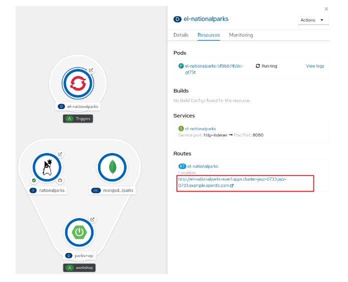

Once you have the URL copied to your clipboard, navigate to the code repository that you have on Github:

Login into your Github account and create a webhook . 

Click the Settings link on the top right of the screen:

Click on **Webhooks**, then the **Add Webhook** button, and finally select **Gogs**.

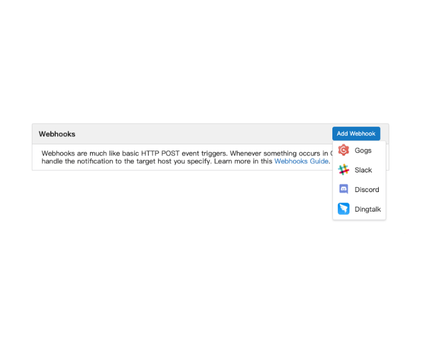

In the next screen, paste your link into the "Payload URL" field. You can leave the secret token field blank — the secret is already in the URL and does not need to be in the payload.

Change the Content Type to application/json.

Finally, click on **Add Webhook**.

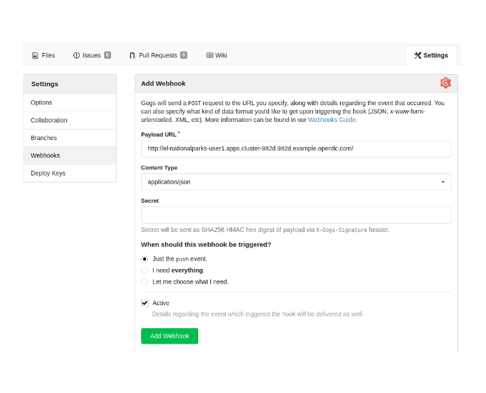

Boom! From now on, every time you commit new source code to your Github  repository, a new build and deploy will occur inside of OpenShift. Let’s try this out.

## Exercise: Using Gogs Web Hooks

Click the **Files** tab in Gogs. This is Gogs’s repository view.

Make sure that the drop-down menu at the upper right is set for the master branch. Navigate to the following path:

`src/main/java/com/openshift/evg/roadshow/parks/rest/`

Then click on the *BackendController.java* file.

Once you have the file on the screen, click the edit button in the top right hand corner as shown here:

Change line number 20:

`return new Backend("nationalparks","National Parks", new Coordinates("47.039304", "14.505178"), 4);`

To

`return new Backend("nationalparks","Amazing National Parks", new Coordinates("47.039304", "14.505178"), 4);`

Click on Commit changes at the bottom of the screen. Feel free to enter a commit message.

Once you have committed your changes, a new **PipelineRun** should almost instantaneously be triggered in OpenShift. Click **Pipeline** in the left navigation menu then nationalparks-pipeline. You should see a new one running:

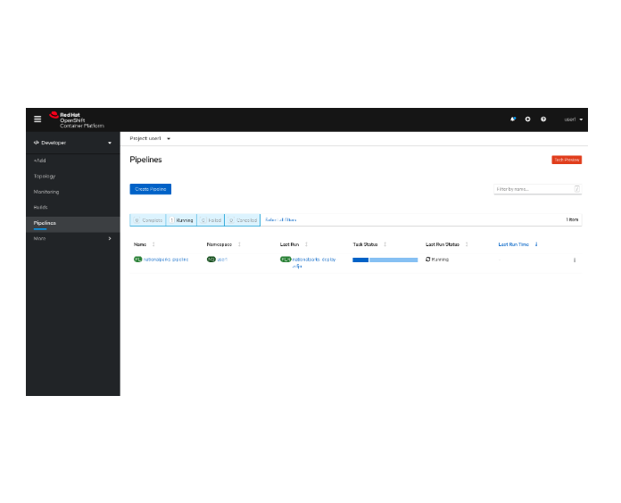

or run the following command to verify:

`oc get PipelineRun`

Once the build and deploy has finished, verify your new image was automatically deployed by viewing the application in your browser:

National Parks Info Page

You should now see the new name you have set in the JSON string returned.

To see this in the map’s legend itself, you will need to scale down your parksmap to 0, then back up to 1 to force the app to refresh its cache.

***

# Using Application Templates

In this lab, we’re going to deploy a complete backend application, consisting of a REST API backend and a MongoDB database. The complete application will already be wired together and described as a backend for the map visualization tool, so that once the application is built and deployed, you will be able to see the new map.

Let’s combine all of the exercises we have performed in the last several labs by using a **Template** that we can instantiate with a single command. While we could have used templates to deploy everything in the workshop today, remember that it is important for you to understand how to create, deploy, and wire resources together.

## Exercise: Instantiate a Template

The front end application we’ve been working with this whole time will display as many back end services' data as are created. Adding more stuff with the right **Label** will make more stuff show up on the map.

Now you will deploy a map of Major League Baseball stadiums in the US by using a template. It is pre-configured to build the back end Java application, and deploy the MongoDB database. It also uses a Hook to call the /ws/data/load endpoint to cause the data to be loaded into the database from a JSON file in the source code repository. Execute the following command:

`oc create -f https://raw.githubusercontent.com/openshift-roadshow/mlbparks/master/ose3/application-template-eap.json`

What just happened? What did you just create? The item that we passed to the create command is a **Template**. create simply makes the template available in your **Project**. You can see this with the following command:

`oc get template`

You will see output like the following:

>>
    mlbparks      Application template MLBParks backend running on Wildfly and using mongodb   12 (2 blank)   8

Run the following command to instantiate the template:

`oc new-app mlbparks -p APPLICATION_NAME=mlbparks`

	
The template can also use maven for the build. In case you want to try this option provide the **MAVEN_MIRROR_URL** parameter with the location of the internal nexus repository:

`oc new-app mlbparks --name=mlbparks -p MAVEN_MIRROR_URL=http://nexus.labs.svc.cluster.local:8081/repository/maven-all-public`

You will see some output similar to this:

>>
    --> Deploying template "user1/mlbparks" to project user1

        MLBparks
        ---------
        Application template MLBParks backend running on Wildfly and using mongodb

        * With parameters:
            * Application Name=mlbparks
            * Application route=
            * Mongodb App=mongodb-mlbparks
            * Git source repository=https://github.com/openshift-roadshow/mlbparks.git
            * Git branch/tag reference=master
            * Maven mirror url=
            * Database name=mongodb
            * Database user name=userW3n # generated
            * Database user password=4PmSfXWL # generated
            * Database admin password=cBQ4RGJf # generated
            * GitHub Trigger=TOR1p3wO # generated
            * Generic Trigger=NUlqyK54 # generated

    --> Creating resources ...
        configmap "mlbparks" created
        service "mongodb-mlbparks" created
        deploymentconfig.apps.openshift.io "mongodb-mlbparks" created
        imagestream.image.openshift.io "mlbparks" created
        buildconfig.build.openshift.io "mlbparks" created
        deploymentconfig.apps.openshift.io "mlbparks" created
        service "mlbparks" created
        route.route.openshift.io "mlbparks" created
    --> Success
        Build scheduled, use 'oc logs -f bc/mlbparks' to track its progress.
        Access your application via route 'mlbparks-user5.apps.cluster-1d43.1d43.openshiftworkshop.com'
        Run 'oc status' to view your app.

OpenShift will now:

> Configure and start a build

>>   Using the supplied Maven mirror URL (if you have specified the parameter)

>>From the supplied source code repository

> Configure and deploy MongoDB

>> Using auto-generated user, password, and database name

> Configure environment variables for the app to connect to the DB

> Create the correct services

> Label the app service with type=parksmap-backend

All with one command!

When the build is complete, visit the parks map. Does it work? Think about how this could be used in your environment. For example, a template could define a large set of resources that make up a "reference application", complete with several app servers, databases, and more. You could deploy the entire set of resources with one command, and then hack on them to develop new features, microservices, fix bugs, and more.

In Topology view, you can drag mlbparks and mongodb-mlbparks into the workshop application grouping.

In addition to being able to instantiate templates from the command line as we did above, templates can also be instantiated from the Developer Perspective in the web console. Click +Add, then From Catalog and search for mlb. You should see a result for MLBparks.

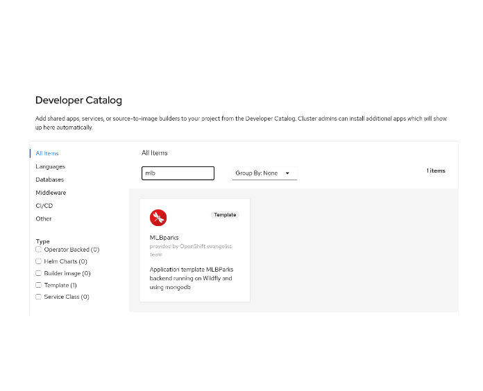

If you click on MLBparks and then click the **Instantiate Template** button, you’ll see a form that guides you through the different required and optional parameters needed to instantiate this template.

Do not actually instantiate the template from the web console now, since you have already done so via the command line.

As a final exercise, look at the template that was used to create the resources for our **mlbparks** application.

`oc get template mlbparks -o yaml`

But as always, you can use the OpenShift web console to do the same. In the Developer Perspective, click **Advanced → Search** in the left navigation, then select **Template** from the dropdown, and click **mlbparks**.

On the next page, click **YAML** to see/edit the YAML from here.

