# Implementing Multi-Layer Container and Kubernetes Security for Automated DevSecOps

## Lab Overview:

In this hands-on lab, we will cover the comprehensive container and Kubernetes security capabilities available in Red Hat OpenShift. You will gain experience with:

>Host OS (Red Hat CoreOS and Red Hat Enterprise Linux) security technologies

>Evaluating container content and sources for vulnerabilities

>Designing the build and CI/CD pipeline to proactively check container content and ensure content governance across the application life cycle, including image policy management and enforcement, image scanning, and image signing

>Certificate & Secrets management

>Implementing methods to control access to containers via authentication and authorization

>Red Hat OpenShift Container Platform security technologies, including Security Context Constraints (SCC), role-based access control (RBAC), and network security with network policies

>Logging, Monitoring, & Audit.

## Prerequisites:

This lab is geared towards systems administrators, cloud administrators and operators, architects, and others working on infrastructure operations management who are interested in learning how to automate security and compliance across their heterogeneous infrastructure using one or more Red Hat Products. The prerequisite for this lab include basic Linux skills gained from Red Hat Certified System Administrator (RHCSA) or equivalent system administration skills. Knowledge of virtualization and basic linux scripting would also be helpful, but not required.

# Lab 1: OpenShift blocks 'rogue' containers from running as privileged user

## Goal of Lab 1

The goal of this Lab is to learn about the default security technologies in Red Hat OpenShift Container Platform. Specifically, you will see how OpenShift blocks 'rogue' containers with images from from Docker Hub from running as a privileged root user and how you can work around that restrictions for this specific container.

## Introduction

Almost all software you are running in your containers does not require 'root' level access. Your web applications, databases, load balancers, number crunchers, etc. do not need to be run as 'root' ever. Building container images that do not require 'root' at all and basing images off of non-privileged container images are needed for container security. However, the vast majority of container images in the world today, such as the community container images available on Docker Hub, require 'root' user. By default, no containers are allowed to run as 'root' on Red Hat OpenShift Container Platform. An admin can override this, otherwise all user containers run without ever becoming 'root'. This is particularly important in multi-tenant OpenShift Kubernetes clusters, where a single cluster may be serving multiple applications and multiple development teams. It is not always practical or even advisable for administrators to run separate clusters for each.

## Lab 1.1 Pull 'rogue' 
container image from Docker Hub and observe how OpenShift locks down the container by default

1. Create a new project called myproject (or any other name that you prefer).

`oc new-project myproject`

2. In the OpenShift console, navigate to Home→Projects, search for myproject and click on it.

l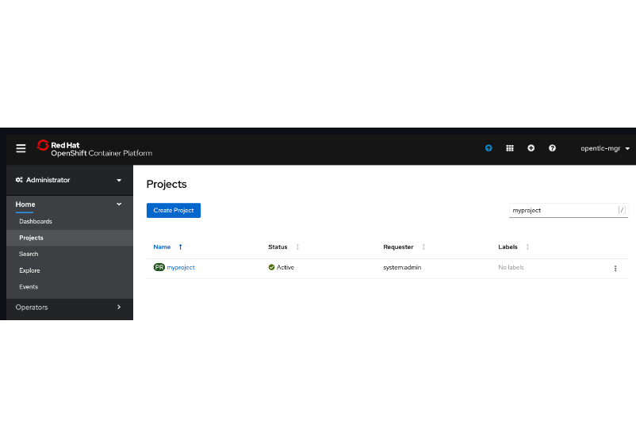

3. Then, go to the Workloads tab and click on the **Container Image** tile.

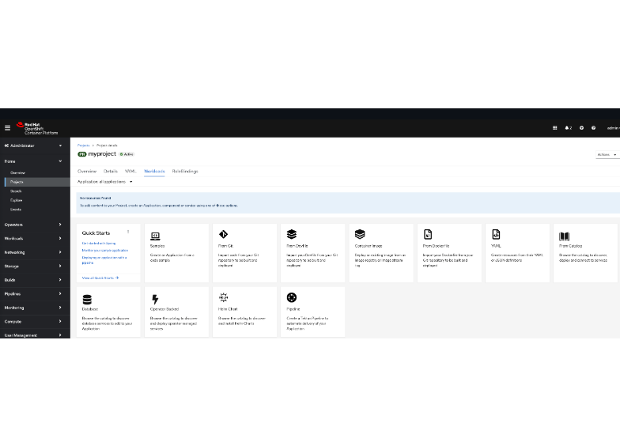

NOTE: It may be easier to use *Developer* perspective of OpenShift console to navigate to a project and click "+Add" button on the left hand side menu  to initiate that workflow.

4. Then, click on **Container Images** . Make sure that Image name from external registry is selected and for the Image Name, type docker.io/httpd. Press the magnifying glass.

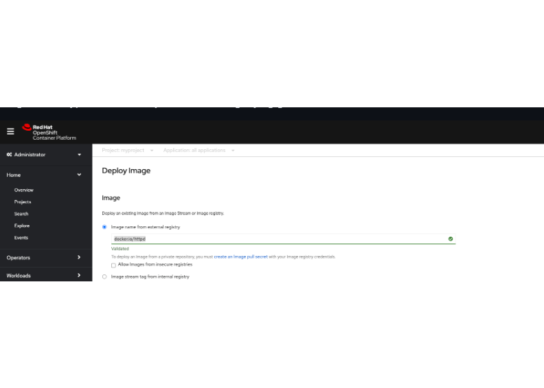

NOTE: Notice that this container image requires to be run as 'root' and listen on port 80.

5. Leave other values as defaults and press **Create**.

6. Now, go back to your terminal and navigate into the project you just created by typing **oc project myproject**. Then, take a look at your pods by typing oc get pods. Notice that one of your pods has a CrashLoopBackOff error.

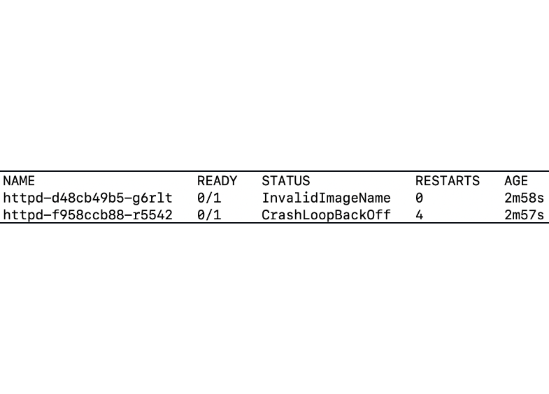

7. Let’s investigate further what is causing this error. Take a look at the log of the pod that is causing this error. You can get the name of the pod from the previous **oc get pods** command.

>>
    POD=`oc get pods --selector app=httpd -o custom-columns=NAME:.metadata.name --no-headers`; oc logs $POD

    # Or use the following command manually replacing the pod_name with the name of your pod.
    # oc logs <pod_name i.e httpd-f958ccb88-r5542>

8. Notice that you get permission denied errors saying that you cannot bind to port 80. This is because the proccess was not startup as root and was modified by the security context constraint to run as a specific user.

9. Also we can review failing container logs via OpenShift UI console, Log tab for that pod:

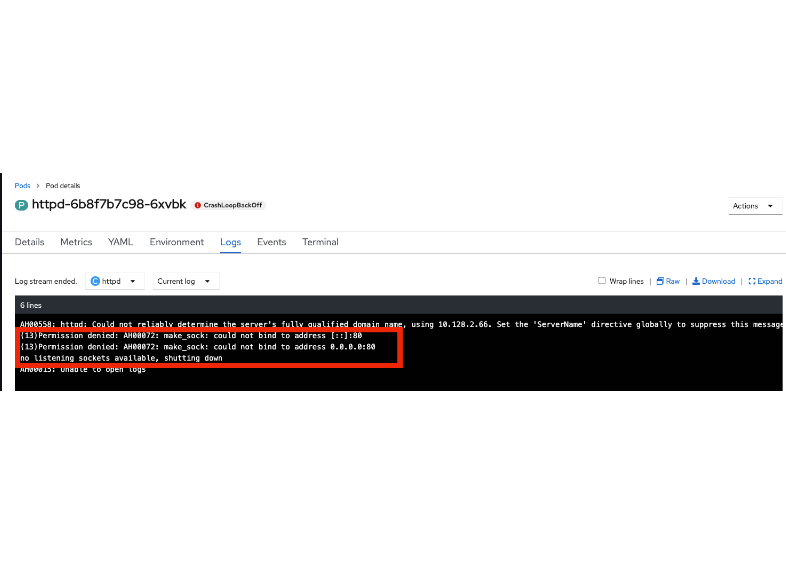

10. For a more detailed look, type 'oc describe pod …​.' with the name of your pod.

>>
    oc describe pod $pod
    # Or
    # oc describe pod <insert_pod_name i.e httpd-f958ccb88-r5542>

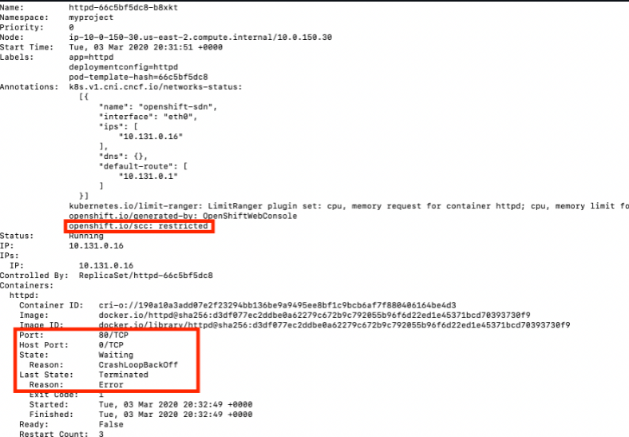

11. Notice that the output shows that the container failed after trying to start on port 80 and terminated due to a CrashLoopBackOff error. Also notice the default OpenShift Security Context Constraints (SCC) policy that is in place is 'restricted' (openshift.io/scc: restricted).

12. Finally, investigate your pod yaml in the OpenShift console by navigating to the YAML* view of your pod in the OpenShift console. Scroll down to the containers definition and notice how the SCC has dropped several capabilites and added a specifc runAsUser. These modifications have prevented your pod from scheduling because it was originally designed in an insecure state.

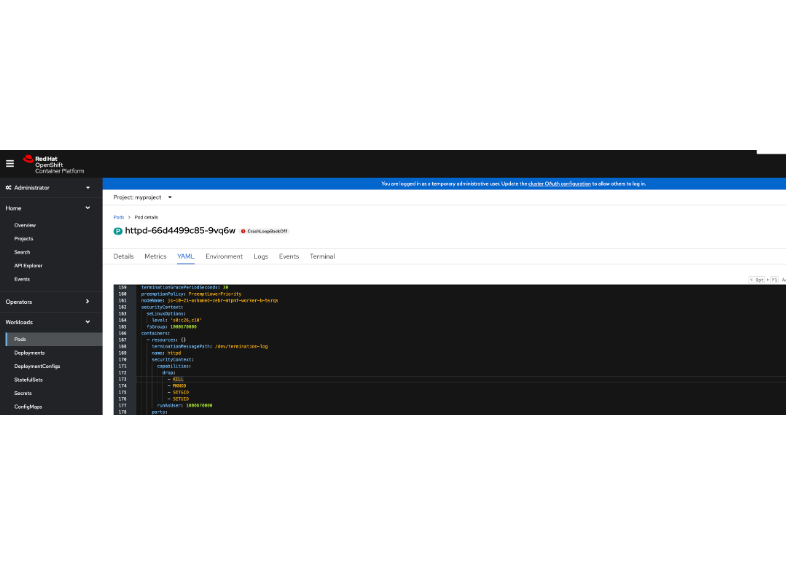

## Lab 1.2 Work around the default container security restriction by using service accounts with SCC privileges

1. Now let’s resolve this issue. In order to allow containers to run with elevated SCC privileges, we will create a Service Account (a special user account to run services) called 'privileged-sa':

`[localhost ~]$ oc create sa privileged-sa`

    serviceaccount/privileged-sa created

2. Then, we will entitle that Service Account (which is not used by default by any pods) to run as any userId by running the folowing command to add an SCC context:

`[localhost ~]$ oc adm policy add-scc-to-user anyuid -z privileged-sa`

    clusterrole.rbac.authorization.k8s.io/system:openshift:scc:anyuid added: "privileged-sa"

3. Now we have a Service Account that can run pods/containers using any userId. But how can we "plug" it into out application to allow it to run with that privilege? There is a pretty straighforward OpenShift command for that as well that "injects" that non-default service account into our application deployment:

`[localhost ~]$ oc set serviceaccount  deployment httpd privileged-sa`

    deployment.apps/httpd serviceaccount updated

4. That will make our 'httpd' pod use this Service Account and enable elevated privileges. We can verify that our Deployment now is using that Service Account by running command:

`[localhost ~]$ oc describe deployment httpd`

    Name:                   httpd
    Namespace:              container-security
    CreationTimestamp:      Wed, 06 Apr 2022 14:30:14 -0700
    Labels:                 app=httpd
                            app.kubernetes.io/component=httpd
                            app.kubernetes.io/instance=httpd
                            app.kubernetes.io/name=httpd
                            app.kubernetes.io/part-of=httpd-app
                            app.openshift.io/runtime-namespace=container-security
    Annotations:            alpha.image.policy.openshift.io/resolve-names: *
                            deployment.kubernetes.io/revision: 2
                            image.openshift.io/triggers:
                            [{"from":{"kind":"ImageStreamTag","name":"httpd:latest","namespace":"container-security"},"fieldPath":"spec.template.spec.containers[?(@.n...
                            openshift.io/generated-by: OpenShiftWebConsole
    Selector:               app=httpd
    Replicas:               1 desired | 1 updated | 1 total | 1 available | 0 unavailable
    StrategyType:           RollingUpdate
    MinReadySeconds:        0
    RollingUpdateStrategy:  25% max unavailable, 25% max surge
    Pod Template:
    Labels:           app=httpd
                        deploymentconfig=httpd
    Annotations:      openshift.io/generated-by: OpenShiftWebConsole
    Service Account:  privileged-sa <== non-default service acount that will run containers
    Containers:
    httpd:
        Image:        image-registry.openshift-image-registry.svc:5000/container-security/httpd@sha256:10ed1591781d9fdbaefaafee77067f12e833c699c84ed4e21706ccbd5229fd0a
        Port:         80/TCP
        Host Port:    0/TCP
        Environment:  <none>
        Mounts:       <none>
    Volumes:        <none>
    Conditions:
    Type           Status  Reason
    -----           ------  ------
    Available      True    MinimumReplicasAvailable
    Progressing    True    NewReplicaSetAvailable
    OldReplicaSets:  <none>
    NewReplicaSet:   httpd-765df85d48 (1/1 replicas created)
    Events:
    Type    Reason             Age    From                   Message
    -----    ------            -----   ----                   -------
    Normal  ScalingReplicaSet  83m    deployment-controller  Scaled up replica set httpd-6b8f7b7c98 to 1
    Normal  ScalingReplicaSet  2m44s  deployment-controller  Scaled up replica set httpd-765df85d48 to 1
    Normal  ScalingReplicaSet  2m41s  deployment-controller  Scaled down replica set httpd-6b8f7b7c98 to 0

5. We now see that Replica Set that controls pods instances has been regenerated and our HTTP server pod is running OK which we can also check in its logs:

`[localhost ~]$oc logs httpd-765df85d48-pwtm5`

    AH00558: httpd: Could not reliably determine the server's fully qualified domain name, using 10.128.2.95. Set the 'ServerName' directive globally to suppress this message
    AH00558: httpd: Could not reliably determine the server's fully qualified domain name, using 10.128.2.95. Set the 'ServerName' directive globally to suppress this message
    [Wed Apr 06 22:50:53.509904 2022] [mpm_event:notice] [pid 1:tid 140675277868352] AH00489: Apache/2.4.53 (Unix) configured -- resuming normal operations
    [Wed Apr 06 22:50:53.510037 2022] [core:notice] [pid 1:tid 140675277868352] AH00094: Command line: 'httpd -D FOREGROUND'
    ...

## Summary

So you have learned that OpenShift by default blocks containers that need to run with elevated privileges. Also, by adding SCC privileges to a Service Account and using that Service Account to run a pod that requires elevated privileges, you can get it to run securely on OpenShift. Please keep in mind that best approach is to always assign minimal SCC privileges that are required for pod security to such service accounts.

Per OpenShift Documentation (https://docs.openshift.com/container-platform/4.10/security/container_security/security-hosts-vms.html) the best practice is for most containers, except those managing or monitoring the host system itself, to run as a non-root user. Dropping the privilege level or creating containers with the least amount of privileges possible is recommended best practice for protecting your own OpenShift Container Platform clusters.

***
# Lab 2: Implementing network isolation between running containers using Network Policies

## Goal of Lab 2

The goal of this lab is to learn about how to implement network isolation between running containers in Red Hat OpenShift Container Platform using Software Defined Networking and Network Policies. First, we will create a few projects (K8s namespaces) and examine default out of the box network policies provided in OpenShift. Then, we will use Network Policies to restrict which applications/projects can talk to each other by restricting the network layer to provide that network isolation between running containers with Software Defined Networking and Network Policies.

## Introduction

Kubernetes Network Policies are an easy way for Project Administrators to define exactly what ingress/egress traffic is allowed to any pod, from any other pod, including traffic from pods located in other projects. By default, all Pods in a project are accessible from all other Pods and network endpoints. To isolate one or more Pods in a project, you can create NetworkPolicy objects in that project to indicate the allowed incoming connections. Project administrators can create and delete NetworkPolicy objects within their own project.

If a Pod is matched by selectors in one or more NetworkPolicy objects, then it will accept only connections that are allowed by at least one of those NetworkPolicy objects. A Pod that is not selected by any NetworkPolicy objects is fully accessible.

## Objective

The objective of the exercise below is to create multiple projects and to test application communication between them. You will introduce Network policies that will block application communications across projects and then allow some.

Project-c will have a hello-world application to which you will send requests. Projects-a, b and c will all have a client application. The client from project-c will always be able to communication with hello-world in project-c since they are in the same project. However, depending on the network policies in place at times you will be blocked from communicating from clients in projects a and b to the hello-world application in project c.

## Lab 2.1 Creating Projects and Labeling Namespaces

1. As a cluster admin user, create 3 projects and label those namespaces.
>>
    [localhost ~]$ oc new-project proj-a --display-name="Project A"
    [localhost ~]$ oc new-project proj-b --display-name="Project B"
    [localhost ~]$ oc new-project proj-c --display-name="Project C"

2. In order to create Network Policies and allow applications in one namespace to be accesssed by applications running in only certain other namespace, you have to label the namespaces so they can be identified in Network Policies (and this is why you have to be 'cluster-admin' level user):

>>
    oc label namespace proj-a name=proj-a
    oc label namespace proj-b name=proj-b
    oc label namespace proj-c name=proj-c

3. Now, let’s look at the projects and labels we just created:

`oc get projects proj-a proj-b proj-c --show-labels`

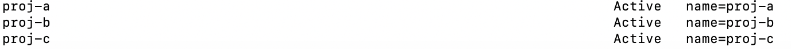

## Lab 2.1 Creating the 'hello world' microservice and client pod in proj-c

1. Let’s go into the project named proj-c and create 2 pods and a service.

>>
    [localhost ~]$ oc project proj-c
    [localhost ~]$ oc new-app quay.io/bkozdemb/hello --name="hello"

This will create a new app, which is a 'hello world' container based on image stored in quay.io that’s built on the RHEL base python image. It runs a simple web server that prints 'hello'.

2. Next, let’s confirm that the 2 pods are starting to run.

`oc get pods`

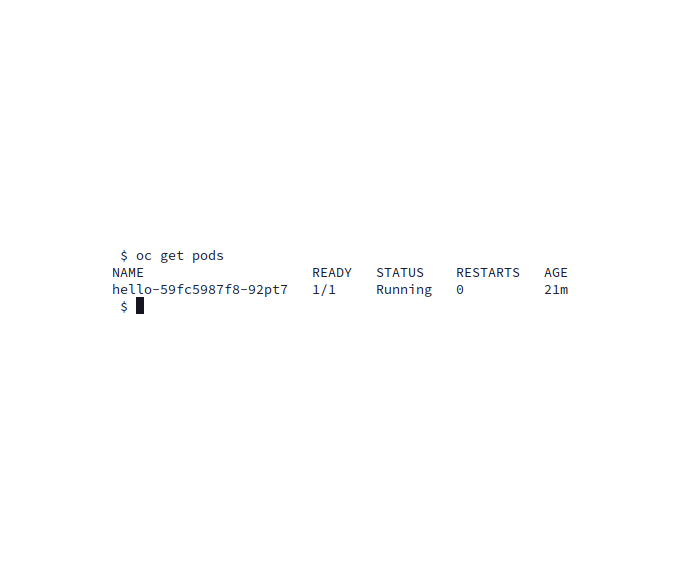

3. Now, let’s create and run the client pod, which is a Fedora base image. When the image is running, notice the command that’s being run (tail -f /dev/null), which essentially prevents the pod from running and then immediately quitting. This client pod will be used to run a curl command later.

>>
    [localhost ~]$ oc run client --image=fedora --command -- tail -f /dev/null
    pod/client created

4. Let’s confirm that our client pod and hello world pod are now running.

`oc get pods`

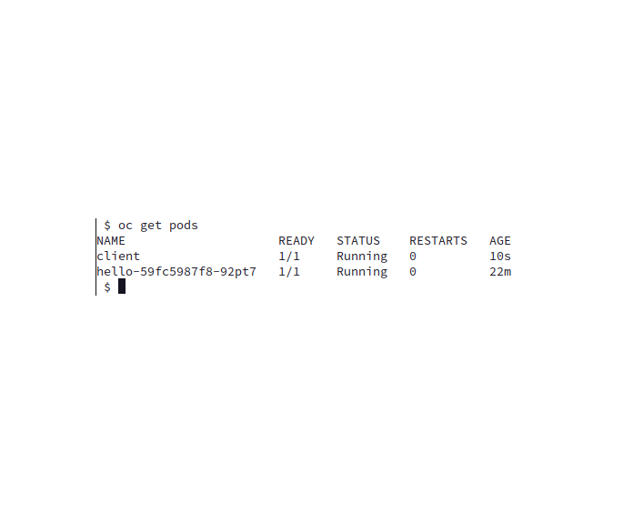

5. Next, let’s create similar client pods in other projects named proj-a and proj-b.

>>
    [localhost ~]$ oc project proj-b
    [localhost ~]$ oc run client  --image=fedora --command -- tail -f /dev/null
    [localhost ~]$ oc project proj-a
    [localhost ~]$ oc run client  --image=fedora --command -- tail -f /dev/null

6. Notice that the projects , proj-a and proj-b just have client pods running.

`oc get pods -n proj-a`

`oc get pods -n proj-b`

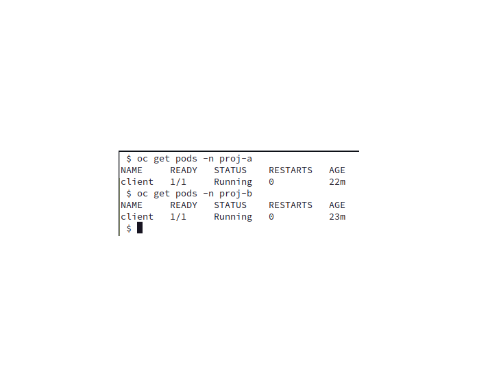

7. As we saw in the previous steps, proj-c, has both a client pod and the service (as a part of 'hello world' app).

`oc get pods -n proj-c`

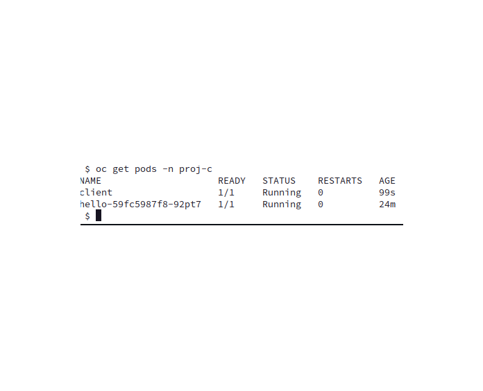

8. When the client pod is ready, display pod information with their labels.

`oc get pods --show-labels`

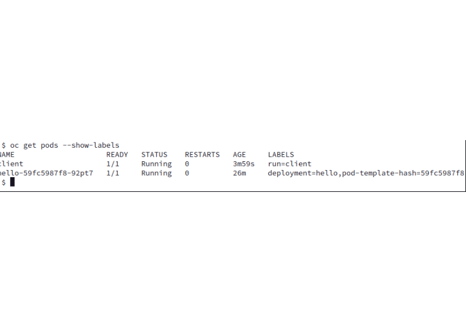

9. Notice that the label that we’re using for Client pod is run=client which is created automatically by our previous 'oc run client' command.

10. Next, from a different project, proj-a, connect to the Client container and try to access the hello.proj-c service in project, proj-c. The default network policy allows a client pod in proj-a to access the microservice in proj-c.

>>
    oc project proj-a
    POD=`oc get pods --selector=run=client --output=custom-columns=NAME:.metadata.name --no-headers`

This command above simply assigns the pod name to the POD variable since some pods have random names by default so this command allows you to give a specific name to the pod.

`echo $POD`

This returns client, which is the pod name. Next, go into the pod and curl the service in project, proj-c. Notice that this is allowed since it’s open access by default.

    oc rsh ${POD}
    #Inside the pod you have to execute:
    curl -v hello.proj-c:8080

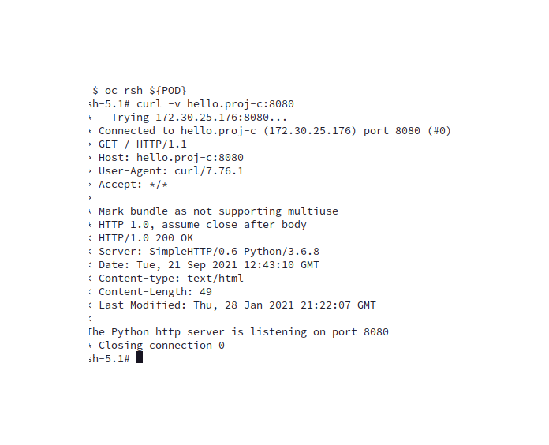

11. What you have seen so far is how Network Policies work by default in OpenShift. Now let’s take a look at the default Network Policies in the OpenShift web console. URL of web console can be found by running command:

    [localhost ~]$ oc whoami --show-console
    https://console-openshift-console.apps.cluster-tx8sn.tx8sn.sandbox1590.opentlc.com

12. Log into the OpenShift web console, then go to Projects and find the project, proj-c. Navigate into proj-c, then select Networking → Network Policies.

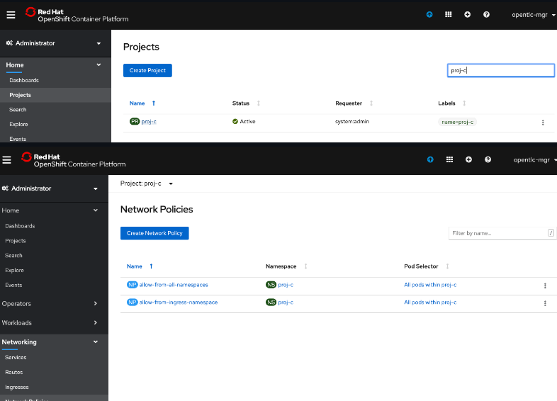

13. Notice that (in earlier versions of OpenShift) those two Network Policies are created by default:

>allow-from-all-namespaces: This is why we can hit services in the project, proj-c from other projects (such as projects, proj-a and proj-b).

>allow-from-ingress-namespace: This allows ingress from the router (outside in through the router).

Note

In the recent versions of OpenShift 4.x those default Network Policies are no longer present. As a result, if no Network Policies are defined, all traffic is allowed.

## Lab 2.2 Creating Network Policies for network isolation

1. In the OpenShift web console, choose project, proj-c, and go to Networking → Network Policies.

2. Next, delete the 2 default Network Policies (allow-from-all-namespaces and allow-from-ingress-namespace) if you see them. Remember that if no Network Policies are defined, all traffic is allowed.

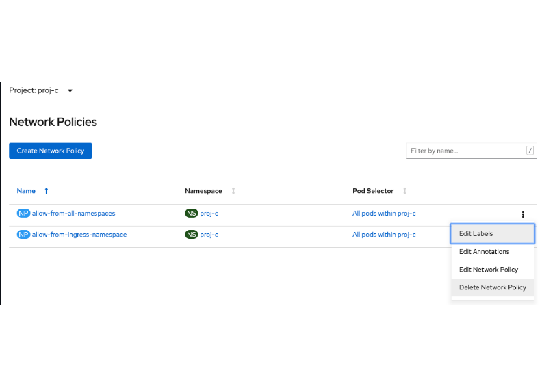

3. Now, create a new Network Policy in project, proj-c that denies traffic from other namespaces. It should be the first example shown on the right in the Sample Network policies. Notice there are a lot of Sample Network Policies. Apply the first example Limit access to the current namespace. Click Try it. This creates the yaml. Next, press create.

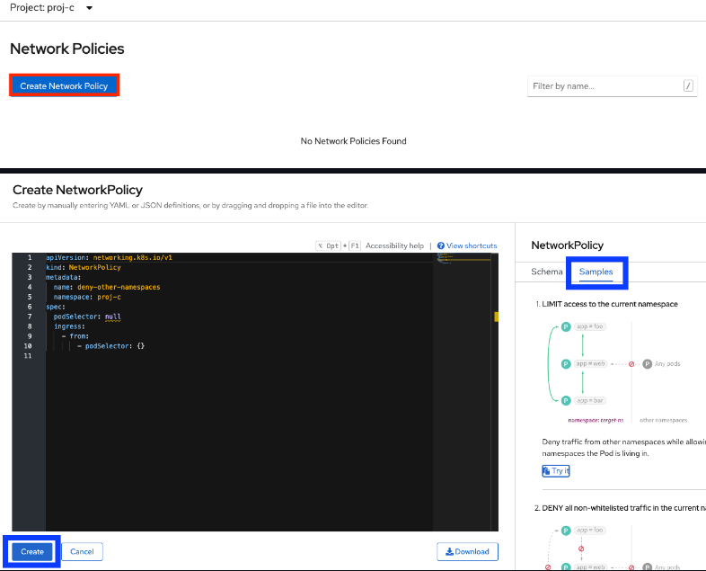

4. Now, navigate into Networking → Network Policies. and notice that the deny-other-namespaces network policy is defined.

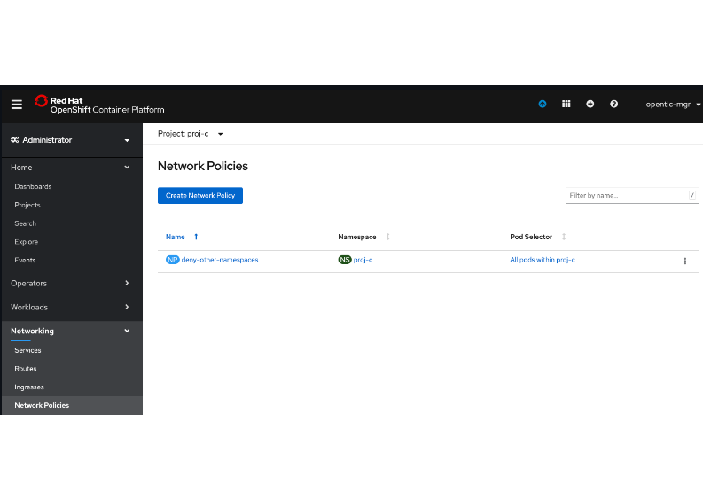

5. Next, try to curl the hello world service in project, proj-c from the client in proj-a. Notice that the curl fails this time.
>>
    oc rsh ${POD}
    #Inside the pod you have to execute:
    curl -v hello.proj-c:8080

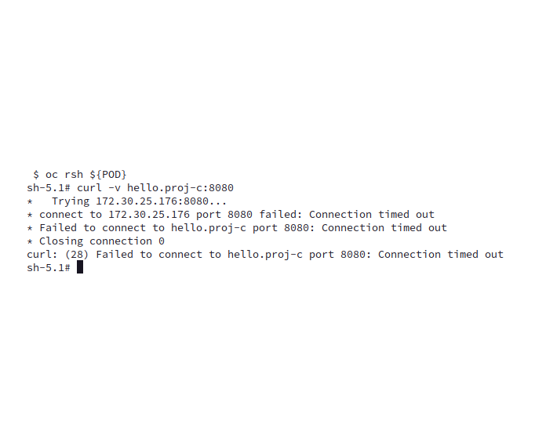

Remember to exit the pod with the exit command.

6. Same kind of failure you would get if you try to access application running in proj-c from proj-b because the deny-other-namespaces Network Policy blocks traffic from ALL namespaces

## Lab 2.3 Creating Network Policies for selective network access

1. Here you will create additional Network Policy that will allow access to pods running in proj-c project from those running in different projects, selected by their labels. In the previous lab you created a Network Policy that denies access to all pods in proj-c from other projects.

2. Now, similar to Lab 2.2, let’s create a Network Policy that is based on the sample "ALLOW traffic from all Pods in a particular namespace" policy. In the 'podSelector.matchLabels' section specify 'deployment:hello' to select the 'hello' labeled pods and in the 'namespaceSelector.matchLabels' section specify 'name:proj-a' to indicate that you will allow traffic from apps deployed in that namespace (recall that we labeled it with 'name:proj-a' in Lab 2.1). Press Create to create Network Policy

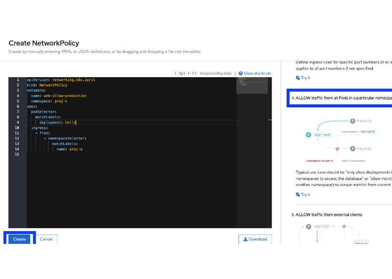

3. Now, navigate into Networking → Network Policies. and notice that the web-allow-production Network Policy is there:

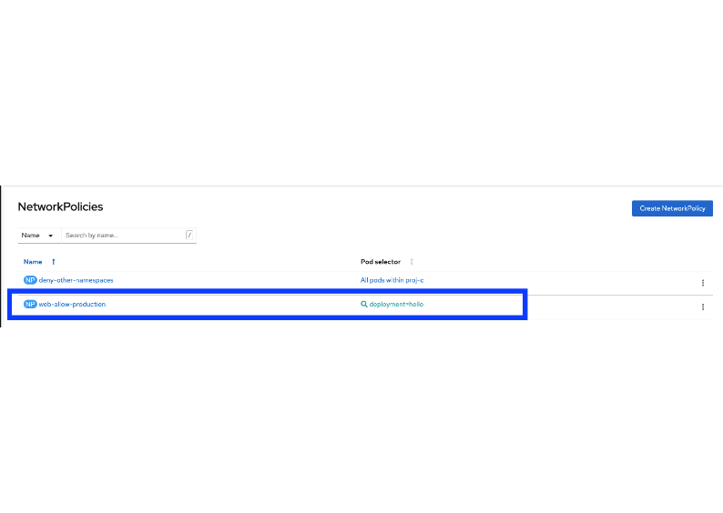

4. Next, again try to access the 'hello world' service in project proj-c from the Client running in proj-a. Notice that the curl succeeds this time because ingress traffic is explicitely allowed from proj-a to our 'hello world' pod by the web-allow-production Network Policy:

    [localhost ~]$ oc rsh ${POD}
    sh-5.0# curl -v hello.proj-c:8080

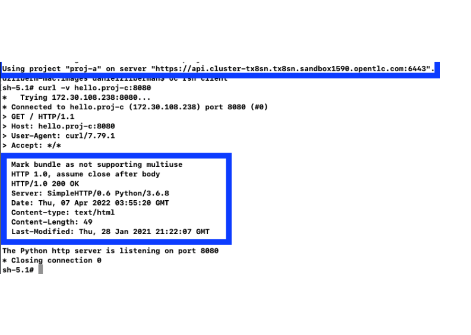

5. Next, try to curl the 'hello world' service in project proj-c from the Client running in proj-b. Notice that the curl fails because the first Network Policy still blocks it and the second one is not applicable to pods running in proj-b:

    [localhost ~]$ oc rsh ${POD}
    sh-5.0# curl -v hello.proj-c:8080

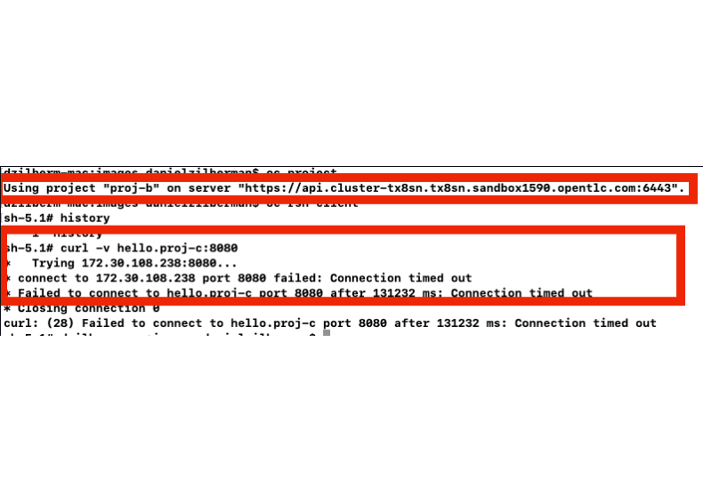

## Summary

You have learned how to created multiple OpenShift projects/namespaces and test application communication between them. You also learned how to create declarative Network Policies that block application communications across projects and then allow application communications between selected applications running in specific namespaces. Network Policies when used propely are very powerful way to implement cloud native applications network security.
***

# Lab 3: OpenShift Role Based Access Control (RBAC)

## Goal of Lab 3

The goal of this lab is to learn about the capabilities provided by OpenShift Role Based Access Control and how it can be used to access cluster based resources within an application.

## Introduction

OpenShift, being a secure platform by default, has included support for authentication and authorization since the beginning of its Kubernetes lineage with version 3.0. Kubernetes originally did not have any form of Role Based Access Control and the work that was pioneered in OpenShift was eventually upstreamed and is now part of core capabilities of Kubernetes. As part of this lab, you will learn the differences between authentication and authorization including how they are implemented within OpenShift along with how they can be configured. Finally, you will use an application running within the platform to extend your knowledge of authentication and authorization to configure custom policies for the application to access cluster based resources.

## Authentication and Authorization in OpenShift
Within the context of security, two of the fundamental terms are Authentication and Authorization. Let’s break down the differences and how they apply to OpenShift.

>Authentication - Verifying the identity of a user

>Authorization - Verifying access to a resource

## OpenShift Authentication
A User is an entity that can make requests against the OpenShift API. They are broken out in the following types:

>Regular users - Typical individuals that access the cluster

>System users - For use by infrastructure related assets, such as nodes

>Service Accounts - Special system users that are associated with Projects/Namespaces. These users are typically used to run pods or access the cluster within external systems.

Multiple users can then be organized into Groups to better manage policies within the cluster.

Authentication against the OpenShift API is accomplished using one of the following methods:

>OAuth Access Tokens - Asset for communicating with the OpenShift API once authenticated.

>X.509 Client Certificates - Use of certificates to authenticate against the API

### OpenShift OAuth Server and Identity Providers

OpenShift contains an included OAuth server for allowing users to obtain access tokens for communicating with the API. The OAuth server can integrate with a number of identity providers that stores information about users. Common examples are LDAP, HTPasswd and OpenID Connect (OIDC).

A full discussion on OpenShift authentication can be found within the OpenShift Documentation.

## OpenShift API

OpenShift emphasizes the use of declarative configurations and is the foundation for this schema. As a distributed system, all requests (whether they be from internal infrastructure resources or external components) invoke the API. The API is exposed as a series of RESTful endpoints and any request undergoes a series of steps prior to it being fulfilled completely. The following diagram depicts the steps of an API request:

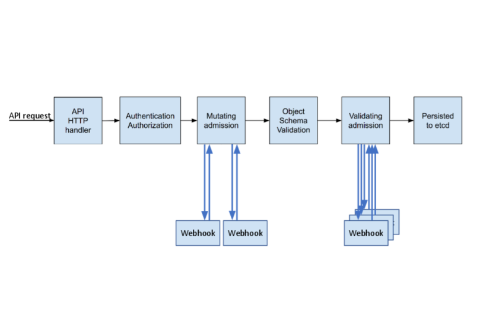

## OpenShift Role Based Access Control (RBAC)

RBAC is used to determine whether a user is allowed to perform a given action. Authorization is managed using the following:

>Rules - Sets of permitted verbs on a set of objects. For example, whether a user or service account can create pods

>Roles - Collections of rules.

>Bindings - Associations between users and/or groups with a role.

Roles and bindings can be created at one of the following scopes:

>Local - Scoped to a given project

>Cluster - Applicable across all projects

To simplify access within the platform, several default cluster roles are automatically configured:

>admin - rights to view any resource in the project and modify any resource in the project except for quota.

>basic-user - A user that can get basic information about projects and users.

>cluster-admin - A super-user that can perform any action in any project. When bound to a user with a local binding, they have full control over quota and every action on every resource in the project.

>cluster-status - A user that can get basic cluster status information.

>edit - A user that can modify most objects in a project but does not have the power to view or modify roles or bindings.

>self-provisioner - A user that can create their own projects.

>view - A user who cannot make any modifications, but can see most objects in a project. They cannot view or modify roles or bindings.

More information on OpenShift RBAC can be found in the OpenShift Documentation.

## Lab Implementation

To demonstrate many of the capabilities around managing Role Based Access Control in OpenShift, a sample application will be used to showcase not only how applications can be used to communicate with the OpenShift API, but also the levels of permissions that can be granted.

### Prerequisites

Prior to starting the lab, the following should be available to you:

>OpenShift environment with cluster level permissions

>OpenShift Command Line Interface (CLI)

### Environment Walkthrough

Login to OpenShift using the web console and from the Administrator perspective, on the lefthand navigation pane, expand Home and select Projects. If the Developer perspective is shown, select the Developer dropdown and select Administrator. Confirm that the rbac-lab project is displayed in the list of available projects.

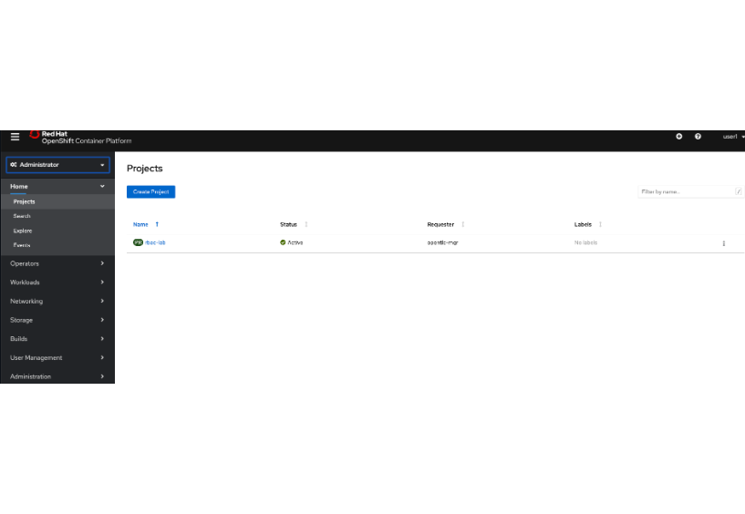

By expanding Workloads on the lefthand side, select Deployments and confirm openshift-rbac is displayed in the list of resources.

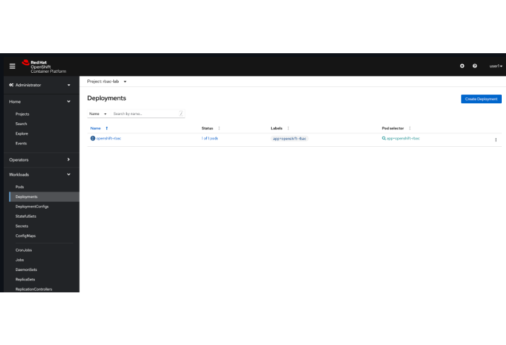

Note

If openshift-rbac is not present, confirm you are in the rbac-lab project by selecting rbac-lab from the Project dropdown at the top of the screen.
Feel free to browse the around to view the Pods, Secrets, and ConfigMaps that are part of the application.

Once complete, navigate to the Route that is exposed for the application. Expand the Networking pane on the lefthand navigation pane and select Routes.

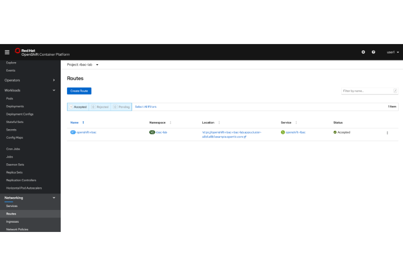

Under the Location column, select the hyperlink to navigate to the application. Depending on the configuration of your environment, you may be presented with an insecure SSL warning as the application is communicating using secure transport. Accept the warning and continue navigating to the application. You should be presented with a screen similar to the following:

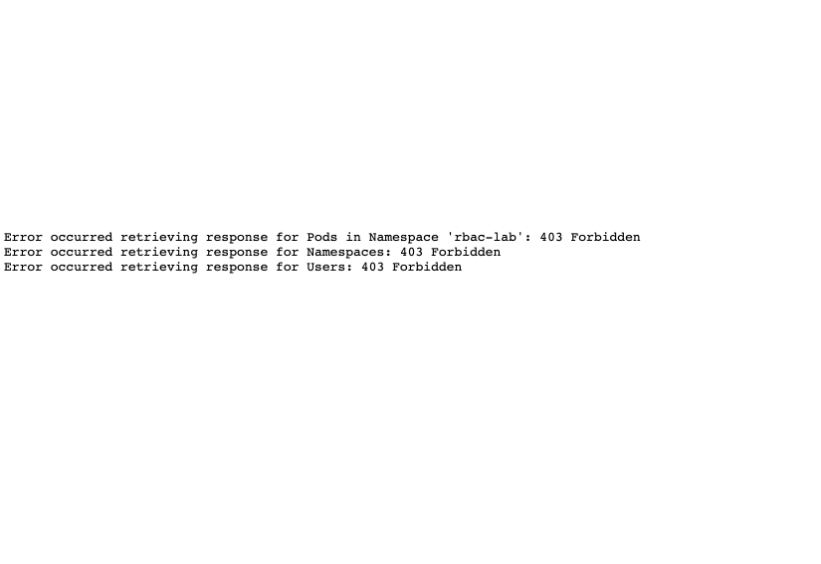

The application is a simple golang based service that communicates with OpenShift to query various assets. The "403 Forbidden" error that is displayed is expected and we will work to resolve these conditions throughout the course of this exercise.

## API Access For Applications

Every pod that is deployed with OpenShift includes a set of tools that make it possible to communicate with the OpenShift API. These tools are found in the /var/run/secrets/kubernetes.io/serviceaccount directory.

Using the OpenShift CLI, ensure that you are logged into the cluster and change into the rbac-lab namespace.

`oc project rbac-lab`

Once in the project, list the running pods by typing oc get pods.

`oc get pods`

>>
    NAME                      READY   STATUS      RESTARTS   AGE
    openshift-rbac-1-build    0/1     Completed   0          5h9m
    openshift-rbac-1-deploy   0/1     Completed   0          5h7m
    openshift-rbac-1-xgh4g    1/1     Running     0          5h7m

Next, start a remote shell session in the running pod.

`oc rsh $(oc get pod -l=app=openshift-rbac -o jsonpath="{ .items[0].metadata.name }")`

Once a session has been established within the pod, list the contents of the /var/run/secrets/kubernetes.io/serviceaccount directory

`ls -l /var/run/secrets/kubernetes.io/serviceaccount`

>>
    total 0
    lrwxrwxrwx. 1 root root 13 Apr 25 14:35 ca.crt -> ..data/ca.crt
    lrwxrwxrwx. 1 root root 16 Apr 25 14:35 namespace -> ..data/namespace
    lrwxrwxrwx. 1 root root 21 Apr 25 14:35 service-ca.crt -> ..data/service-ca.crt
    lrwxrwxrwx. 1 root root 12 Apr 25 14:35 token -> ..data/token

The following contents are available:

>ca.crt - OpenShift Certificate Authority (CA)

>namespace - Contains the namespace the pod is currently running within

>service-ca.crt - OpenShift Service Certificate Authority

>token - Contains the OAuth token for the Service Account associated with the running pod

The contents provided in this directory make it possible for applications to query the OpenShift API using the URL https://kubernetes.default.svc. Try to query this endpoint using the curl command:

`curl https://kubernetes.default.svc`

Executing the command will result in an error being displayed and indicates that the certificate for Kubernetes is not trusted. Fortunately, we have the CA for Kubernetes in our pod that we can specify. Execute the following command that refers to the CA file as described previously.

`curl --cacert /var/run/secrets/kubernetes.io/serviceaccount/ca.crt https://kubernetes.default.svc`

>>
    {
    "kind": "Status",
    "apiVersion": "v1",
    "metadata": {

    },
    "status": "Failure",
    "message": "forbidden: User \"system:anonymous\" cannot get path \"/\"",
    "reason": "Forbidden",
    "details": {

    },
    }

Better. We are able to invoke the API, but we are receiving Forbidden error. Notice the message that is displayed. User \"system:anonymous\" cannot get path \". Since we did not provide any credentials, OpenShift maps us into the reserved system:anonymous user. The OAuth token can be used to communicate with the API using the service account that is used to run the pod. Let’s make one more command that passes authentication as part of the request:

`curl --cacert /var/run/secrets/kubernetes.io/serviceaccount/ca.crt -H "Authorization: Bearer $(cat /var/run/secrets/kubernetes.io/serviceaccount/token)" https://kubernetes.default.svc`

>>
    {
    "paths": [
        "/api",
        "/api/v1",
        "/apis",
        "/apis/",
        "/apis/admissionregistration.k8s.io",
        "/apis/admissionregistration.k8s.io/v1",
        "/apis/admissionregistration.k8s.io/v1beta1",
        "/apis/apiextensions.k8s.io",
        "/apis/apiextensions.k8s.io/v1",
        "/apis/apiextensions.k8s.io/v1beta1",
        "/apis/apiregistration.k8s.io",
        "/apis/apiregistration.k8s.io/v1",
        "/apis/apiregistration.k8s.io/v1beta1",
        "/apis/apps",
        ...

Great! We have successfully authenticated against the OpenShift api and see a list of endpoints that are exposed by the OpenShift API.

You can exit out of the running pod by typing exit and hit the Return key.

 ### Roles and RoleBindings

With a basic understanding of how applications can query information from the OpenShift API, let’s return our focus to the example application in the rbac-lab namespace. As you can see from the application viewed in the web browser, each of the requests against the API are returning a HTTP 403 error. This error indicates that authentication was successful, however, the user does not have the appropriate rights to access the requested service.

The first query attempts to list all pods that are found in the current namespace. Recall that permission scope in OpenShift can either be at a namespace or cluster level. Since listing pods in the current namespace is limited to only a single namespace, a role would be applicable for defining the policies that could be applied.

As covered in the overview section, any policy requires the following considerations:

>Resources that would be queried

>Verbs associated to the request

With those considerations in mind, a new role can be created for the application to allow the application to list all pods in the rbac-lab namespace.

Execute the following command to create a new Role called pod-lister that grants access to list all pods.

`oc create role pod-lister --verb=list --resource=pods`

    role.rbac.authorization.k8s.io/pod-lister created

We can view the contents of the pod-lister role by executing the following command:

`oc get role pod-lister -o yaml`

    
    apiVersion: rbac.authorization.k8s.io/v1
    kind: Role
    metadata:
    creationTimestamp: "2020-04-26T16:00:19Z"
    name: pod-lister
    namespace: rbac-lab
    resourceVersion: "598640"
    selfLink: /apis/rbac.authorization.k8s.io/v1/namespaces/rbac-lab/roles/pod-lister
    uid: 8e3582b2-c8bb-469b-9a34-110735d4dbfd
    rules:
    - apiGroups:
    - ""
    resources:
    - pods
    verbs:
    - list

Notice how the resources and verbs are organized based on our desired intentions.

With the new role created, the next step is to associate the pod-lister role to the Service Account that is used to run the application. By default, all pods in OpenShift execute using the default Service Account. The association of namespace scoped roles to an entity, such as a Service Account, is accomplished using a RoleBinding.

Execute the following command to create a new RoleBinding called pod-listers:

`oc create rolebinding pod-listers --role=pod-lister --serviceaccount=rbac-lab:default`

The --serviceacount flag takes the form <namespace>:<serviceaccount>

View the contents of the RoleBinding by executing the following command:

`oc get rolebinding pod-listers -o yaml`

>>

    kind: RoleBinding
    metadata:
    creationTimestamp: "2020-04-26T16:08:25Z"
    name: pod-listers
    namespace: rbac-lab
    resourceVersion: "600800"
    selfLink: /apis/rbac.authorization.k8s.io/v1/namespaces/rbac-lab/rolebindings/pod-listers
    uid: 3691987a-5abb-4f84-a51e-a9984151aa8c
    roleRef:
    apiGroup: rbac.authorization.k8s.io
    kind: Role
    name: pod-lister
    subjects:
    - kind: ServiceAccount
    name: default
    namespace: rbac-lab

With the Role and RoleBinding now created in order for the default Service Account to list pods in the rbac-lab namespace, return to the application in the web browser and refresh the page to confirm that a valid response is now being displayed for the first query.

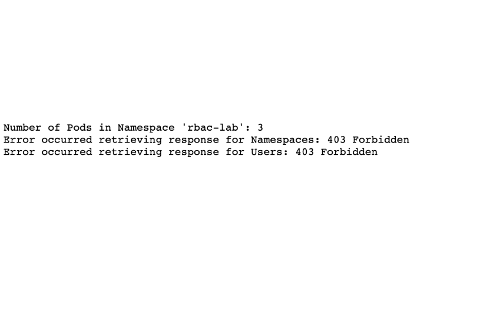

### ClusterRoles and ClusterRoleBindings

With a basic understanding of Roles and RoleBindings as a way to grant access to resources in a single namespace, let’s attempt to resolve the authorization issue that still exists with the application. The next request attempts to list all namespaces. Listing all namespaces is a cluster scoped action and as a result, a Role cannot be used. Instead, a ClusterRole must be created in order to grant access to this resource.

Execute the following command to create a new ClusterRole called namespace-lister that grants access to list all namespaces in the cluster:

`oc create clusterrole namespace-lister --verb=list --resource=namespace` 

Note

If you receive an authorization error, be sure that you are logged into OpenShift using an account with elevated access.
Now, create a ClusterRoleBinding to associate the pod-lister ClusterRole to the default Service Account in the rbac-lab namespace:

`oc create clusterrolebinding namespace-listers --clusterrole=namespace-lister`
` --serviceaccount=rbac-lab:default`

With the ClusterRole and ClusterRoleBinding created, return once again to the application in the web browser and refresh the page. The second query should now display a valid response.

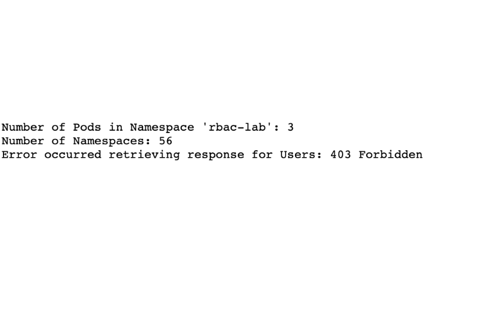

Note

The number of namespaces may differ based on the contents of your OpenShift environment.

## API Groups

For the first few versions of Kubernetes, all of the API resources were located under a single endpoint (v1). To promote the emerging ecosystems of consumers looking to take advantage of the compute power of Kubernetes, the concept of API Groups was created to provide a method to be able to manage their increasing number of API’s that would need to be registered. Instead of putting all of the desired endpoints under v1, the concept of API groups was created where developers could register their own API and have them be managed in a way similar to the core set of endpoints.

Namespaces and Pods are part of the core API group. You may have noticed when creating the Roles and ClusterRoles the inclusion of the apiGroups field as shown below:

    ...
    rules:
    - apiGroups:
    - ""
    resources:
    - pods
    verbs:
    - list
    ...

Notice how the apiGroups field is empty. This indicates that the desired resource is part of the core group. To view all of the API’s that are registered, the following command can be used:

`oc api-resources`

>>
    NAME                                  SHORTNAMES         APIVERSION                                    NAMESPACED   KIND
    bindings                                                 v1                                            true         Binding
    componentstatuses                     cs                 v1                                            false        ComponentStatus
    configmaps                            cm                 v1                                            true         ConfigMap
    endpoints                             ep                 v1                                            true         Endpoints
    events                                ev                 v1                                            true         Event
    mutatingwebhookconfigurations                            admissionregistration.k8s.io/v1               false        MutatingWebhookConfiguration
    validatingwebhookconfigurations                          admissionregistration.k8s.io/v1               false        ValidatingWebhookConfiguration
    customresourcedefinitions             crd,crds           apiextensions.k8s.io/v1                       false        CustomResourceDefinition
    apiservices                                              apiregistration.k8s.io/v1                     false        APIService
    apirequestcounts                                         apiserver.openshift.io/v1                     false        APIRequestCount
    controllerrevisions                                      apps/v1                                       true         ControllerRevision
    daemonsets                            ds                 apps/v1                                       true         DaemonSet
    deployments                           deploy             apps/v1                                       true         Deployment
    ...

The APIVERSION column is a representation of both the version and the API group. Notice how the first few results only include the version v1. This indicates that they are part of the core group while daemonsets are part of the apps group. You can also add the --namespaced flag to limit resources that are either namespaced or cluster scoped.

For the final exercise, we will make use of a resource outside of the core API group to query all registered users.

### Methods of Verifying API Access

So far, we have used the application as an indicator for determining the level of access that the default Service Account has against the OpenShift API. However, there are other options available that can be used ahead of deployment time in order to validate the desired level of access. Through a concept called User Impersonation, requests can be made to appear as if it was originating from another user.

The --as flag can be used to specify the user to impersonate. When combined with the oc auth can-i command, it provides a method for determining whether a user can access an OpenShift API resource. Try this out by first determining whether your current user can list all users in the cluster by executing the following command:

` oc auth can-i list users`

    Warning: resource 'users' is not namespace scoped in group 'user.openshift.io'
    yes

As indicated, since you are logged in with a user with elevated access to OpenShift, you can successfully list all users.

Now, use the User Impersonation capabilities to determine if the default Service Account in the rbac-lab namespace can list users.

`oc auth can-i list users --as=system:serviceaccount:rbac-lab:default`

    Warning: resource 'users' is not namespace scoped in group 'user.openshift.io'
    no

As expected, the default Service Account does not have access. You may also notice that we needed to give the full name for the Service Account. In prior commands when creating RoleBindings and ClusterRoleBindings, we did not need to provide system:serviceaccount as it was assumed through the --serviceaccount flag.

In the final section, we wil create policies to enable the application to be able to query the number of users in OpenShift.

### Creating Policies for Resources Outside the Core API

The process for creating policies for resources outside of the Core API is very similar to those within the Core API. As indicated previously, Users are cluster scoped and with that in mind, the ability to list all users in the cluster requires that a new ClusterRole and ClusterRoleBinding be created.

The first step is to determine the API group that users are part of. Use the oc api-resources command to help determine the API group

`oc api-resources | grep users
users                        `

>>
                          user.openshift.io/v1                     false        User

The first column indicates the resource while the second column indicates the API Group.

Now that we know the API Group users are part of, we can create a ClusterRole called user-lister using the following command:

`oc create clusterrole user-lister --verb=list --resource=users.user.openshift.io`

The combination of the resource name and the API Group is used in the --resource flag.

Finally, create a ClusterRoleBinding to grant access to the default Service Account to the newly created ClusterRole

`oc create clusterrolebinding user-listers --clusterrole=user-lister --serviceaccount=rbac-lab:default`

While we could confirm that the application can now query for users, let’s use User Impersonation to determine ahead of time whether the default Service Account has the appropriate rights.

Execute the following command to impersonate the default Service Account:

`oc auth can-i list users --as=system:serviceaccount:rbac-lab:default`

    Warning: resource 'users' is not namespace scoped in group 'user.openshift.io'
    yes

With access verified, navigate to the application in the web browser and refresh the page to confirm all of the queries against the OpenShift API return valid results.

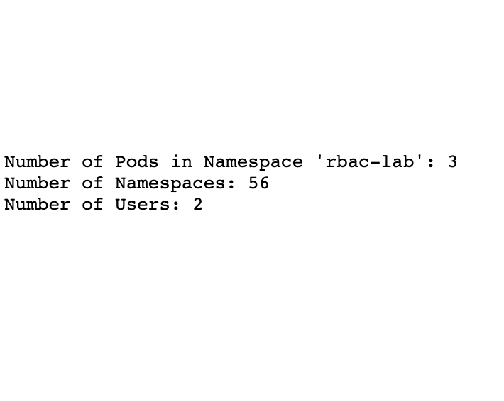

By completing this lab, you should have a better understanding of the key components of OpenShift’s Role Based Access Control and how these capabilities provide for a more secure operating environment.

***

# Lab 4: Implementing DevSecOps to Build and Automate Security into the Application using Red Hat Advanced Cluster Security

## Lab Objective

The goal of this lab is to learn how to build a secure software factory that orchestrates a combination of different security tools. With the advent of DevSecOps, security is put front and center - it is addressed in terms of people, processes, and technology. Security tools are integrated right into the build process and we could easily break the build if security requirements are not met with the security gates that we build into the CI/CD pipeline.

## Introduction

The benefits of DevOps and Continuous Integration / Continuous Delivery (CI/CD) have been demonstrated with great success over the years. Organizations have always sought to do more with less. Security was treated as an add-on to the end of the software delivery process in many cases, and it often delayed software delivery.

The industry recognized that this had to change. Organizations must continue to meet contractual and regulatory obligations as well as internal security standards, but need to accelerate software delivery to capitalize on opportunities. To enable organizations to meet these standards and deliver at the speed of DevOps security has faced the choice of becoming irrelevant or molding to modern software delivery practices.

Security is critical to deliver software quickly and has become a metric of software quality, so there was a push to include “Sec” in “DevOps.” With the advent of DevSecOps, Shift Left is a practice intended to find and prevent defects early in the software delivery process. Security tools are integrated directly into the build process. As a result, the CI/CD process can move faster and reduce the length of time to delivery while still continuously improving the quality of each release.

This lab exercise will focus on some of technologies used to implement automated security compliance controls within a typical CI/CD application pipeline.
A number of tools have been installed and pre-configured to support the DevSecOps pipeline. Most of these tools are running containerized within the Red Hat OpenShift cluster. Here is the pipeline we will be stepping through during our lab:

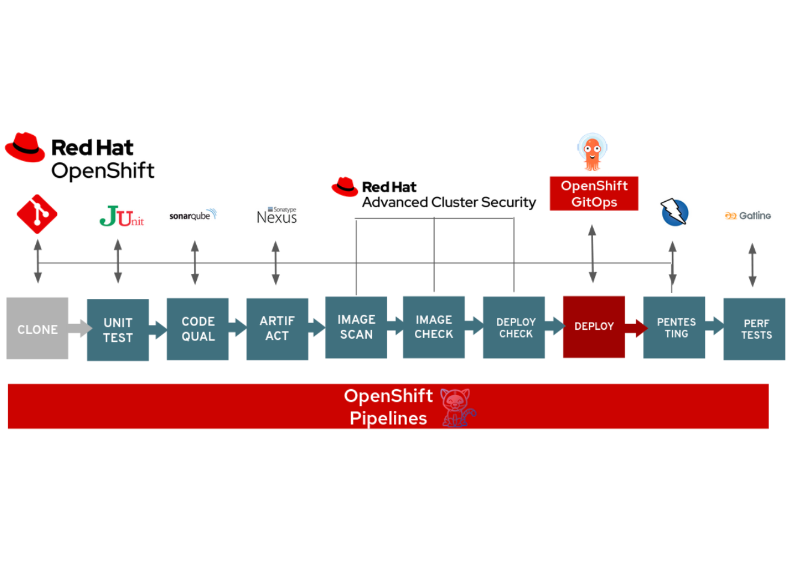

In our DevSecOps CI/CD pipeline, we will be using several technologies such as:

    OpenShift Pipelines based on Tekton

    OpenShift GitOps based on ArgoCD

    Red Hat Advanced Cluster Security for Kubernetes

    OpenShift Container Registry

    SonarQube

    Nexus

    JUnit

    Gogs

    Git Webhook

    Gatling

    Zap Proxy

## Before you start

The information from the instructor will be used in this lab:

>Access to RHEL 8 VM (bastion) with username and password

>OpenShift Console URL

>OpenShift API server

>OpenShift admin user password

## User Requirements

>Up-To-Date Browser: Chrome and Firefox recommended

>Command-line with ‘oc’ tool is included in the bastion VM that comes with the lab.

>>SSH into the assigned VM similar to the below command:

>> `ssh lab-user@bastion.GUID.sandbox####.opentlc.com`

>>To check if the oc command-line utility is available, open the terminal and run the following command:

>> `oc version`

>>To get the console URL from command-line:

>>`oc login -u admin api.cluster-{GUID}.{GUID}.sandbox###.opentlc.com:6443`

API server information for ‘oc login’ can be found in the Before You Start.

>>Alternatively, if we want to setup oc client on our laptop, perform the following steps:

>>Log in to the OpenShift console. OpenShift console admin user password information is provided by the instructor. Select the question mark in the top right corner and select “Command Line Tools”

>>Download the oc command-line tool for the operating system of your choice.

>>Move the oc command-line tool to the system executables location for simplicity of access throughout the exercise.

For example, on Macbook, run the command

`mv <insert-download-path> /usr/local/bin /usr/local/bin/`

>>Internet access to the lab environment

>>Internet access to GitHub

## Lab 4.1 Continuous Integration

This first module will run an OpenShift Pipeline and let us explore the steps in a sample secure pipeline.

In this lab, we will learn how to start the Tekton pipeline and how to use the tasks to integrate the security and gitops tools within the development lifecycle.

1. There are three ways to start the pipeline:

Option 1: Use Developer UI to start

>Browse to the OpenShift Console URL in the browser

>Log in to the console using the provided credentials

>If we are not already in the Developer Perspective, select Developer to switch to the developer console in the top left corner.

>Navigate to the “ocp-workshop” project
Click 'Pipelines' on the left menu to view all pipelines

>Click onto the “petclinic-build-dev” pipeline

>From the top right corner, click “Actions” → “Start” - a "Start Pipeline" screen will pop up

>Under “Workspaces”, select PVC and then choose the PVC petclinic-build-workspace as the shared storage path that the pipelines will use at runtime. Under “maven-settings” select Config Map and choose “maven-settings” as the Config Map

>Click Start

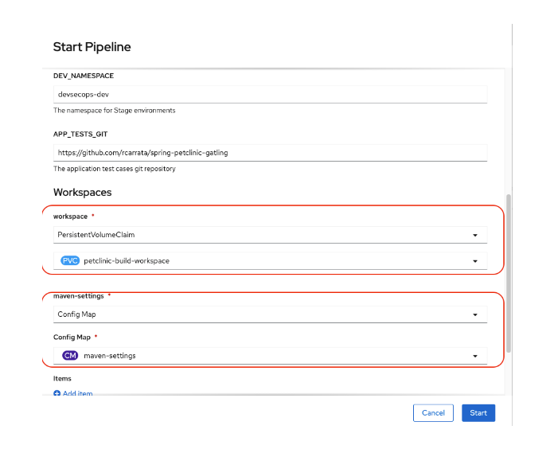

Option 2: Use Command line to start the pipeline The command-line is a convenient way to start the pipeline while testing, and it is a way to simulate a PR or push to git and trigger the pipeline. It is for users who prefer the CLI to start the pipeline.

>Run:

>`oc create -f https://raw.githubusercontent.com/RedHatDemos/SecurityDemos/master/2021Labs/OpenShiftSecurity/documentation/labs-artifacts/pipeline-build-dev-run.yaml -n ocp-workshop`

Option 3: When new code is pushed to the git repo, it will also trigger the pipeline to start. In this lab, git repo is Gogs. The steps below are for pushing code via the “Gogs” git repo. This option may be the most popular from a developer perspective. The pipeline starts from a PR or a push into the git repo and the webhook automatically starts the pipeline.

>From the Dev console, click Search on the left nav menu.

>Type 'route' and click Route from the list.

>Click the Gogs route to open the Gogs repo URL:

>Click on the Sign In, to log in with the gogsadmin credentials:

>>
    User: gogsadmin

    Password: openshift

>Select the spring-petclinic repository inside of the gogsadmin account:

>Click into the README.md, click in Edit this file and introduce a change:

> Commit the change that we introduced into the README.md:

[Note] This event based integration is only for demo purposes. Usually direct code push to master is not recommended, and it’s a Pull / Merge Request from another branch (such as develop) that is used instead.

>The pipeline will be triggered automatically, please skip to step 6 of this lab to see the Pipeline Runs console.

2. Open the browser using the provided OpenShift console URL.

3. Log in to the console using the provided credentials.

4. Click to Developer to switch to Developer’s console.

5. Make sure the ocp-workshop project is selected.

6. Click Pipelines on the left menu to view all pipelines.

7. Click onto Pipeline petclinic-build-dev and click onto the Pipeline Runs tab.

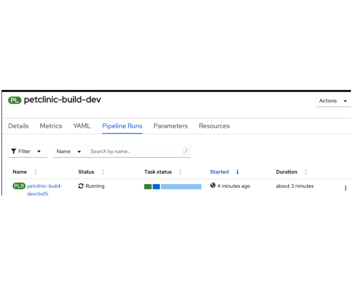

8. Click onto the Pipeline Run.

Please see the Pipeline Run as shown below when it starts.

The pipeline run will fail at step “image-check” in the pipeline run. This is due to an Important severity level vulnerability in the image detected by a pipeline gate policy, stopping the deployment.

This vulnerability has to be fixed for the pipeline to complete successfully - we will do it in the next module. Here is what a successfully completed pipeline run looks like.

The next module Lab 4.2 will walk through what’s happened and how to resolve it securely.

[Note] In addition to triggering a pipeline run manually, every push to the spring-petclinic Git repository on the Gogs server kicks it off via configured Pipeline triggers.

9. Explore the pipeline! Once the pipeline is started, we can click on each detailed step to explore its logs. We’ll direct some of the explorations in the next few steps.

>Source Clone - app source code is pulled from the Git (Gogs) server installed in this Lab.

[Note] Files persist between steps in the pipeline via workspace (PVC) that is pre-defined in the pipeline.

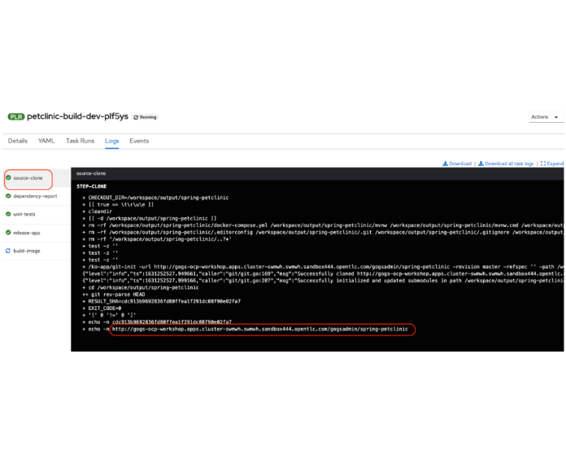

Copy the Git repo URL. Open a browser tab to explore the code

The URL takes us to the Gogs git repo as shown below.

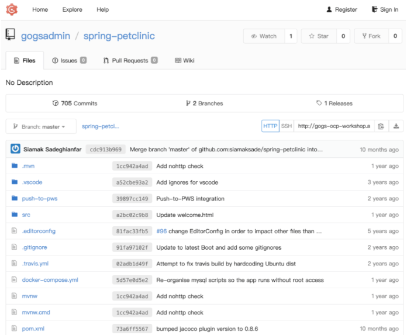

Click onto gogsadmin - there are 2 repositories for this Lab.

The credentials for gogsadmin user are:

    User: gogsadmin

    Pass: openshift

>Dependency Report is a step in the pipeline that creates a report of the app dependencies from the source code and uploads it to the report server repository.

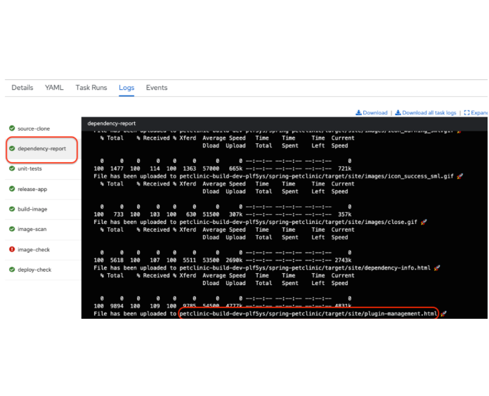

Let’s look at the report!

>From the dev console, click Search on the left nav menu

>Click Resources, type route, and click Route from the list

>Click on the reports repo link

>Click onto the petclinic-build link from the page

> Continue to click on spring-petclinic → target → site

> Click on the Dependencies from the page. We may examine the details from that page by scrolling down

> Unit tests task is executed in parallel with dependency report.

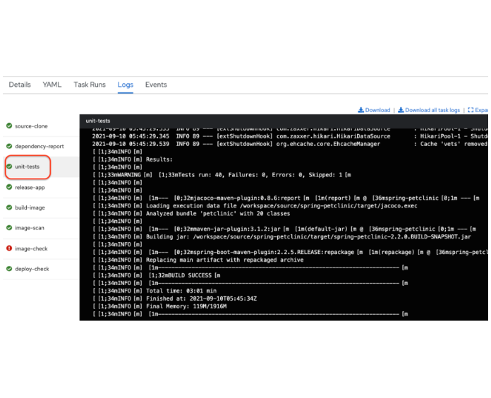

10. Release-app is where the application is packaged as a JAR archive and released to Sonatype Nexus snapshot repository.

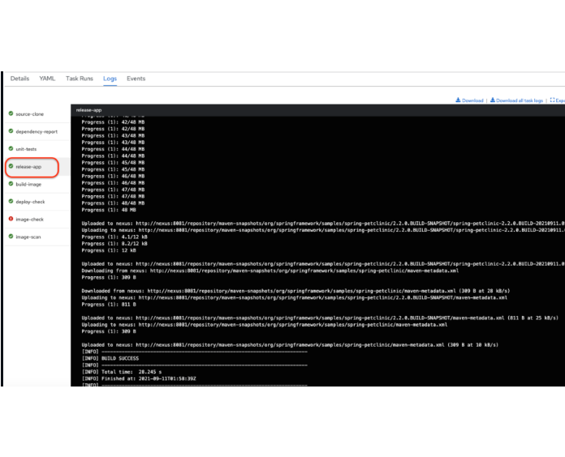

11. Build-image step is when a container image is built in DEV/QA environments using S2I, pushed to OpenShift internal registry, and tagged with spring-petclinic:[branch]-[commit-sha] and spring-petclinic:latest tags.

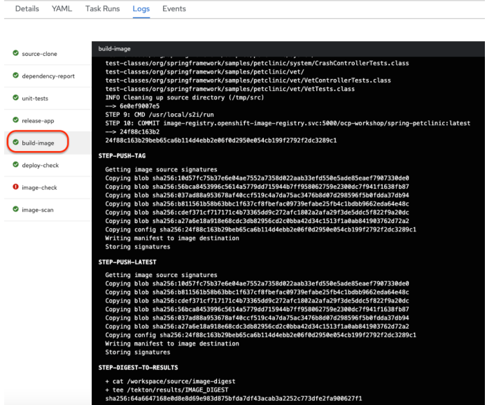

## Lab 4.2 DevSecOps - Integration with Advanced Cluster Security

Red Hat Advanced Cluster Security (ACS) for Kubernetes controls clusters and applications from a single console, with built-in security policies.
First-generation container security platforms focus on the container. ACS’s focus on Kubernetes helps DevOps and Security teams operationalize security, with a Kubernetes-native architecture that leverages K8s declarative data and built-in controls for richer context, native enforcement, and continuous hardening. In addition, ACS focuses on Kubernetes helps DevOps and Security teams operationalize security, simplifying the process of protecting the cloud-native application stack.

In this lab, we will learn how ACS integrates into the CI/CD process. ACS not only simplifies that process but provides visibility to the Security team in our organization. Using roxctl and ACS API, we integrated several additional security steps into our DevSecOps pipeline:

1. The image scan step uses the ACS Scanner to scan the image built and pushed into internal repository in the previous step.

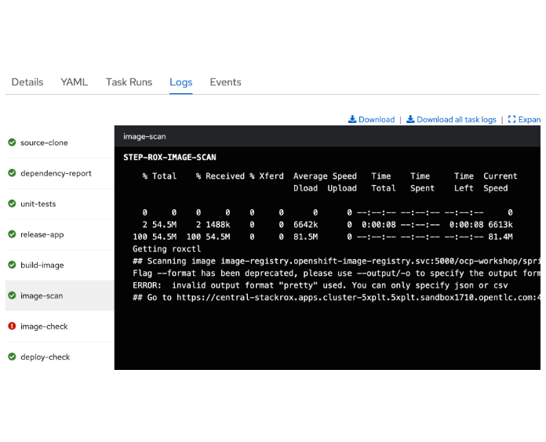

The error below in the log is caused by the pretty output format parameter that is deprecated.

ERROR: invalid output format "pretty" used. You can only specify json or csv

To change the format you can do the steps below.

>Click Pipelines on the left menu

>Click onto the petclinic-build-dev pipeline

>Select Actions → Edit Pipeline

>Click onto the image-scan task and use csv for output format instead of pretty

>Click Save

>Optionally select Actions → rerun and you will see the actual output of the image-scan.

In the log of this step, there is a URL link to the image scan in ACS.

[Note] If we see a security certificate warning proceeding to that link, ignore it.
Copy and paste URL into another tab in order to get more information about the scanned image - it would open ACS Central login screen Enter the following information:

    User: admin

    Pass: stackrox

The URL takes us to Vulnerability Management. Here is an overview of the vulnerabilities (CVEs) found in this image:

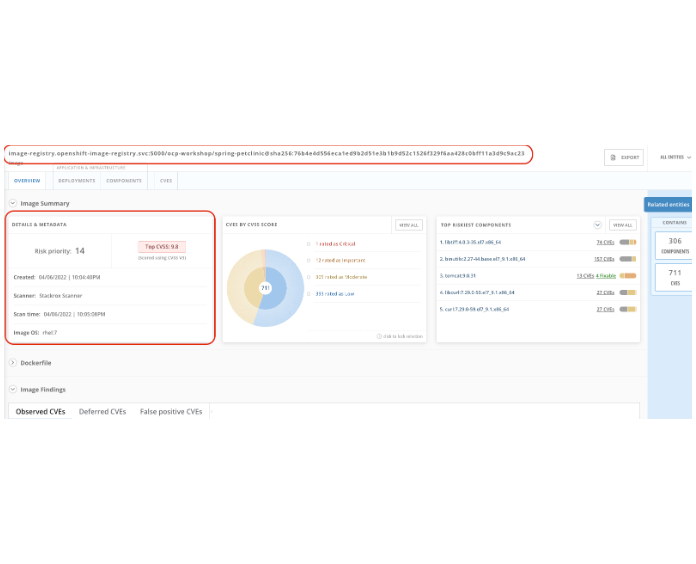

>Under the Deployment tab The ACS tool is aware of if this image is deployed. Since the first pipeline didn’t pass all of its gates and image was not pushed, at first there will be no deployments displayed.

>Under the Component tab This is a view of all of the components in this image. It lists relevant information such as the number of CVEs that can be fixed with an upgrade of the component, top CVSS score associated with any of the CVEs in the component, and other deployments that include each component.

For example, if we click on the tomcat 9.0.31 component, we will see the details of the component as shown below. This page shows the risk priority, the CVE’s information, the location of the component, and the version of the component to upgrade to in order to remediate the CVE.

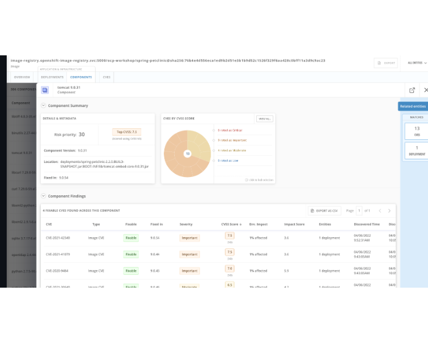

>Click “X” on the top right to go back

>CVEs tab presents a view of all vulnerabilities of the image

>Go back to the Overview tab, and scroll down to the Image findings section, we will see the fixable CVEs. These are CVEs where ACS knows there are fixes available.

>Click '>' to expand Dockerfile section above the Image Findings section, the detailed image components and related CVEs are shown per each step, per the ACS CVE database.

Feel free to continue to explore ACS before continuing to review the pipeline. Understanding security checks and tool capabilities are a key part of this lab and can help raise the knowledge of a secure software delivery pipeline.

Now, go back to OpenShift Developer console.

2. The Image Check step of the pipeline

[Note] The build-time violations of the different security policies defined in ACS.

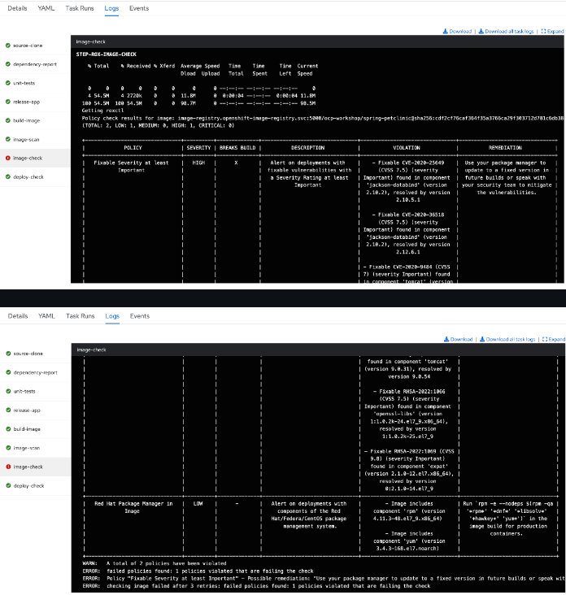

This step checks build-time and deploy-time violations of security policies defined in ACS for any deployment that uses this image. Due to security policy violations, this pipeline fails at this task because we set security Policy enforcement in ACS. Scanning images is critical to prevent highly vulnerable containerized applications from deployment.

3. Deploy-check shows the violation of the policies in the log. The log shows the violations, but it did not fail at this task because the deployment enforcement is not on in this example. We will explore more on the policy in the later lab.

[Note] These 3 steps (deploy-check, image-check, and image-scan) are executed in parallel to save time in our DevSecOps pipeline.

4. If image-check fails, go to the pipeline run and click image-check. The bottom of the log shows Error: failed policies found: 1 policy violated that are failing the check. The reason for the error is because ACS enforces the policy from building and deploying if a violation occurs. The pipeline integrates ACS via the roxctl CLI in Tekton pipeline tasks.

When an image violates the policies, the best practice is to fix the code and execute the pipeline until it passes the checks. The logs reported the list of violations and remediation. Developers can take the information from the image-check task’s log and make changes accordingly. When the fix is checked into Git, the pipeline will be triggered. We have prepared the bonus exercise for fixing the image. If we would like to continue to test other tasks on the pipeline, we can add an exception to the policy to exclude the spring-petclinic. Adding an exception to a policy can be useful when developers need to fix the code, and the CI process needs to continue the testing.

[Note] Please be aware that fixing the image source code to remove such violations will be the recommended approach.

Assuming that we will add an exception to bypass the policy for spring-petclinic image build.

>When we inspect the log from the image-check task, we will find the below message which caused the failure:

>>
    ✗ Image image-registry.openshift-image-registry.svc:5000/ocp-workshop/spring-petclinic@sha256:ece54d2923654c36f4e97bc0410f5c027871c5b7483e977cfc6c2bd56fef625d and 'ERROR: Policy "Fixable Severity at least Important"'

>Click waffle icon to get the console links → select Red Hat Advanced Cluster Security For Kubernetes as shown below.

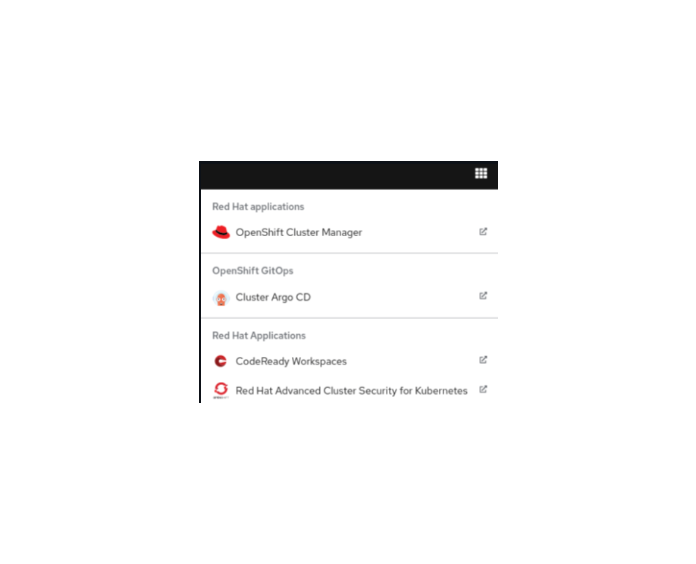

>You will be prompted to log in to the ACS console → click Advanced → Proceed to central-stackrox.apps.cluster…​ link to proceed.

>Enter the following login credentials:

    User: admin

    Pass: stackrox

Click Login - you should land on the ACS page as shown below.

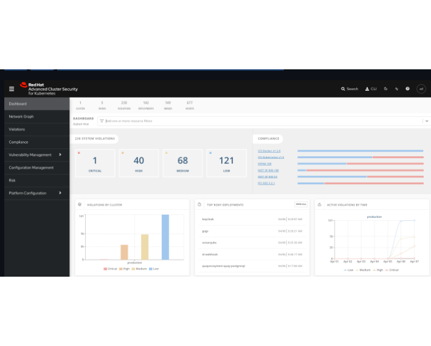

>Click on the top left scroll bar → click Platform Configuration → select Policies

> Under Policies, put the policy name Fixable Severity at least Important in the search field and hit Enter. The policy will list as the result.

> Click onto Fixable Severity at least Important to open Policy details page. The Policy page allows Edit, Clone, Export and Disable policy under Actions. Click 'Edit policy' under Actions. Developers can use the information in the guidance to fix the image. The lifecycle stage information is where the policy enforcement takes place. Since the enabled policy is violated, it will not pass the Build and Deploy stages in the pipeline.

>Click Next on Policy Details

>Click Next on Policy Behavior

>Click Next on Policy Criteria in order to get to the Policy Scope section to specify the image to be excluded from scanning

>In the Exclude Images section, type the following to filter the options in the Excluded Images (Build Lifecycle only) list:

`image-registry.openshift-image-registry.svc:5000/ocp-workshop/spring-petclinic`

>Select the `Create "image-registry.openshift-image-registry.svc:5000/ocp-workshop/spring-petclinic" option.

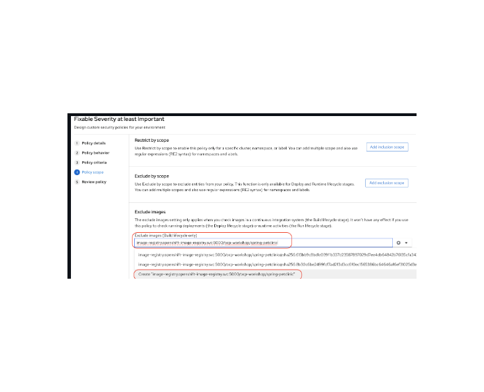

>Click Next

>Please review Policy Summary before clicking Save

Now, the updated Fixable Severity at least Important policy with excluded image is shown below:

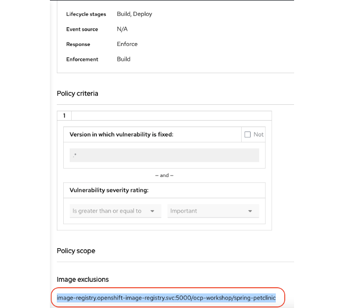

Switch back to the OpenShift Developer console, and select the failing Pipeline on the nav under “ocp-workshop” project

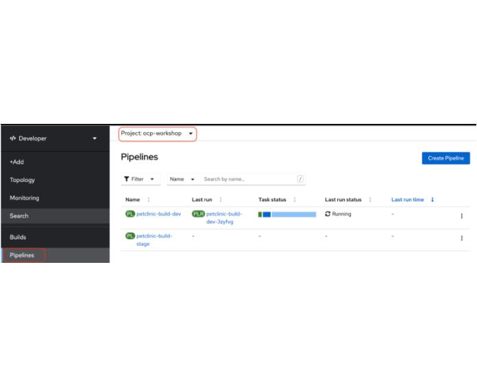

Rerun the pipeline:

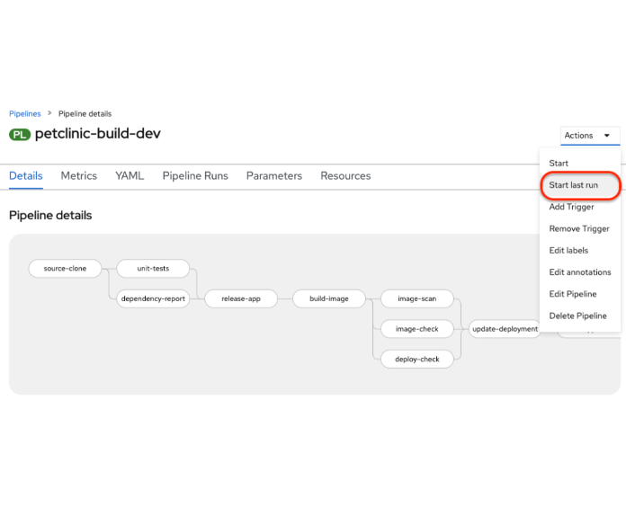

Click onto the Pipeline Runs tab and select the one just started - it should now complete successfully

[Notes]: There still are warnings for other, non-critical, ACS Policy violations in the image-scan step, but they don’t block the pipeline from completion

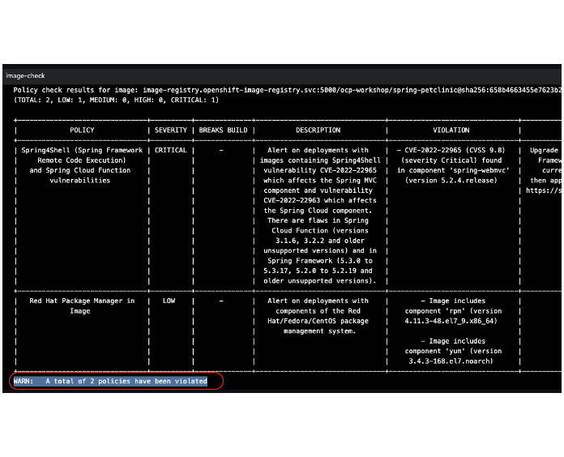

If you finish the bonus lab to fix the source image vulnerability, go back to the above Policy and remove the excluded spring-petclinic image from there.

Kubernetes kustomization files are updated in the update deployment step with the latest image [commit-sha] in the overlays for dev. This will ensure that our applications are deployed using the specific built/tagged image in this pipeline.

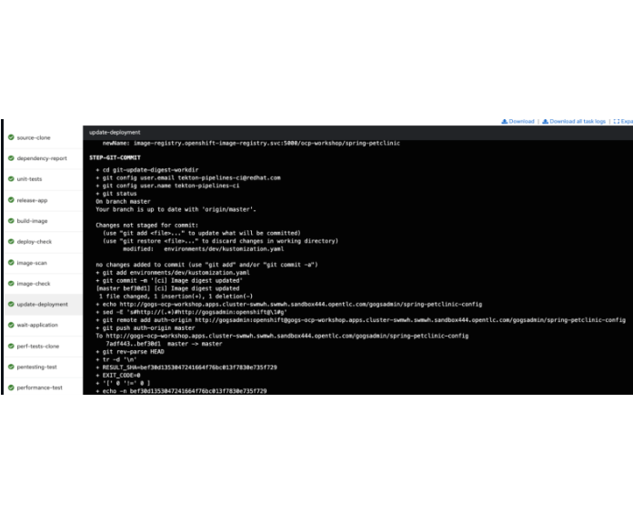

## Lab 4.3 Continuous Application Delivery Using GitOps

**GitOps** is a declarative way to implement continuous deployment for Cloud-native applications. We can use GitOps to create repeatable processes for managing OpenShift Container Platform clusters and applications across multi-cluster Kubernetes environments. GitOps handles and automates complex deployments at a fast pace, saving time during deployment and release cycles.
The GitOps workflow pushes an application through development, testing, staging, and production. GitOps either deploys a new application or updates an existing one, so we only need to update the repository; GitOps automates everything else.

**ArgoCD** continuously monitors the configurations stored in the Git repository and uses Kustomize to overlay environment-specific configurations when deploying the application to DEV and STAGE environments.

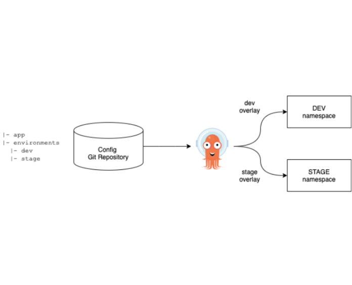

1. The ArgoCD application syncs the manifests in our Gogs git repositories, and applies the changes automatically into the namespaces defined:

A. Click on the waffle icon on the top to get to the console links and select “Cluster Argo CD”

B. The link redirects to the Argo CD login. If it is the first time logging in to Argo CD, please click Advanced → Proceed to openshift-gitops-server-openshift-gitops.apps… link.

C. In order to be able to log in as an "admin" user, please first retrieve its password by running the command as shown below.

`oc get secret/openshift-gitops-cluster -n openshift-gitops -o jsonpath='{.data.admin\.password}' | base64 -d`

D. Once logged in, the applications are listed on the Argo CD console as shown below.

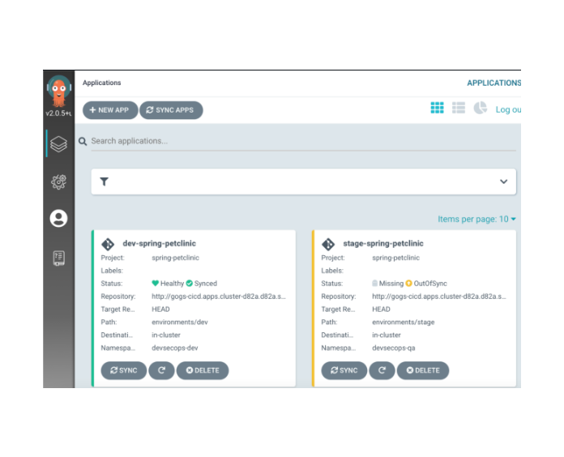

E. Click onto dev-spring-petclinic to access the application.

2. ArgoCD will deploy every manifest that is defined in the branch/repo of our application. The application shows “Synced”.

A. Click **App Details** to view the details of the dev-spring-petclinic application.

B. The details above show the namespace where the application is deployed. Back to the OpenShift Dev console, click Topology on the left navigation menu under devsecops-dev project. Click the arrow to access the application URL.

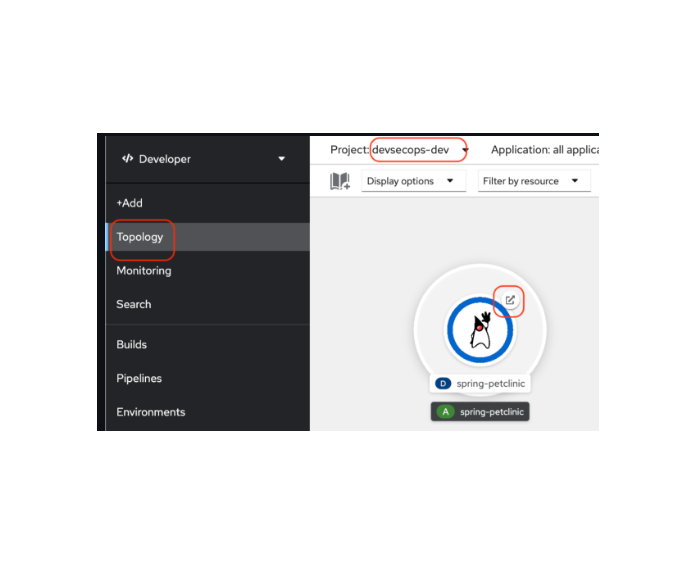

Application shows as below.

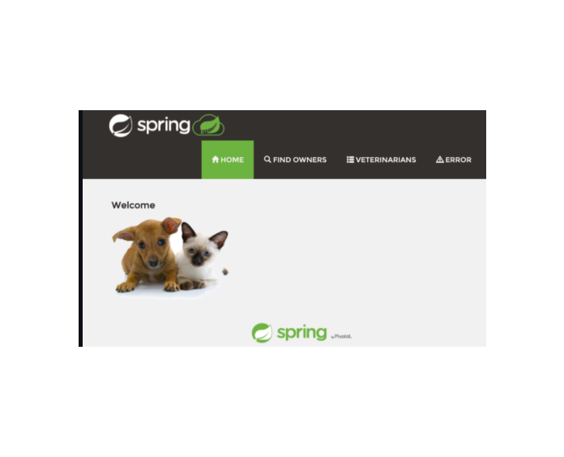

C. Go back to the Argo CD console. Click Applications on the top left.

[Note] The namespace for stage-spring-petclinic is set to devsecops-qa.

D. Click stage-spring-petclinic

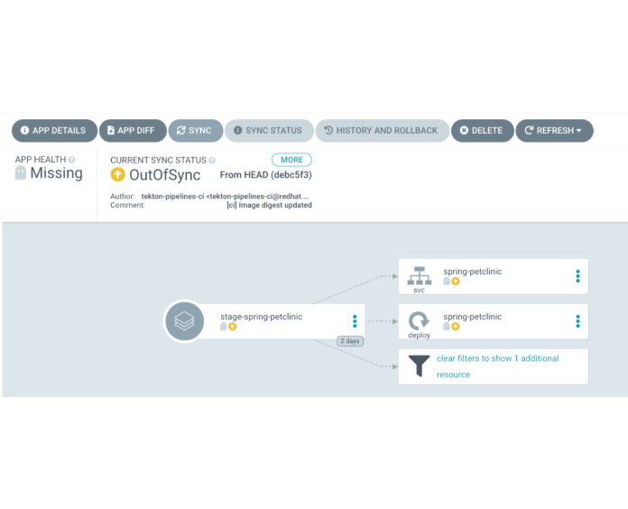

E. Click Sync on the top menu to deploy the application to devsecops-qa namespace and wait until “Synced” as shown below.

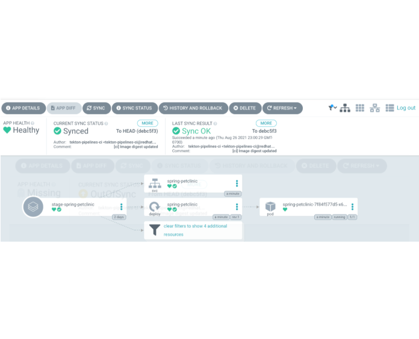

F. Back to the OpenShift Dev console, click Topology on the left navigation menu under devsecops-qa project. Click the arrow to access the application URL.

G. The application is now deployed to the devsecops-qa project as shown below:

## Lab 4.4 Post CI - Dynamic Application Security and Testing (DAST)

Dynamic application security testing (DAST) is designed to detect conditions indicative of a security vulnerability in an application in its running state. DAST has an important role in helping to identify vulnerabilities in applications during production. Running DAST penetration tests enables us to find those vulnerabilities before an attacker does! In this lab, ZAP is used to perform application security testing as an example. Performance tests and penetration tests start in parallel after the application is promoted from Dev to QA.

1. Our CI in Openshift Pipelines waits until the app is fully synced via ArgoCD (Wait Application step) and all related resources are deployed

A. Go to the successful pipeline run, and examine the step wait-application

B. Click onto the step, the log is shown below.

This step authenticates into an ArgoCD instance and initiates the synchronization process for 'dev-spring-petclinic' application from Git repo (gogs) to the target project in the OCP cluster.

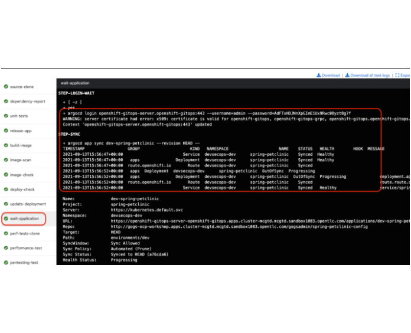

2. Click on the pipeline the step perf-test-clone

The performance tests are cloned (Performance Tests Clone) into our pipeline workspace.

3. Click onto step pentesting-test

The pentesting step (Pentesting Test) is executed by the web scanner OWASP Zap Proxy using a baseline to check the possible vulnerabilities. A Zap Proxy report is uploaded to the report server repository. See the result from the bottom of the log.

4. A performance report is uploaded to the Report server repository.

Click Route on the left navigation, click reports-repo route location.

B. The link has the name that corresponds to the name of the PipelineRun.

C. Please click on the link with the same name as the PipelineRun. A similar link is shown below.

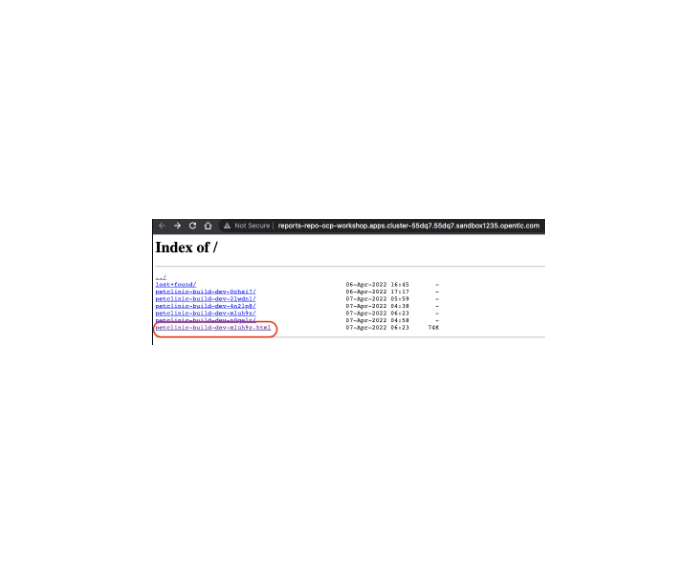

D. Go to petclinic-build-dev-XXXXXX.html under the route location

5. In parallel, the performance tests are executed using the load tests via Gatling. Click “performance-test” from the pipeline run.

A. Scroll down to see the report location

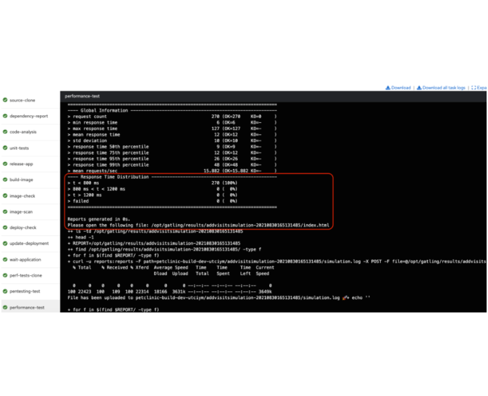

B. Go back to the report repo location:

C. Click on the link that matches the name of Pipeline Run, then select the link corresponding to the "addvisitsimulation" performance test that is also shown in the performance-test task log.

D. Please see the result of the performance test page similar to the image below.

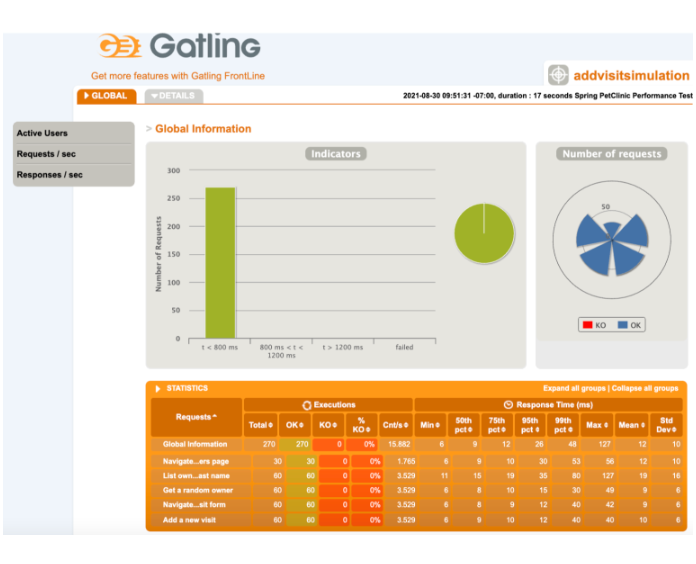

***

## Lab 4.5 ACS Security Policies and CI Violations

In this demo, we can control the security policies applied to our pipelines, scan the images, and analyze the different deployment templates used to deploy our applications.
We can enforce the different Security Policies in ACS, failing our CI pipelines if a violation of this policy appears in each step of our DevSecOps pipelines (steps “image-check”, “image-scan”, “deploy-check”).

>Click on the waffle icon and select Red Hat Advanced Cluster Security for Kubernetes

>Log in using credentials admin/stackrox to ACS console.

>Click Platform Configuration → Policies

Security Policies can be defined at the BUILD (during the build/push of an image), or at the DEPLOYMENT level (controlling deployment of an application).

>Click on the Red Hat Package manager in Image policy

For example, this Security Policy checks if an RH Package Manager (dnf, yum) present in an application Image and will FAIL the pipeline if it detects that an Image built contains any RH Package Manager.

>The policy details can be modified. Also, the lifecycle stages are defined in the policy and other properties. The enablement of Policy options is where the user controls CI pass/fail conditions based on policy

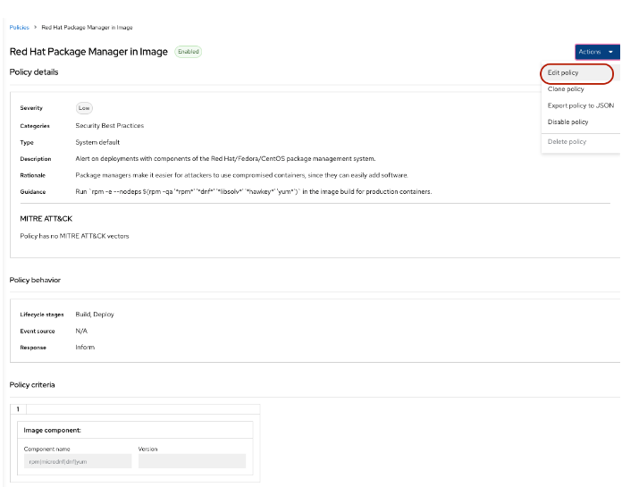

>Click Actions → Edit policy

>Click Next on Policy Details

>Select Inform and enforce under Response method

>Select Enforce on Build for Build

>Click Next 3 times and Save This policy enforcement ensures that DevOps team has full control of SDLC: no image is pushed into the Image registry or deployed to the cluster that fails to comply with defined Security Policies.

## Bonus Exercise for Lab 4.2: Fixing the source image

To show a complete DevSecOps demo and show the transition from a "bad image" to one that passes the Build security policy check, we can update the Pipeline task of the image build and fix the image source. In this example, we will be enabling the Red Hat Package Manager in Image policy in ACS, which will initially fail our pipeline at the image-check as both yum and rpm package managers are present in our base image.

1. Add an exception to bypass the violation in the Fixable Severity at least Important policy as we did in the previous section.

2. Enable enforcement of the Red Hat Package Manager in Image policy:

A. Go to Platform Configuration → Policies

B. Search for Red Hat Package Manager in Image policy

C. Click onto the Red Hat Package Manager in Image policy

D. Click Actions → Edit Policy

E. Click Next

F. Select Inform and enforce in Response method

G. Ensure selection of Enforce on Build in Build under Configure enforcement behavior section

H. Click Next until reaching Review policy page

I. Click Save (if any modification apply)

J. Go to the OpenShift Dev UI, click Pipelines on the left → click petclinic-build-dev pipeline → click Actions on the top right corner → select Start last run to re-run pipeline with same parameters

K. Check and confirm that pipeline fails on the image-check step as the built image has the "rpm" and "yum" package managers installed. Notice the suggestion from the image-check step:

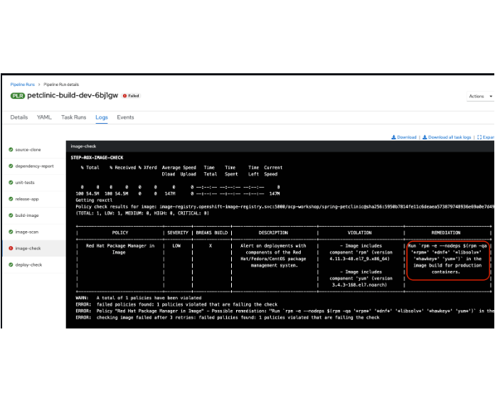

L. We will effectively update the image following this remediation suggestion.

3. Instead of updating the s2i-java-11 Tekton pipeline task that actually builds the image, we are replacing it with a corrected version.

A. From the OpenShift Administrator UI, make sure the ocp-workshop project is selected before going to Pipelines → Tasks and delete the s2i-java-11 task.

B. Or from the pipeline Tekton cli

`tkn task delete s2i-java-11`

4. Apply the new update task from the command terminal:
>>
    kubectl apply -f https://raw.githubusercontent.com/RedHatDemos/SecurityDemos/master/2021Labs/OpenShiftSecurity/documentation/labs-artifacts/s2ijava-mgr.yaml --namespace=ocp-workshop

or, using OpenShift CLI:

    oc apply -f https://raw.githubusercontent.com/RedHatDemos/SecurityDemos/master/2021Labs/OpenShiftSecurity/documentation/labs-artifacts/s2ijava-mgr.yaml -n ocp-workshop

5. Re-run the pipeline that previously failed - the deployment now succeeds, congratulations to the developers!

6. The pipeline image-check task run result will be similar to the one below.

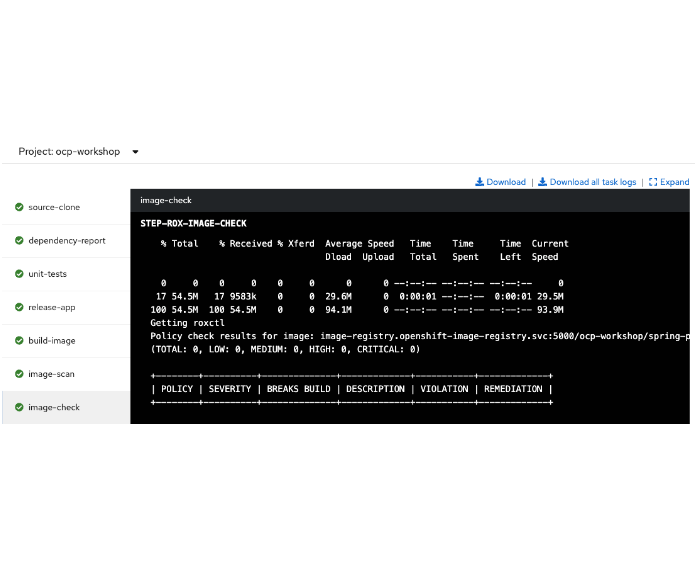

[Note] Please examine the contents of https://raw.githubusercontent.com/RedHatDemos/SecurityDemos/master/2021Labs/OpenShiftSecurity/documentation/labs-artifacts/s2ijava-mgr.yaml file for more details on how the image was fixed. We have added a step to the build task, using buildah CLI tool to remove the problematic package managers from the image (search for "rpm" or "yum" in the file).

## Bonus Exercise: Defer CVEs or Mark as "False Positive"

 If we just want to snooze policy violations for particular CVEs instead of fixing problematic images and/or adding exceptions for build/deploy stages (e.g. to be able to test a pipeline end-to-end). ACS allows users to temporarily disable CVEs violation for a period of time.

[Note] Deferring CVEs would disable violation notifications for those CVE for ALL policies that include it.

For this lab, we can defer the CVEs that cause the image-check to fail and continue to build the pipeline. We will see that image-check task is reporting some Fixable violations information from the pipeline task log:

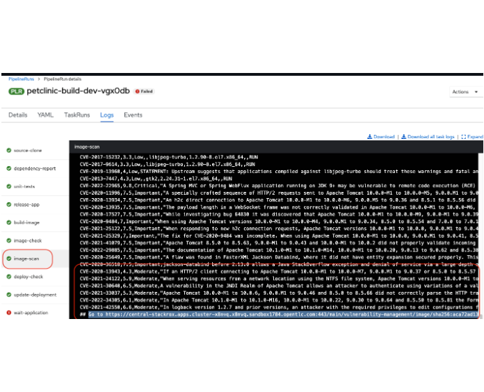

In some situations, we may want to defer triggering of certain CVEs for a period of time. Here are the steps:

1. Navigate to the ACS console via the waffle icon and click on the Red Hat Advanced Clustered Security for Kubernetes link. Click Vulnerability Management left menu and click on the CVEs button on the top.

2. Look for the detected CVEs and request Deferral by selecting the duration needed (Until Fixable, 2 Weeks, 30 Days, 90 Days, Indefinite).

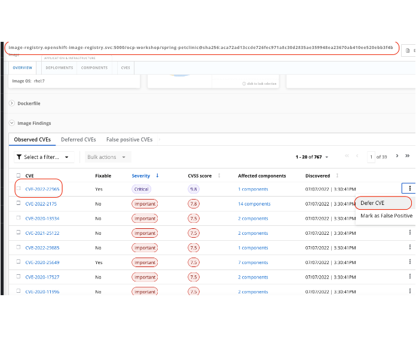

A. Submit a request for selected Deferral period or marking as False positive (exclusion of specified CVEs from policy violations if determined as such)

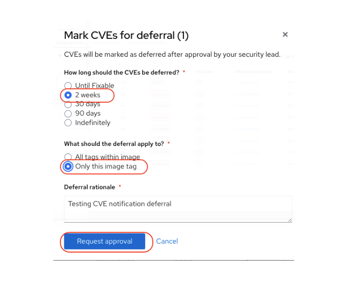

B. Upon approval by your Security lead (via Risk Acceptance menu), policy violations for selected CVE will be deferred for selected period of time or permanently, depending on request

## Bonus Exercise: ACS Notifications

ACS Central can be integrated with several Notifiers for alerting DevOps users when certain security events occur in managed clusters. In our Lab, we integrate with Slack to receive notifications when some Policies are violated to have more useful information:

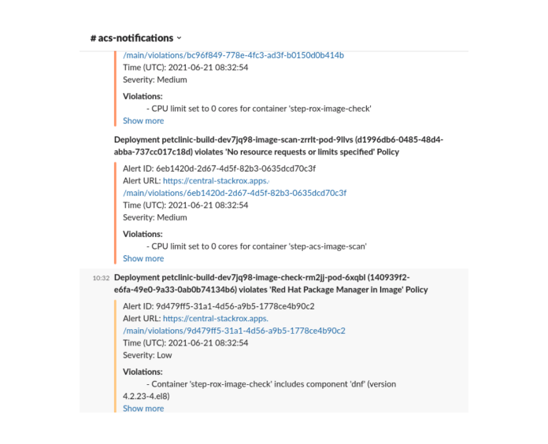

These policy notifications can be configured for each system policy enabled in our ACS Central, so we can create our own notification baselines in order to have only the proper information received in our systems.
Here are the steps to set up slack integration with ACS based on the official Integrate with Slack documentation in ACS.

1. Create a Slack App, enable Incoming Webhooks and get the Webhook URL

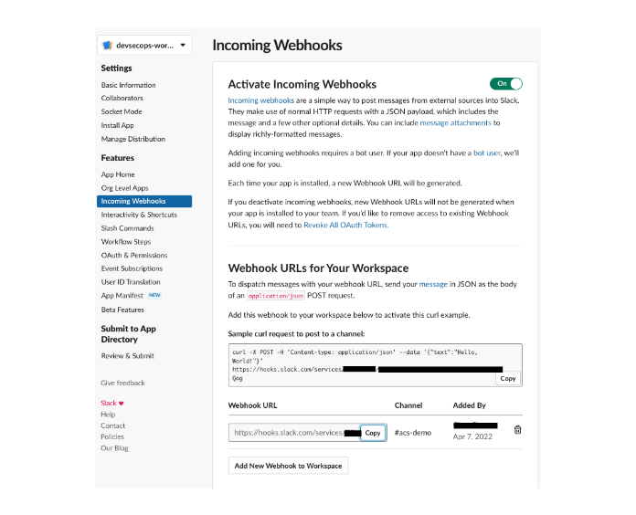

2. Select Platform Configuration → Integration

3. Click Slack and Click New integration

4. Enter Slack App channel information in the form below.

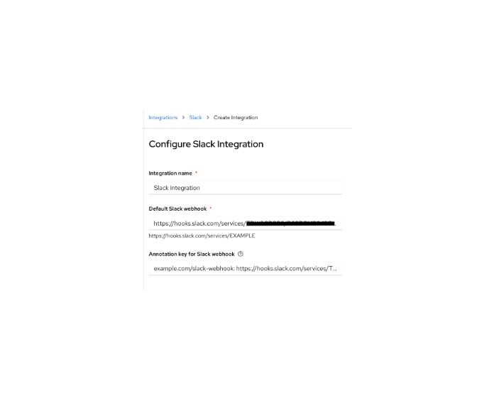

5. Enable the Notifications in the system policies: Select Platform Configuration → Policies

A. Select a Policy → Click Actions → Edit policy

B. Select checkbox next to Slack Notifier in the Attach Notifiers section of Policy details screen, click Next a few times and Save policy.

C. You should be getting notifications when this policy violation is triggered

## Lab Troubleshooting Tips

### Code Analysis Failures

> Issue: Sometimes Code Analysis raises an error when mvn is running the maven install 'sonar:sonar':

    [[1;31mERROR[m] Failed to execute goal+
    [32morg.apache.maven.plugins:maven-compiler-plugin:3.8.1:testCompile[m [1m(default-testCompile)[m on
    project [36mspring-petclinic[m: [1;31mCompilation failure[m
    [[1;31mERROR[m]
    [1;31m/workspace/source/spring-petclinic/src/test/java/org/springframework/samples/petclinic/service/ClinicServiceTests.java:[30,51]
    cannot access org.springframework.samples.petclinic.owner.Pet[m
    [[1;31mERROR[m] [1;31m  bad class file:
    /workspace/source/spring-petclinic/target/classes/org/springframework/samples/petclinic/owner/Pet.class[m
    [[1;31mERROR[m] [1;31m    class file contains wrong class:
    org.springframework.boot.test.autoconfigure.orm.jpa.DataJpaTest[m
    [[1;31mERROR[m] [1;31m    Please remove or make sure it appears in the correct subdirectory of the
    classpath.[m
    [[1;31mERROR[m] [1;31m[m
    [[1;31mERROR[m] -> [1m[Help 1][m
    [[1;31mERROR[m]

>Resolution: Just rerun the pipeline and will succeed without changing anything additional. The results will succeed afterward:

    [[1;34mINFO[m] Analyzed bundle 'petclinic' with 20 classes+
    [[1;34mINFO[m] Analyzed bundle 'petclinic' with 20 classes
    [[1;34mINFO[m]
    [[1;34mINFO[m] [1m--- [0;32mmaven-jar-plugin:3.1.2:jar[m [1m(default-jar)[m @
    [36mspring-petclinic[0;1m ---[m
    [[1;34mINFO[m]
    [[1;34mINFO[m] [1m--- [0;32mspring-boot-maven-plugin:2.2.5.RELEASE:repackage[m [1m(repackage)[m @
    [36mspring-petclinic[0;1m ---[m
    [[1;34mINFO[m] Replacing main artifact with repackaged archive
    [[1;34mINFO[m] [1m------------------------------------------------------------------------[m
    [[1;34mINFO[m] [1;32mBUILD SUCCESS[m
    [[1;34mINFO[m] [1m------------------------------------------------------------------------[m
    [[1;34mINFO[m] Total time: 01:55 min
    [[1;34mINFO[m] Finished at: 2021-07-23T07:37:09Z
    [[1;34mINFO[m] Final Memory: 118M/1245M
    [[1;34mINFO[m] [1m------------------------------------------------------------------------[m

### JUnit Tests Failures

Refer to the Code Analysis. Just rerun it. It will fix the error.

Failure uploading the zap proxy report into the upload server
After the zap proxy task is executed the upload to the report repo server fails due to wrong folder structure:

    + ls -lhrt /zap/wrk
    total 76K

    -rw-r--r--. 1 zap zap 75K Aug 20 10:41 petclinic-build-devm9hqv.html
    + echo 'Uploading the report into the report server'
    Uploading the report into the report server

    + curl -u reports:reports -F path=petclinic-build-devm9hqv.html -F file=/zap/wrk/petclinic-build-devm9hqv.html -X POST http://reports-repo:8080/upload
    % Total    % Received % Xferd  Average Speed   Time    Time     Time  Current
                                    Dload  Upload   Total   Spent    Left  Speed

    0     0    0     0    0     0      0      0 --:--:-- --:--:-- --:--:--     0
    100   335  100    36  100   299   7200  59800 --:--:-- --:--:-- --:--:-- 67000
    {"message":"Internal Server Error"}

Fix the zap-proxy task and replace the line 99, with the content of the following curl to upload properly

`curl -u $(params.REPORTS_REPO_USERNAME):$(params.REPORTS_REPO_PASSWORD) -F path=$PIPELINERUN_NAME/$PIPELINERUN_NAME.html -F file=@/zap/wrk/$PIPELINERUN_NAME.html -X POST $(params.REPORTS_REPO_HOST)/upload; echo ""`

After that rerun the pipeline and check that effectively the zap proxy report its uploaded to the reports server:

`+ curl -u reports:reports -F path=petclinic-build-dev-6f4569/petclinic-build-dev-6f4569.html -F file=@/zap/wrk/petclinic-build-dev-6f4569.html -X POST http://reports-repo:8080/upload`

`% Total % Received % Xferd Average Speed Time Time Time Current`

`Dload Upload Total Spent Left Speed`

`0 0 0 0 0 0 0 0 --:--:-- --:--:-- --:--:-- 0`

`100 76435 100 89 100 76346 22250 18.2M --:File has been uploaded to petclinic-build-dev-6f4569/petclinic-build-dev-6f4569.html 🚀--:-- --:--:-- --:--:-- 18.2M`

`+ echo ''`

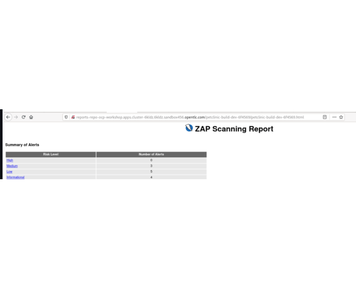

***

# Lab 5: Signing Images with Image Signing Operator

## Goal of Lab 5

The goal of this lab is to learn about image signing and the capabilities provided by OpenShift and Red Hat Enterprise Linux.

## Introduction

### Signing Images

In order to sign a image you must have a private key. Others can then use a public key to verify that the image that was signed.

### Trust Policy

The trust policy is defined by modifying the following files:

>/etc/containers/policy.json

>>This file defines whether a signature is needed for a specific repository.

>>It also defines the public key that is required to verify the signature.

>/etc/containers/registries.d/{{file/for/repository.yaml}}

>>The file here contains the location of the signature store for each repository. This is typically some kind of web server like Apache Httpd.

For more information on the format of these files, please read through the following article: signing guide. During the course of this lab exercise, you will also see what these files look like.

### Signing Operator

For the purposes of this lab, signing will be done with an operator built to sign images. This operator is not an officially supported Red Hat product. It was built by the Red Hat Consulting team and is used by several clients in production.

This operator listens for a custom resource called a ImageSigningRequest. This triggers the launch of a new Pod that then pulls and signs the requested image. Github Link - Image Signing Operator

## Lab exercise

### Step 1 - Clone Git Repository

Using the OpenShift CLI in the bastion, ensure that you are logged into the cluster as admin and execute the following steps.

`oc whoami`

`#Should say: admin`

`git clone https://github.com/redhat-cop/image-scanning-signing-service.git`

`cd image-scanning-signing-service`

### Step 2 - Install the Operator

At this point you should be in the directory of the repository you just cloned, and should be logged into a OpenShift cluster as a cluster admin. The steps below are very similar to the install directions in the README of the repository cloned, but differ in a few ways. Please follow the instructions here. The instructions in the repository tell you how to build from source, and run the operator in a local development mode. In this lab we will be using images that already exist.

`oc new-project image-management`

`oc apply -f deploy/crds/imagesigningrequests.cop.redhat.com_imagesigningrequests_crd.yaml`

`oc apply -f deploy/service_account.yaml`

`oc apply -f deploy/role.yaml`

`oc apply -f deploy/role_binding.yaml`

`oc apply -f deploy/scc.yaml`

`oc apply -f deploy/secret.yaml`

Feel free to explore the files we just applied to the OpenShift clusters. The first file is the custom resource definition defining the ImageSigningRequest. The next several files are about permissions, as the pods that run in this operator require elevated permissions. And the last file is a secret that contains the private key used for signing.

This next batch of files will install the actual operator and the signature store server. But first we have to label a specific worker node for signing. This is not a requirement if you have storage that can be mounted and written to by multiple pods at the same time, but for this lab we assume you do not and we use host path storage. Because of this the signature store, and the signing pods must run on the same node.

`oc get nodes`

Copy the node name of one of the worker nodes. You know its a worker because under the ROLES column it says worker.

    WORKER="$(oc get nodes -l node-role.kubernetes.io/worker --no-headers -o custom-columns=":metadata.name" | head -1)"
    echo ${WORKER}
    oc label node ${WORKER} type=builder

Note

This will take a few minutes to update the worker nodes in a cluster. Wait until all nodes have been updated to move forward. To validate that this worked and is finished you run the following command and wait for all the UPDATED rows to become TRUE:

`oc get machineconfigpools -w`

`# Ctrl+c to exit`

Now we can finally install the operator and signature store.

`oc apply -f deploy/lab_extras/operator.yaml`

`oc apply -f deploy/lab_extras/sigstore.yaml`

`# Run the following command to take a look at the pods being deployed`

`oc get pods`

### Step 3 - Set Trust Policy

In Red Hat CoreOS files should not be modified directly on the nodes. All configuration should either be done at start up via ignition, or by using machine configs to update clusters after they have been installed. For more information check out the OpenShift documentation here.

Open up deploy/lab_extras/trust-machineconifg.yaml and take a look. You will see three files we are adding to nodes to set up the trust policy.

>/root/pubkey.gpg

>>This is the public key to verify the signatures.

>/etc/containers/policy.json

>>Here we define that we require signatures for docker.io but accept unsigned images from other repositories.

>>In a production like environment we would want to enforce signatures on all images, but this is useful configuration for a lab.

>/etc/containers/registries.d/docker.io.yaml

>>Here we define where the signature store is for docker.io

>>In this step we will replace {{token}} with the base64 encoded version of this file.

Note

We will take a look at plain text version of these files later, but feel free to decode now if you want.
Run the following command to get route for the signature store. You should still be in the image-management namespace. If you are not switch back.

`oc get routes`

There should just be a single route, copy the url and paste it into deploy/lab_extras/registry-conf.yaml replacing {{replace_with_sigstore_route}} The url for the route must begin with http://. If it does not add it when pasting into the file.

Next we need to base64 encode this file. If running on a linux system this command is as follows:

`base64 deploy/lab_extras/registry-conf.yaml -w 0`

Copy the result and paste it into deploy/lab_extras/trust-machineconifg.yaml. You should replace {{token}}. This must be a single line. That is what the -w 0 is for. Telling it to not wrap the result onto a new line. If using some other tool to encode make sure the result has no new lines in it.

Now apply the machine config.

`oc apply -f deploy/lab_extras/trust-machineconifg.yaml`

This will take a few minutes to update the worker nodes in a cluster. Wait until all nodes have been updated to move forward. To validate that this worked and is finished run the following command:

`oc get machineconfig`

You should see at the bottom of the list something that looks like this rendered-worker-XXXXXXXXXXXXXX that was created moments after you applied the machine config. This combines all the machine configs that apply to a node and renders them into one to be applied.

Now run:

`oc get machineconfigpools`

`# if you want add a -w to the end of the previous command.  It will wait and update with new results.  You must exit when the machineconfigpool is finished being updated.`

Wait until the worker is no longer updating. MACHINECOUNT = READYMACHINECOUNT = UPDATEDMACHINECOUNT

### Step 4 - Explore Worker Nodes

`oc get nodes`

`WORKER="$(oc get nodes -l node-role.kubernetes.io/worker --no-headers -o custom-columns=":metadata.name" | head -1)"`

`echo ${WORKER}`

`oc debug node/${WORKER}`

You should now have a shell on a debug container running on one of the worker nodes. Run the following command to use host binaries:

`chroot /host`

This makes it so you have access to the host binaries and file system. Run the following commands and take a look at the files that control trust on the nodes.

`cat /etc/containers/policy.json`

`cat /etc/containers/registries.d/docker.io.yaml`

Now if we try to pull a image from docker.io directly on this node, we should get an error saying the image has not been signed.

`podman pull docker.io/library/mysql`

Now exit from the debug pod.

    exit
    # that exited from from the chroot command.
    exit
    # now we are exited from the pod.

### Step 5 Lets Deploy a Application

In this step we will sign and deploy an application from docker.io

First lets watch the application fail to deploy. We will use a basic nginx container to test this.

`oc new-project nginx-test`

`oc import-image nginx --from="docker.io/nginxinc/nginx-unprivileged" --confirm`

`oc new-app nginx`

If we set up everything correctly this pod should not have deployed.

`oc get pods`
>>

    # if it is still in status CreatingContainer just run the command a few more times or add -w.

We should see an image pull backoff. If we describe the pod we can see the events that show the image pull error occurs because the image is not signed.

`oc describe pod {paste pod id from above}`

Now lets sign the image so it can deploy. Lets take a look at the ImageSigningRequest custom resource. Open up the file deploy/lab_extras/signing-request.yaml and take a look. You can see we are telling it to sign the latest nginx ImageStreamTag. Now lets apply that file.

`oc apply -f deploy/lab_extras/signing-request.yaml`

The signing operator is now going to see this new ImageSigningRequest and launch a signing pod to actually sign the image. Lets take a look at the logs of that signing pod:

`oc get pods -n image-management`

    # copy the pod id of the most recently created pod (its a 32 character hex string)

`oc logs -f {paste pod id} -n image-management`

You can see that the pod first pulls, then signs the image.

`oc get imagesigningrequests nginx-1 -o yaml`

If you look at the status section, it will show you that the signing process completed successfully.

We can take a look at the signature itself too:

`oc get routes -n image-management`

Copy the route url and paste it into your browser as follows: {route_url}/nginxinc. If you navigate down, you should see a signature created a few moments ago. You can click it and download it if you want, but it is just binary content.

Note

If you get a Application is not available error, ensure you are using http and not https. For this lab that endpoint is not listening on 443
By this point the application should have deployed since we created the signature. OpenShift will periodically retry pulling the image and once the signature is in the signature store the app should deploy.

`oc get pods`

Note

To follow the progress of the pods you can also run the previous command with the parameter -w
The nginx pod should be running and ready. If it is not you can give it another minute or two, if you want to force a redeployment which will attempt to pull again run this:

`oc rollout restart deployment/nginx`

