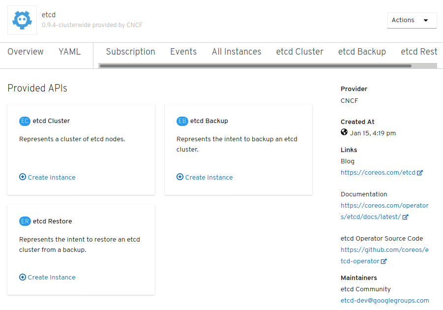
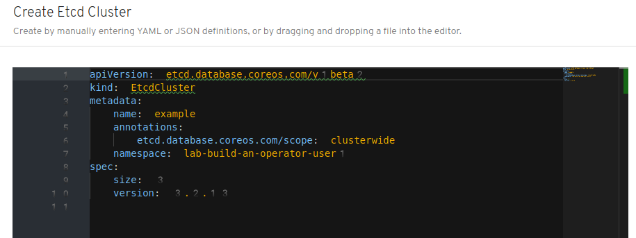
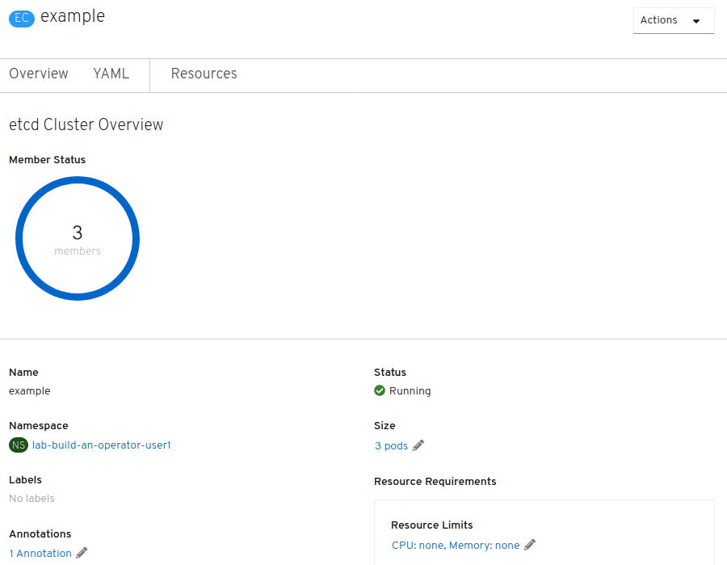

From the list of [installed Operators](%console_url%/k8s/ns/%project_namespace%/clusterserviceversions)&nbsp;, find the "etcd" entry. If you have a large list of operators available to you, enter "etcd" into the "Filter Cluster Service Versions by name" text box. Click on the entry for "etcd". This should bring up a description of the etcd Operator.

Much of the information in this page of the web console is generated from the `ClusterServiceVersion` resource object for the etcd Operator. This includes some instructions about using etcd, but more importantly lists the options you have for creating a new etcd cluster, or tasks for backing up or restoring an existing etcd cluster managed by the etcd Operator.

You can browse through the YAML definition of the `ClusterServiceVersion` for the etcd Operator by selecting on the "YAML" tab. When done looking, return back to the "Overview" tab.

At this point, double check that the web console shows you as being in the `%project_namespace%` project, and not some other project. The name of the project is displayed on a project drop down menu just below the top banner of the web console. Select the correct project from the drop down menu if necessary.

To create a new etcd cluster from this page in your project, find the "etcd Cluster" card under "Provided APIs". Click on "Create Instance" of this card. You can also get there by clicking on the "etcd Cluster" tab and then clicking on the "Create Etcd Cluster" button.

This will bring up an editor on a pre-filled YAML definition for a custom resource, which when created, will in turn trigger the creation of the etcd cluster.

The name of the custom resource in this case is `EtcdCluster`. It is one of three custom resource types the etcd Operator responds to. The others are `EtcdBackup` and `EtcdRestore`, corresponding to those same tasks as you saw listed in the "Overview" page for the etcd Operator in the web console.

Leave the pre-filled YAML definition as is and click on "Create".

In this case, the YAML definition used the value `example` for `metadata.name`. This means the name of the `EtcdCluster` resource created will be called "example", but this name will also be used in the resources created for the etcd cluster which will in turn be created.

Upon clicking "Create", you should be returned to the "Etcd Clusters" tab, where you can see a list of the etcd clusters which have been created.

Click on "example" in the list, which refers to the etcd cluster you just created. This should bring you to the page giving details on this specific etcd cluster.

The animation for "Member Status" should update as the number of member instances in the cluster are started up and become available. If it doesn't update, clicking on the "Overview" tab will force it to update the display. When the complete etcd cluster is up and running, it should show 3 members. This corresponds to the value 3 for `spec.size` in the YAML definition when you created the etcd cluster.
